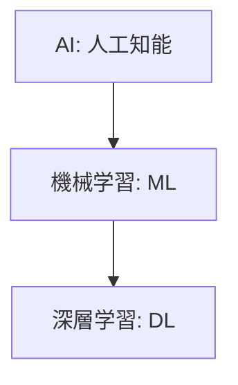
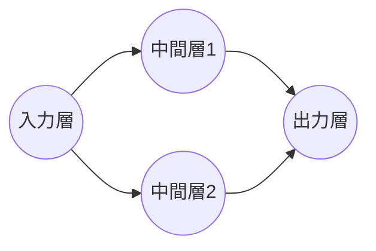

AIに関連するニュースを追いかけていると、次から次へと新しい用語が出てきますよね。今回は **20 Most Important AI Concepts Explained in Just 20 Minute** という記事を参考に、これだけは押さえておきたい20の基本概念を整理。この記事まとまっていて俯瞰し易かったです。

AIの全体像をざっくりと掴むための地図として活用してみてください。

---

## 1. AI・機械学習・深層学習の関係性

まずは、よく混同されがちな「AI」「機械学習」「深層学習」の違いから見ていきましょう。これらは入れ子構造になっています。

*   **AI (Artificial Intelligence):** 人間の知能を模倣する技術の総称です。
*   **機械学習 (Machine Learning):** データからパターンを学び、予測や判断を行う手法です。
*   **深層学習 (Deep Learning):** 人間の脳の神経回路を模した「ニューラルネットワーク」を多層にして使う、機械学習の一種です。

## 2. 3つの学習スタイル

AIがどうやって賢くなるのか、その代表的な3つの方法を比較してみます。

| 学習方法 | 特徴 | 具体例 |
| :--- | :--- | :--- |
| **教師あり学習** | 正解ラベル付きのデータで学ぶ | メールのスパム判定 |
| **教師なし学習** | 正解がないデータから構造を見つけ出す | 顧客のグループ分け |
| **強化学習** | 試行錯誤して報酬を最大化するように学ぶ | 囲碁や将棋のAI |

## 3. ニューラルネットワークの仕組み

深層学習の核となるのが「ニューラルネットワーク」です。これは、入力された情報を、いくつかの層を通して処理し、結果を出力する仕組みです。

*   **入力層 (Input Layer):** 画像やテキストなどのデータを受け取る窓口です。
*   **中間層 (Hidden Layer):** 特徴を抽出する場所で、ここで複雑な計算が行われます。
*   **出力層 (Output Layer):** 最終的な予測結果（「これは猫です」など）を出す場所です。

## 4. 学習を調整する要素

AIが正しく学習するためには、いくつかの「調整つまみ」が必要です。

*   **重みとバイアス (Weights & Biases):** 入力情報の重要度を調整する数値です。たとえば、果物を識別する際に「色」を重視するか「形」を重視するか、といった調整を自動で行います。
*   **活性化関数 (Activation Function):** 神経細胞が発火するかどうかを決める仕組みです。一定以上の情報が来たら次の層へ伝える、という役割を持ちます。
*   **損失関数 (Loss Function):** AIの予測が正解からどれだけズレているかを測る指標です。この数値が小さいほど、優秀なAIと言えます。

## 5. 賢くなるためのプロセス

AIが学習する過程は、よく「料理の味付けを調整する」ことに例えられます。

1.  **勾配降下法 (Gradient Descent):** 損失関数の値を最小にする（＝ミスを減らす）ために、パラメータを少しずつ動かす数学的な手法です。
2.  **誤差逆伝播法 (Backpropagation):** 出力のミスを後ろの層から前の層へと伝えていき、どの「重み」を直すべきか特定する仕組みです。

## 6. 学習の失敗パターン

学習がうまくいかない状態として、以下の2つを知っておくと便利です。

*   **過学習 (Overfitting):** 練習問題（訓練データ）を丸暗記しすぎて、本番（新しいデータ）に対応できない状態です。
*   **学習不足 (Underfitting):** そもそもパターンを掴めておらず、練習問題すら解けない状態です。

## 7. 自然言語処理 (NLP) と LLM

最近のChatGPTなどのベースとなっている技術です。

*   **トークン化 (Tokenization):** 文章を単語や文字の単位（トークン）に細かく刻む作業です。
*   **単語埋め込み (Word Embeddings):** 単語を数字のリスト（ベクトル）に変換することです。似た意味の単語（「犬」と「猫」など）は、数学的にも近い位置に配置されます。
*   **Transformer:** 今のAIブームの火付け役となったアーキテクチャです。文章の中のどの単語が重要かを判断する「注意機構（Attention）」が特徴です。
*   **大規模言語モデル (LLM):** 膨大なテキストデータを学習した、巨大なTransformerモデルのことです。

## 8. 生成AIを使いこなすための概念

*   **プロンプトエンジニアリング:** AIへの「指示の出し方」を工夫する技術です。
*   **ファインチューニング (Fine-tuning):** すでに賢いモデルを、特定の専門分野（医療、法律など）に合わせて追加で学習させることです。
*   **ハルシネーション (Hallucination):** AIがもっともらしい嘘をついてしまう現象のことです。
*   **RAG (Retrieval-Augmented Generation):** AIの知識だけに頼らず、外部の信頼できる資料を検索して回答させる仕組みです。これにより、ハルシネーションを減らすことができます。

---

こうして整理してみると、複雑に見えるAIも一つひとつの概念が組み合わさってできていることがわかります。まずは全体の流れをイメージできるようになると、新しい技術のニュースもずっと読みやすくなるはずです。

## 参照記事

- [20 Most Important AI Concepts Explained in Just 20 Minute](https://medium.com/@Deep-concept/20-most-important-ai-concepts-explained-in-just-20-minute-b7dd3ad2b506)

---

詳しくは[こちら](https://microarchitectures.jp/blog/20-basic-concepts-to-understand-how-ai-works-guide/)をご覧ください。