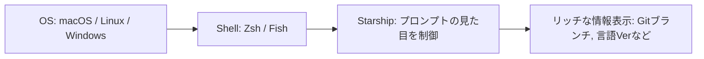
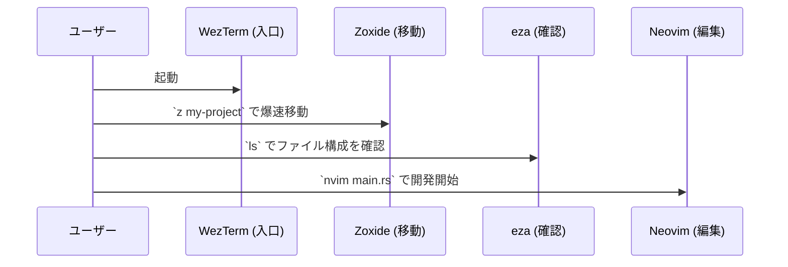

今回は、**The Ultimate Terminal Stack in 2026: A Cross-Platform Guide for macOS, Linux, and Windows** という記事を参考に、これから数年先まで使い続けられるであろうターミナル環境の構成についての紹介です。

エンジニアにとって、ターミナルは一日の大半を過ごす大切な場所ですよね。macOS、Linux、そしてWindows。使うOSが変わっても、同じ設定、同じ操作感で作業ができたら最高だと思いませんか？そんな「クロスプラットフォームな究極の環境」を支えるツールたちを見ていきましょう。

ターミナル環境構築のノウハウが詰まっていて興味深いと思ってので共有です。参考まで。

---

## なぜ「スタック」を意識するのか

かつてのターミナル環境は、OSごとにバラバラなツールを使うのが当たり前でした。しかし最近では、Rustなどの言語で書かれた高速でポータブルなツールが増えたことで、どのOSでも共通の「スタック」を組めるようになっています。

環境を統一することで、コンテキストスイッチ（頭の切り替え）のコストを減らし、どのマシンに向かってもすぐにフルスピードで作業を開始できるのが最大のメリットです。

## 1. 基盤となるターミナル：WezTerm

まず、全ての入り口となるターミナルエミュレータには **WezTerm** を選びます。

以前は Alacritty や iTerm2 が定番でしたが、WezTerm はそれらの良いとこ取りをしたような存在です。GPUレンダリングによる滑らかな動作はもちろん、設定を Lua という言語で書けるのが特徴です。

たとえば、こんなイメージです：
- **iTerm2など**: メニュー画面からポチポチ設定する
- **WezTerm**: 設定ファイル（`.lua`）を書き換える

「設定をコードで書く」ことで、Gitなどで管理（Dotfiles）しやすくなり、新しいPCを買ったときも設定ファイルをコピーするだけで一瞬で元の環境が復元できるわけですね。

## 2. シェルと見た目のカスタマイズ：Zsh + Starship

シェル本体は、安定の **Zsh**（Windowsの場合は WSL2 上の Zsh）を使います。そこに組み合わせるのが **Starship** です。

Starship は「プロンプト」と呼ばれる、入力待ちの行（`$` とか `>` が出ている部分）をカスタマイズするツールです。

Starship は非常に高速で、Rustで書かれているため、どんなに情報を詰め込んでも動作がもたつかないのが嬉しいポイントです。どの言語のプロジェクトにいるか、Gitのステータスはどうなっているかを、設定なしでもいい感じに表示してくれます。

## 3. 生産性を底上げする「モダンなCLIツール」たち

ここが一番面白い部分かもしれません。昔からある標準コマンド（ls や cd など）を、より使いやすく高速にした「モダン代替ツール」たちが揃ってきています。

これらを導入するだけでも、ターミナル作業の快適さは大きく変わります。

| 従来のコマンド | モダンな代替ツール | 特徴 |
| :--- | :--- | :--- |
| `ls` | **eza** | アイコン表示やGitステータス表示に対応 |
| `cat` | **bat** | コードのシンタックスハイライト（色付け）ができる |
| `cd` | **zoxide** | 過去の履歴から「あいまい検索」で移動できる |
| `grep` | **ripgrep (rg)** | 圧倒的に速い全文検索 |
| `find` | **fd** | シンプルな構文でファイルを探せる |
| `CTRL+R` | **fzf** | コマンド履歴などを爆速で絞り込める |

たとえば `zoxide` は、「スマートなGPS」のようなものです。一度行ったことのあるディレクトリなら、フルパスを打たなくても `z project` と打つだけで、AIが推測して移動してくれます。

## 4. エディタ：Neovim という選択

ターミナル完結型の環境を目指すなら、エディタは **Neovim** が筆頭候補になります。

最近の Neovim は、VS Code に負けないほどのリッチな機能を持たせることができます。LSP（Language Server Protocol）を使えば、コード補完や定義ジャンプもサクサク動きます。

ゼロから設定するのが難しいと感じる場合は、**LazyVim** や **AstroNvim** といったプリセット（設定済みのパッケージ）から使い始めてみるのがおすすめです。

## 5. 全体のワークフロー

これらのツールを組み合わせると、開発の流れは以下のようになります。

## まとめ

2026年に向けたターミナルスタックは、「高速（Rust製）」「ポータブル（クロスプラットフォーム）」「カスタマイズ可能（Lua/Config）」という3つのキーワードで構成されています。

一度に全部変えるのは大変ですから、まずは `eza` や `bat` といった、標準コマンドの置き換えから始めてみるのがいいかもしれません。少しずつ自分の手に馴染む道具を揃えていく過程は、エンジニアにとって最高に楽しい時間ですよね。

皆さんも、自分だけの「究極のスタック」を探求してみてはいかがでしょうか。

## 参照記事

- [The Ultimate Terminal Stack in 2026: A Cross-Platform Guide for macOS, Linux, and Windows](https://medium.com/@vidyasagarmsc/the-ultimate-terminal-stack-in-2026-a-cross-platform-guide-for-macos-linux-and-windows-c0d1f93cd9cc)
- [7 Underused Rust Features Every Senior Developer Knows](https://medium.com/@Krishnajlathi/7-underused-rust-features-every-senior-developer-knows-7b8bb8da684f)
- [Training LLM, from Scratch, in Rust](https://medium.com/@stefanobosisio1/training-llm-from-scratch-in-rust-03381bbd7204)
- [We Built a Kernel Module in Rust — And It Actually Worked](https://medium.com/@theopinionatedev/we-built-a-kernel-module-in-rust-and-it-actually-worked-eeec597b29cf)
- [Inside the Secret Tools Real Rust Teams Use (That Cargo Doesn’t Want You to Know About)](https://medium.com/@theopinionatedev/inside-the-secret-tools-real-rust-teams-use-that-cargo-doesnt-want-you-to-know-about-ee22b21be193)
- [Go Just Killed Rust’s Only Advantage (And Nobody’s Talking About It)](https://medium.com/@kanishks772/go-just-killed-rusts-only-advantage-and-nobody-s-talking-about-it-0d5fc550f355)

---

詳しくは[こちら](https://microarchitectures.jp/blog/2026-terminal-environment-cross-os-stack-configuration/)をご覧ください。