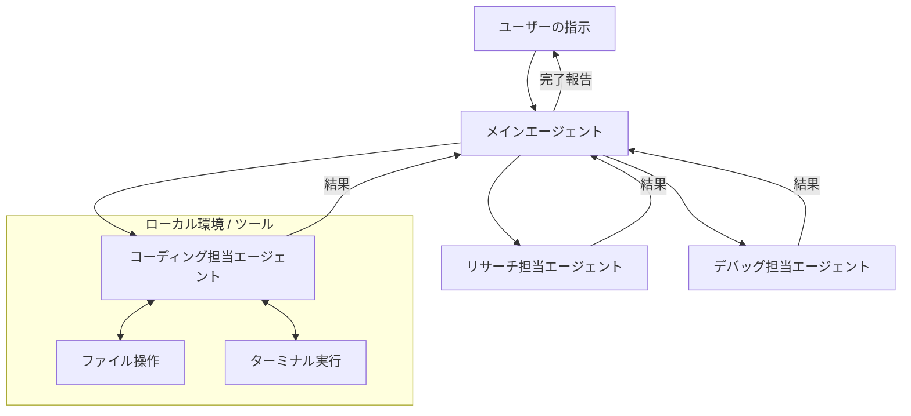

Reza Rezvani氏による **OpenClaw: The Practical Guide to Building an AI That Actually Can Run Your Work and Business** という記事を読み、AIを単なる「チャット相手」から「仕事を任せられる相棒」に進化させる具体的な手法が非常に参考になったので、そのエッセンスを整理して紹介します。

AIに質問をして回答を得る、という段階から一歩進んで、実際にコードを書き、ファイルを操作し、リサーチを完結させる。そんな「動くAI」を作るための設計図を見ていきましょう。

OpenClaw楽しいですよね。実際に使っていますが、面白くてはまりがちです。ちゃんと仕事しないと...。

---

## なぜ「チャット」だけでは不十分なのか

これまでのAI利用は、ユーザーが質問してAIが答える「一問一答」のスタイルが主流でした。しかし、実際の業務では「資料を読んで、コードを修正し、テストを実行して、結果を報告する」といった一連のプロセスが必要です。

OpenClawが目指すのは、こうしたワークフローを自律的にこなす「エージェント型」のAIです。従来のチャットボットと、OpenClawのようなエージェント型AIの違いを表にまとめてみました。

| 特徴 | 従来のチャットAI | エージェント型AI (OpenClaw) |
| :--- | :--- | :--- |
| **役割** | 回答者・相談役 | 実行者・スタッフ |
| **操作範囲** | ブラウザ内のテキスト | ファイル、ターミナル、外部ツール |
| **タスク管理** | 1ステップずつ人間が指示 | ゴールを与えればプロセスを自律判断 |
| **エラーへの対応** | 人間がエラーを伝えて再試行 | 自分でエラーを見て修正を繰り返す |

このように、AIに「手足」となるツールを与え、自分で考えて動いてもらうのがエージェント型の特徴です。

## OpenClawの基本アーキテクチャ

OpenClawの考え方で重要なのは、1つの巨大なAIにすべてをやらせるのではなく、役割を分担させることです。たとえば、全体の進行を管理する「メインエージェント」がいて、必要に応じて専門的な「サブエージェント」を呼び出す、というチームのような構造を作ります。



この仕組みの面白いところは、メインエージェントが「今はコードを書く段階だから、コーディング担当を呼ぼう」と判断して動く点です。

## 実際にAIを動かすための3つのステップ

実務で使えるレベルのAIエージェントを構築するには、単に「仕事をしてください」と言うだけでは足りません。以下の3つの要素を整える必要があります。

### 1. 明確な役割（ロール）の定義
AIに対して「あなたはシニアエンジニアです」といった性格付けだけでなく、「どんな権限を持ち、何を最終成果物とするか」を定義します。

たとえば、システム修正を依頼する場合のプロンプト（指示書）のイメージはこんな感じです：
```text
あなたはプロジェクトの「自動デバッグ担当」です。
1. ターミナルでテストを実行し、エラーを特定してください。
2. 関連するソースファイルを読み込み、修正案を作成してください。
3. 修正後、再度テストを実行して解決を確認してください。
確認が取れるまで、このサイクルを自律的に繰り返してください。
```

### 2. 「手足」となるツールの提供
AIがローカル環境で動くためには、ファイルの中身を見たり、コマンドを実行したりする権限が必要です。最近では「Claude Code」のようなツールを使うことで、AIが直接ターミナルから操作できるようになっています。

### 3. フィードバックループの構築
AIが一度で完璧な仕事をすることは稀です。そのため、「実行 → 失敗 → 原因分析 → 再実行」というループをAI自身に回させることが重要になります。

たとえば、コードを書き換えた後に自動でコンパイルを行い、エラーが出たらそのメッセージをAIが読み取って次の修正に活かす、といった流れです。

## サブエージェントを活用するメリット

なぜ「サブエージェント」に分ける必要があるのでしょうか。それは、1つの会話（コンテキスト）が長くなりすぎると、AIの注意力（精度）が落ちてしまうからです。

たとえば「リサーチ」と「コーディング」を別のサブエージェントに任せることで、以下のようなメリットがあります：

- **専門性の向上**: 特定のタスクに特化した指示（プロンプト）を与えられる
- **コストの削減**: 必要な時だけ高性能なモデルを使い、単純作業は軽量なモデルに任せられる
- **エラーの切り分け**: どこで問題が起きたのかが明確になる

イメージとしては、1人の万能な天才を探すよりも、得意分野を持った数人のチームを作る方が、仕事が安定して回るのと似ていますね。

## まとめ：これからのAIとの付き合い方

OpenClawのような考え方を取り入れると、AIは「教えてくれるツール」から「一緒に働いてくれるチームメンバー」に変わります。

最初は、小さな繰り返し作業（ログの整形や、ドキュメントの雛形作成など）からエージェントに任せてみるのが良いかもしれません。AIに適切な「役割」と「道具」を与え、自分は「ディレクター」としてゴールを示す。そんなワークスタイルが、これからのスタンダードになっていきそうです。

---

## 参照記事

- [OpenClaw: The Practical Guide to Building an AI That Actually Can Run Your Work and Business](https://medium.com/@alirezarezvani/openclaw-the-practical-guide-to-building-an-ai-that-actually-can-run-your-work-and-business-3587dd4aa22b)
- [How the Creator of Claude Code Actually Uses It: 13 Practical Moves](https://medium.com/@jpcaparas/how-the-creator-of-claude-code-actually-uses-it-13-practical-moves-2bf02eec032a)
- [A Lawyer Just Beat 500 Developers at Anthropic’s Hackathon](https://medium.com/@jinghuu/a-lawyer-just-beat-500-developers-at-anthropics-hackathon-140ca074d1a9)
- [I Turned Karpathy’s Autoresearch Into a Agent Skill For Claude Code That Optimizes Anything — Here Is the Architecture](https://medium.com/@alirezarezvani/i-turned-karpathys-autoresearch-into-a-agent-skill-for-claude-code-that-optimizes-anything-here-97de83f2b7f0)
- [Claude Code Insane Nerf. AMD Noticed (Here’s How You Fix It).](https://medium.com/@alexjamesdunlop/anthropics-hidden-claude-code-nerf-amd-noticed-here-s-how-you-fix-it-424e0d4a6a65)
- [Why Every Developer Needs Claude Code Sub Agents (And How I Build Them)](https://medium.com/@alexjamesdunlop/why-every-developer-needs-claude-code-sub-agents-and-how-i-build-them-551c2ae4aab0)

---

詳しくは[こちら](https://microarchitectures.jp/blog/openclaw-autonomous-agent-construction-guide/)をご覧ください。