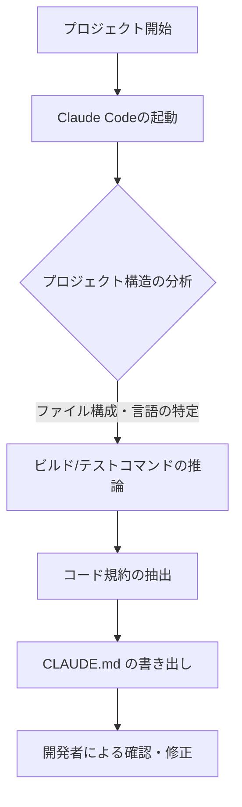

今回は、**Stop Copy-Pasting Claude Code Instructions: I Tried Generating Perfect CLAUDE.md Files Automatically** という記事を読み、Claude Codeのポテンシャルを引き出すための「CLAUDE.md」をいかに効率よく作成するかという点について、自分なりに整理してみたいと思います。

記事では curl を使ってインストールになってますが、レポジトリをみると claude の /plagin コマンドでのインストールが推奨されていたので、組み込んでみました。まだ、これから使いこなして見ますが、CLAUDE.md のメンテナンスに便利そうです。

---

AIを活用したコーディングが一般的になる中で、指示（プロンプト）の管理は徐々に複雑化しています。特に Claude Code をプロジェクトで活用する場合、そのプロジェクト固有のルールやコマンドを AI に認識させる「CLAUDE.md」の存在が重要になりますが、これを毎回手動で用意するのは少し手間がかかります。

## CLAUDE.md とは何でしょうか

CLAUDE.md は、いわば「AIのためのプロジェクト説明書」です。人間が読む README.md とは異なり、AIがそのプロジェクトで正しく振る舞うためのガイドラインを記述します。

一般的には、以下のような項目を含めることが多いかと思います。
- **ビルド・実行コマンド**: `npm run dev` や `make build` など
- **テスト実行コマンド**: `pytest` や `jest` など
- **コードスタイル**: 型定義の優先順位、命名規則、好まれるライブラリなど

これがあることで、AIは「このプロジェクトではどう振る舞えばいいのか」を迷わずに判断できるようになります。

## 手動作成から自動生成への転換

多くの開発者は、お気に入りの設定テンプレートをどこかに保存しておき、新しいプロジェクトを始めるたびにそれをコピー＆ペーストしているかもしれません。しかし、プロジェクトごとに技術スタック（ReactなのかGoなのか、はたまたRustなのか）は異なります。

そこで、Claude Code 自身の分析能力を使って、そのプロジェクトに最適な CLAUDE.md を自動生成させるというのが、今回紹介するアプローチの肝になります。

### 自動生成のプロセス

自動生成の流れを簡単に図解すると、以下のようなイメージになります。

このように、まずは AI にプロジェクト全体を俯瞰させ、その後にドキュメントを生成させるステップを踏みます。

## 実践的な生成の手順

具体的には、Claude Code に対して以下のような流れで指示を出してみるとスムーズかと思います。

1. **現状の把握**: まずは `ls -R` や主要な設定ファイル（`package.json` や `pyproject.toml` など）を読み込ませます。
2. **分析の依頼**: 「このプロジェクトのビルド方法、テスト方法、およびコードの書き方の特徴を分析してください」と伝えます。
3. **ドキュメント化**: 「分析結果に基づき、Claude Code が最適に動作するための `CLAUDE.md` を作成してください」と指示します。

たとえば、以下のようなプロンプトが考えられます。

> 「このリポジトリの構造を分析し、開発に必要なコマンドと、適用されているコーディング規約をまとめてください。その内容を `CLAUDE.md` というファイル名で保存してください。」

これにより、プロジェクトに馴染みのない外部ライブラリの使い分けや、独自のディレクトリ構成についても、AIが自ら学習してドキュメントに反映してくれます。

## 手動と自動の比較

手動でテンプレートを使い回す場合と、AIに自動生成させる場合の違いを比較表にまとめてみました。

| 項目 | 手動（コピペ） | 自動生成 |
| :--- | :--- | :--- |
| **作業時間** | 数分（微調整が必要） | 数十秒 |
| **正確性** | 古い情報が混ざりやすい | 現状のコードベースに即している |
| **一貫性** | 開発者によって記述がバラつく | Claude Codeが理解しやすい形式になる |
| **カスタマイズ性** | 汎用的な内容になりがち | プロジェクト特有のクセを反映できる |

実際に試してみると、自動生成されたファイルの方が、そのプロジェクトで今すぐ使える具体的なコマンドが正確に抽出されていることが多いように感じます。

## CLAUDE.md を育てるという考え方

一度生成して終わりではなく、開発が進むにつれて「あ、このルールも追加しておきたいな」という場面が出てくるかと思います。たとえば「新しいコンポーネントを作る時はこのディレクトリを参照してほしい」といったルールです。

そのような時は、直接ファイルを編集するのも良いですが、Claude Code との対話の中で「今のルールを CLAUDE.md に追記しておいて」と伝えるのがスマートかもしれません。

AIに指示を繰り返すのではなく、**「AIが参照するルールを更新させる」**というメタな視点を持つことで、長期的な開発効率はかなり変わってくるはずです。

## まとめ

Claude Code を単なる「コード生成ツール」として使うのではなく、プロジェクトの文脈を理解した「パートナー」にするためには、CLAUDE.md の質が重要になります。

こちらを自動生成に切り替えることで、以下のようなメリットが得られます。
- セットアップの摩擦が減り、すぐに本質的な実装に入れる。
- プロジェクトごとに最適なガイドラインが維持される。
- チーム内で共通のAI操作基準が自然に出来上がる。

「毎回同じような指示をしているな」と感じたら、ぜひ一度、Claudeに自分用の説明書を書かせてみてはいかがでしょうか。案外、自分でも気づいていなかったプロジェクトのルールを発見できるかもしれません。

## 参照記事

- [Stop Copy-Pasting Claude Code Instructions: I Tried Generating Perfect CLAUDE.md Files Automatically](https://medium.com/@alirezarezvani/stop-copy-pasting-claude-code-instructions-i-tried-generating-perfect-claude-md-43b06e1f3fea)
- [Claude Code /simplify Command: The Practical Guide to Automated Your Code Quality](https://medium.com/@alirezarezvani/claude-code-simplify-command-the-practical-guide-to-automated-your-code-quality-74eb318a68c2)
- [Claude Code Has Opinions About Your Stack. You Should Pay Attention.](https://medium.com/@deshpandetanmay/claude-code-has-opinions-about-your-stack-you-should-pay-attention-04a31be8ae91)
- [Claude Code /btw: The Usefull Side Question That Changed How I Use Context](https://medium.com/@alirezarezvani/claude-code-btw-the-usefull-side-question-that-changed-how-i-use-context-d30ddea4aa2d)
- [How I Turn Claude Into a Systems Engineering Genius With One Prompt](https://medium.com/@alexjamesdunlop/how-i-turn-claude-into-a-systems-engineering-genius-with-one-prompt-d342af0f517c)
- [Proven way to improve code quality generated by Claude Code](https://medium.com/@101/proven-way-to-improve-code-quality-generated-by-claude-code-f824d7c359ee)

---

詳しくは[こちら](https://microarchitectures.jp/blog/automating-claude-code-context-management-claude-md-flow/)をご覧ください。