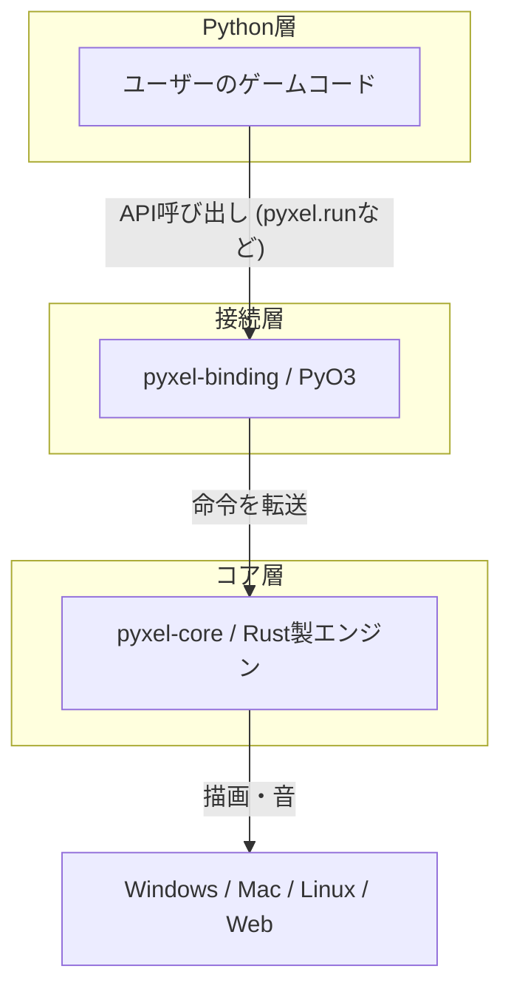

開発者による解説記事 **【公式】レトロゲームエンジンPyxelが動く仕組み** を読み、シンプルに見えるエンジンの裏側でどのような技術的選択がなされているのか興味が湧いたので、自分なりにその構造を整理してみました。

この記事で書かれているような、グルー言語としてPythonを使い、実際のエンジン部分はRustって構成は、これから増えてくると思うんだけど、この当たりの解説とかまとめると良いのな？ 特にお手軽な組込系とかでニーズあるのかな。ちょっと考えてみよう。

---

「ドット絵のレトロゲームをPythonで手軽に作れる」ことで人気のPyxelですが、実はそのパフォーマンスやマルチプラットフォーム対応を支えているのは、今注目を集めているプログラミング言語 **Rust** です。今回は、ユーザーからは見えない「Pyxelの内部構造」について掘り下げてみましょう。

## 「Pythonエンジン」の皮を被った「Rustエンジン」

Pyxelを使っていると、当然「Pythonで書かれたライブラリ」だと思いがちです。しかし、中身を開けてみると、そのコードの99%はRustで記述されています。

ユーザーが `import pyxel` として呼び出すAPIはPythonですが、実際に画面を塗りつぶしたり、音を鳴らしたりする重たい処理は、すべて背後にあるRust製エンジンが担当しているんですね。

### 2つの主要コンポーネント
Pyxelの構造を大きく分けると、以下のようになります。

| モジュール名 | 役割 | 使用言語 |
| :--- | :--- | :--- |
| **pyxel-core** | エンジンの本体。描画、サウンド、入力管理などのコア機能。 | Rust |
| **pyxel-binding** | Pythonから `pyxel-core` を呼び出すための橋渡し役。 | Rust (PyO3) |

この関係を図解すると、以下のようなイメージです。

なぜわざわざRustを使っているのでしょうか。それは、Pythonが「人間にとっての書きやすさ」を優先した言語である一方で、1pixel単位の描画やリアルタイムの音合成のような「高速な計算」を繰り返す処理には、本来あまり向いていないからです。

そこで、計算の重い部分は実行速度の速いRustに任せ、ユーザーが触れる部分だけをPythonにするという「いいとこ取り」の構成をとっているわけです。

## PythonとRustをつなぐ魔法の道具

「別の言語で書かれたプログラムをPythonから動かす」というのは、実は少し手間のかかる作業です。Pyxelでは、この橋渡しをスムーズにするために **PyO3** と **maturin** というツールを活用しています。

- **PyO3**: Rustの関数をPythonから呼べるように変換してくれるライブラリです。
- **maturin**: Rustで書かれたコードを、Pythonの標準的なインストール形式（wheel）にパッケージングしてくれるツールです。

これらがあるおかげで、私たちは `pip install pyxel` と打ち込むだけで、中身がRustであることを意識せずにインストールできるのです。

## なぜWebブラウザでも動くのか？

Pyxelの大きな特徴の一つに、作ったゲームをWebブラウザ上で公開できる「Pyxel Web」があります。これには **WebAssembly (Wasm)** という技術が使われています。

通常、Pythonをブラウザで動かすのは難しいのですが、RustはWebAssemblyへの変換が非常に得意な言語です。

1. Rustで書かれたコアエンジンをWebAssemblyにコンパイルする。
2. ブラウザ上で動くPython実行環境（Pyodideなど）と組み合わせる。

このステップを踏むことで、デスクトップで動かしていたゲームと全く同じものが、ブラウザ上でもスムーズに動くようになっています。

## レトロな仕組みを現代の技術で再現する

Pyxelが「レトロ」に見えるのは、単にドット絵だからというだけではありません。その制限の作り込みが徹底しています。

### 描画の仕組み
最近のPCは数千万色を同時に表示できますが、Pyxelはあえて「同時に16色まで」という制限を設けています。この制限があるからこそ、誰が描いても「あの頃のゲーム」らしい統一感が出るんですね。内部的には、Rustが画面上の各ピクセルの色番号を高速に計算し、ビデオメモリに書き込んでいます。

### サウンドの仕組み
ファミコンのような懐かしい音（矩形波や三角波）は、録音された音源を再生しているわけではありません。Rust側で、音の波形をリアルタイムに計算して生成しています。いわば「ソフトウェア・シンセサイザー」が内蔵されているような状態です。

## まとめ

Pyxelの「誰でも簡単にレトロゲームが作れる」という体験は、実は裏側にあるRustの堅牢な設計と、Pythonとの巧みな連携によって支えられています。

「Pythonは実行速度が遅い」と言われることもありますが、Pyxelのように適材適所で言語を組み合わせることで、その弱点を克服し、かつ最高の開発体験を提供できるという点は、システムプログラミングの面白いところですね。

もしPyxelを触る機会があれば、「今、自分の書いたPythonの裏側でRustがフル回転しているんだな」と想像してみると、また違った楽しさがあるかもしれません。

## 参照記事

- [【公式】レトロゲームエンジンPyxelが動く仕組み](https://qiita.com/kitao/items/5361d45554872a39da92)
- [The Rise of Embedded WebAssembly: Rust’s WASI Revolution](https://medium.com/@theopinionatedev/the-rise-of-embedded-webassembly-rusts-wasi-revolution-a66d24ecbff2)
- [Python Is 93× Slower?! The MCP Benchmark That Shocked Developers](https://medium.com/@kanishks772/python-is-93-slower-the-mcp-benchmark-that-shocked-developers-7e1c5be6604e)
- [Training LLM, from Scratch, in Rust](https://medium.com/@stefanobosisio1/training-llm-from-scratch-in-rust-03381bbd7204)
- [We Built a Kernel Module in Rust — And It Actually Worked](https://medium.com/@theopinionatedev/we-built-a-kernel-module-in-rust-and-it-actually-worked-eeec597b29cf)
- [Inside the Secret Tools Real Rust Teams Use (That Cargo Doesn’t Want You to Know About)](https://medium.com/@theopinionatedev/inside-the-secret-tools-real-rust-teams-use-that-cargo-doesnt-want-you-to-know-about-ee22b21be193)

---

詳しくは[こちら](https://microarchitectures.jp/blog/behind-the-scenes-of-pyxel-mostly-written-in-rust/)をご覧ください。