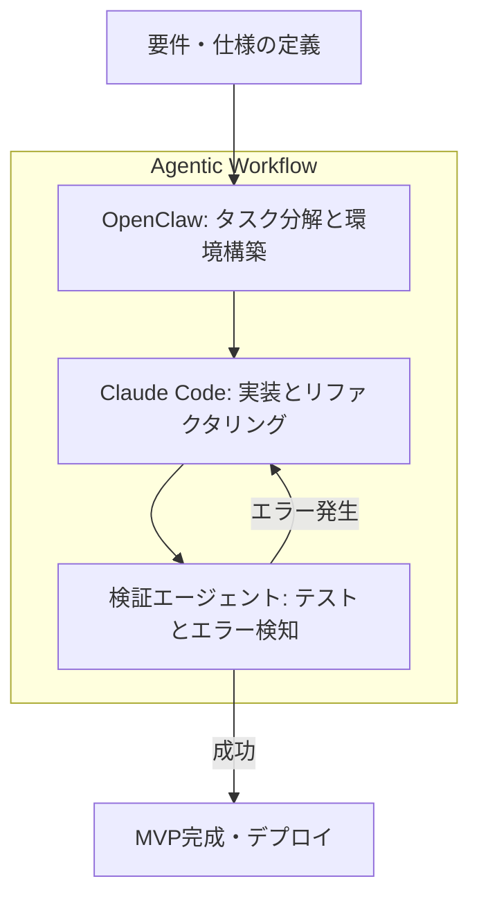

今回は、Reza Rezvani氏が執筆した **Agentic AI Coding Stack: How OpenClaw + Claude Code Built a SaaS MVP in 4 Days** という記事を参考に、最新のAIエージェントスタックを用いた開発手法について整理してみたいと思います。

これは面白い記事でした。別途、OpenClaw もいじっているのですが、ちょっと危険な香りもしていて、メインマシンでは動かせていません。この記事を読むと動かしたくなるなぁ。別途、Multicaも試しているので、こっちでやってみようかな。

---

昨今のAI進化により、数週間かかっていたMVP（Minimum Viable Product）の開発を、わずか数日に短縮できる環境が整いつつあります。単にAIにコードを書かせるだけでなく、複数のエージェントを協調させる「エージェント型開発」がどのように機能するのか、その核心を見ていきましょう。

## 開発スピードを最大化する「AIスタック」の正体

短期間でプロダクトを形にするためには、開発者が一行ずつコードを指示するのではなく、エージェントが自律的に動くための「スタック（階層構造）」を構築することが重要になります。

今回のケースで活用されているのは、主に以下の2つのツールです。

*   **OpenClaw**: 自動化やシステム操作、ハードウェア的な最適化を担うエージェントフレームワーク。
*   **Claude Code**: Anthropic社が提供する、ターミナル上で動作するエンジニアリング特化型AI。

これらを組み合わせることで、「何をすべきか」という抽象的な指示から、実際のファイル生成、テスト、デバッグまでを一気通貫で自動化する仕組みを作っています。

## エージェント間の役割分担とワークフロー

一つの強力なAIにすべてを任せるのではなく、役割を分散させた複数のエージェントを協調させるのが現在のトレンドです。たとえば、以下のような流れで処理が進行します。

### 1. タスクの細分化
まずOpenClawがプロジェクト全体の構造を把握し、実装すべき機能を小さなタスクに分解します。いきなり全体を作ろうとせず、「認証機能」「データベース接続」といった単位で切り分けるのが、AIを迷わせないコツかもしれません。

### 2. 実装の反復
Claude Codeがターミナル上で直接ファイルを操作し、コードを記述していきます。ここで重要なのは、単にコードを書くだけでなく、`/simplify` コマンドなどを用いてコードの品質をその場で最適化していく点です。

### 3. 並列処理によるエラー解決
元記事で興味深いのは、一つのエージェントがエラーで行き詰まった際、複数のエージェントを並列で走らせて解決策を競わせるというアプローチです。1人で悩むのではなく、5人のエージェントに90分間一斉に考えさせることで、複雑なバグを突破できることがあります。

## 実務で役立つ「CLAUDE.md」の活用

AIエージェントとの協調において、情報の「一貫性」を保つのは意外と難しいものです。そこで役立つのが **CLAUDE.md** という仕組みです。

これは、プロジェクトのビルド方法、テスト実行コマンド、コーディング規約などをまとめた「AIのためのガイドブック」のようなファイルです。

| 項目 | 内容 | メリット |
| :--- | :--- | :--- |
| **Build Commands** | `npm run dev` など | エージェントが迷わず環境を起動できる |
| **Code Style** | 命名規則、使用ライブラリ | 修正のたびにスタイルが崩れるのを防ぐ |
| **Context** | プロジェクトの目的、現在の課題 | エージェントが状況を正しく理解できる |

このファイルを適切にメンテナンスしておくことで、エージェントが「何をすべきか」を毎回質問してくる手間を省き、自律性を高めることができます。

## 実際に4日間で構築するためのポイント

実際にこのスタックを使ってMVPを作る際、いくつか意識しておきたい点があります。

1.  **プロンプトをコピペしない**: 毎回手動で指示を出すのではなく、`CLAUDE.md` などの設定ファイルを自動生成させ、エージェントがそれを読み取るフローを構築します。
2.  **コードの簡素化を徹底する**: コードが増えれば増えるほどAIのコンテキストは複雑になります。こまめに `/simplify` を実行し、見通しの良い状態を保つことが、結果として開発スピードを維持する鍵になるでしょう。
3.  **人間は「指揮者」に徹する**: 細かなバグ修正はAIに任せ、人間は「全体の設計が意図通りか」「ユーザー体験として正しいか」という上位レイヤーの判断に集中します。

たとえば、フロントエンドのデザインが少し崩れている程度であれば、エージェントにスクリーンショットを読み込ませて修正させる、といった使い分けが現実的かと思います。

## まとめ

OpenClawとClaude Codeを組み合わせた「能動的（Agentic）な開発」は、従来の「AIアシスト」から一歩進んだ、新しい開発の形を示しているように感じます。

もちろん、すべてをAI任せにできるわけではありませんが、適切なツール選定とコンテキスト管理を行えば、4日間でSaaSのMVPを立ち上げるというスケジュールも、決して不可能ではない時代になってきたのかもしれません。

まずは、自分のプロジェクトに `CLAUDE.md` を導入してみる辺りから始めてみるのが、最初の一歩としてちょうど良いのではないでしょうか。

## 参照記事

- [Agentic AI Coding Stack: How OpenClaw + Claude Code Built a SaaS MVP in 4 Days](https://medium.com/@alirezarezvani/agentic-ai-coding-stack-how-openclaw-claude-code-built-a-saas-mvp-in-4-days-95b4ec20dcbb)
- [21 OpenClaw Automations Nobody Talks About — Because the Obvious Ones Already Broke the Internet](https://medium.com/@rentierdigital/21-openclaw-automations-nobody-talks-about-because-the-obvious-ones-already-broke-the-internet-3f881b9e0018)
- [Claude Code /simplify Command: The Practical Guide to Automated Your Code Quality](https://medium.com/@alirezarezvani/claude-code-simplify-command-the-practical-guide-to-automated-your-code-quality-74eb318a68c2)
- [I Gave an AI Assistant Access to My Entire Work Life for 6 Weeks Now. Here’s What Actually Happened.](https://medium.com/@alirezarezvani/i-gave-an-ai-agent-access-to-my-entire-work-life-for-6-weeks-now-heres-what-actually-happened-d632635a8572)
- [Stop Copy-Pasting Claude Code Instructions: I Tried Generating Perfect CLAUDE.md Files Automatically](https://medium.com/@alirezarezvani/stop-copy-pasting-claude-code-instructions-i-tried-generating-perfect-claude-md-43b06e1f3fea)
- [5% of Users in Claude Code Were Getting Errors. One Agent Failed. Five Agents Solved It in 90 Minutes.](https://medium.com/@alirezarezvani/5-of-users-were-getting-errors-one-agent-failed-five-agents-solved-it-in-90-minutes-5dafc5b8c1e1)

---

詳しくは[こちら](https://microarchitectures.jp/blog/build-saas-mvp-4-days-agent-ai-openclaw-claude-code/)をご覧ください。