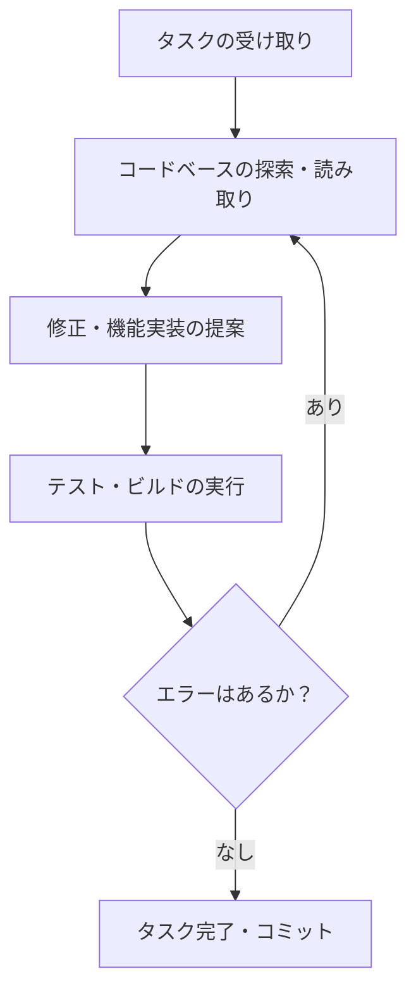

今回は、**Which Programming Language Should You Use with Claude Code?** という記事を読んで、AIエージェントとプログラミング言語の相性について興味深いデータが出ていたので、自分なりに整理して紹介しようと思います。

最近、ターミナルで動作するAI開発エージェント「Claude Code」が注目を集めていますよね。単なるコードの補完ではなく、自分でファイルを読み込み、テストを実行し、エラーが出れば修正までこなす。そんな「自律的な動き」が魅力ですが、実は使うプログラミング言語によって、その効率が大きく変わるということが分かってきました。

コードエージェントでのコード生成に使われる言語で何が良いのか？と言う疑問をここ暫く持っています。人間がコードを書くなら強い型付き言語でケアレスミスを防止しないと駄目と言われるのは納得するのですが、機械で生成させるコードだったらもう少し違う目線で設計した方が良くない？と常々考えています。この記事は、そう言った思いを重なる部分が多くあったのでとても参考になりました。

---

### AIエージェントにとっての「書きやすさ」とは？

私たちがコードを書くとき、書きやすい言語とそうでない言語があるように、Claude CodeのようなAIエージェントにとっても「作業しやすい言語」が存在します。

まずは、Claude Codeがどのように動いているのか、その基本的なプロセスを整理してみましょう。

このループをいかに速く、少ない回数で回せるかが重要なんですね。

### 13言語のベンチマーク結果

元記事で紹介されていたベンチマークでは、13の主要なプログラミング言語を対象に、AIエージェントがどれだけ正確にタスクをこなせるかが検証されました。

結果の一部を簡略化して表にまとめると、以下のような傾向が見えてきます。

| 言語 | 相性（スコア傾向） | 特徴 |
| :--- | :--- | :--- |
| **Go** | 非常に高い | コンパイルが速く、エラーメッセージが明確 |
| **TypeScript** | 高い | 型定義がしっかりしており、ミスに気づきやすい |
| **Python** | 標準的 | 書きやすいが、実行速度や依存関係で詰まりやすい |
| **Java** | 標準的 | 冗長な記述が多く、トークンを消費しやすい |
| **C++** | やや苦戦 | ビルド環境の構築やメモリ管理でエラーが起きやすい |
| **Rust** | 苦戦 | 所有権などの制約が厳しく、修正ループが長くなりがち |

ここで面白いのは、人間にとって「安全で強力」な言語が、必ずしも現時点のAIエージェントにとって「扱いやすい」わけではないという点です。

### なぜ「Go」がClaude Codeと相性がいいのか

今回のベンチマークで特に注目されたのが **Go（Golang）** です。なぜGoがAIエージェントに向いているのでしょうか？ それにはいくつか具体的な理由があります。

#### 1. ビルドとフィードバックの速さ
AIエージェントは「書いて、試して、直す」を繰り返します。Goはコンパイルが非常に速いため、このループが高速に回ります。たとえばC++でビルドに数分かかるプロジェクトだと、AIが待機する時間も増え、コスト（トークン）もかさんでしまいます。

#### 2. シンプルで厳格な文法
Goは書き方の自由度が低く、誰が書いても似たようなコードになりやすい言語です。これはAIにとって「読み間違い」が少ないことを意味します。また、未使用の変数があるだけでコンパイルエラーになる厳格さも、AIが自分のミスにすぐ気づけるというメリットに働きます。

#### 3. 依存関係の管理が楽
Pythonなどでよくある「ライブラリのバージョンが合わなくて動かない」というトラブルが、Goでは比較的起きにくいです。AIが環境構築で立ち往生するリスクが低いのは、自動化する上で大きな強みですね。

### PythonやRustを使うときの注意点

もちろん「じゃあ全部Goで書こう」とはなりませんよね。他の言語を使う際のヒントも見てみましょう。

*   **Python:** 実行してみるまでエラーが分からない「動的型付け」の性質があるため、型ヒント（Type Hints）をしっかり書くように指示すると、Claude Codeの精度が安定します。
*   **Rust:** コンパイラのアドバイスが非常に親切なので、Claude Codeに「コンパイルエラーをそのまま読んで修正して」と伝えると、自力で解決してくれる確率が上がります。ただ、どうしても試行回数は増えがちです。

### まとめ：道具に合わせた言語選び

Claude Codeのようなエージェントを使う場合、これからは「AIがいかに効率よく動けるか」という視点も大切になってきそうです。

たとえば、マイクロサービスのちょっとしたツールを作るなら、相性のいいGoを選んでAIに丸投げする。逆に、複雑なロジックが必要なコア部分はRustで人間が主導して書く、といった使い分けが現実的かもしれません。

皆さんも、自分のメイン言語でClaude Codeがどんな動きをするか、一度じっくり観察してみると面白い発見があるはずですよ。

## 参照記事

- [Which Programming Language Should You Use with Claude Code?](https://medium.com/@hxzhouh/which-programming-language-should-you-use-with-claude-code-39beaa4693af)
- [The New Claude Code’s Auto-Memory Feature Just Changed How My Team Works — Here Is the Setup I Actually Build](https://medium.com/@alirezarezvani/the-new-claude-codes-auto-memory-feature-just-changed-how-my-team-works-here-is-the-setup-i-5126174b35dc)
- [I Turned Karpathy’s Autoresearch Into a Agent Skill For Claude Code That Optimizes Anything — Here Is the Architecture](https://medium.com/@alirezarezvani/i-turned-karpathys-autoresearch-into-a-agent-skill-for-claude-code-that-optimizes-anything-here-97de83f2b7f0)
- [Python Is 93× Slower?! The MCP Benchmark That Shocked Developers](https://medium.com/@kanishks772/python-is-93-slower-the-mcp-benchmark-that-shocked-developers-7e1c5be6604e)
- [Why Every Developer Needs Claude Code Sub Agents (And How I Build Them)](https://medium.com/@alexjamesdunlop/why-every-developer-needs-claude-code-sub-agents-and-how-i-build-them-551c2ae4aab0)
- [97% of Developers Kill Their Claude Code Agents in the First 10 Minutes (Here’s How The 3% Build Unstoppable Systems)](https://medium.com/@alirezarezvani/97-of-developers-kill-their-claude-code-agents-in-the-first-10-minutes-heres-how-the-3-build-d2b6913f4cb2)

---

詳しくは[こちら](https://microarchitectures.jp/blog/claude-code-efficiency-language-compatibility-benchmarks/)をご覧ください。