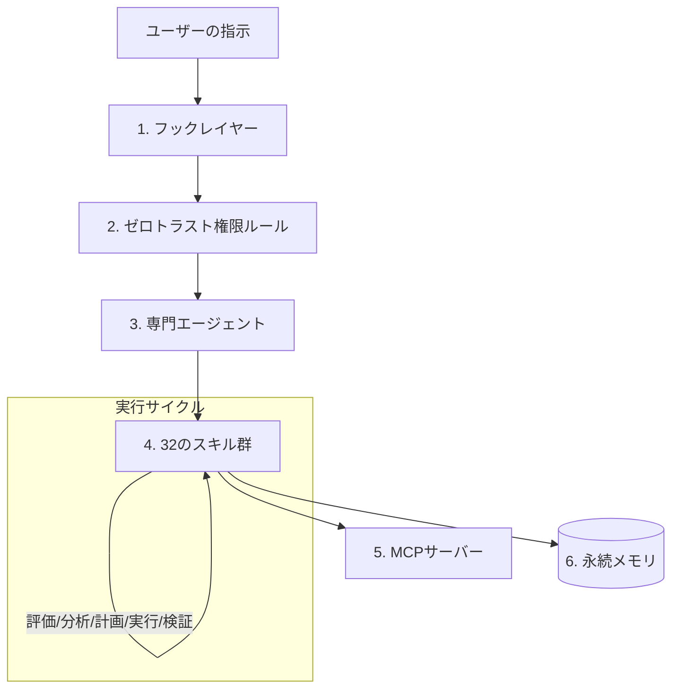
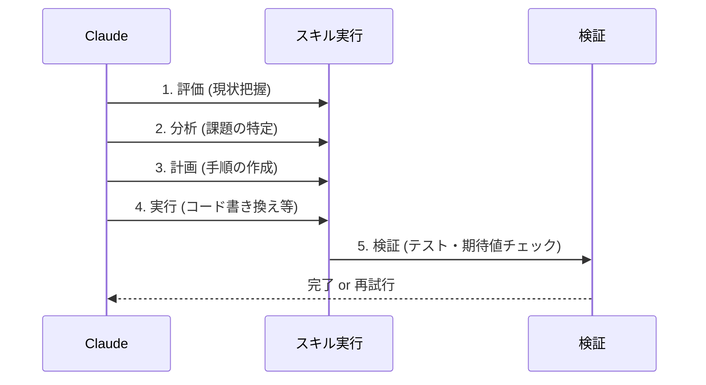

Anthropicから公開された**I Turned Claude Code Into an Operating System. Here’s the Blueprint.**という記事を読み、Claude Codeを単なるチャットツールではなく、制御可能な「プラットフォーム」として捉える考え方に非常に共感したので、その設計思想を紐解いてみたいと思います。

これも面白そうですよね。ちょっと環境を構築してやってみようかな。

　　*

「Claudeに指示を出したけれど、もっともらしい嘘（ハルシネーション）をつかれて時間を無駄にしてしまった」という経験はありませんか？元記事の筆者は、FastAPIのライブラリ仕様についてClaudeに嘘をつかれ、40分も無駄にした経験から、Claude CodeをOS（オペレーティングシステム）のように構造化する道を選んだそうです。

今回は、その「Claude Code OS」の設計図（ブループリント）がどのような構成になっているのか、ポイントを絞って紹介します。

---

## Claude Code OS の全体像

Claude Codeをターミナルのついたチャットボットとして使うのではなく、以下の図のような「多層構造のプラットフォーム」として再定義します。

このアーキテクチャの肝は、LLMの自由奔放さを「決定論的なルール」と「構造化されたプロセス」で包み込んでいる点にあります。

---

## 6つのレイヤー構成

このシステムは、以下の6つのコンポーネントで構成されています。それぞれの役割を整理してみましょう。

| レイヤー | 内容 | 役割 |
| :--- | :--- | :--- |
| **1. フック (Hooks)** | 17のライフサイクルイベント | コマンド実行前後で処理を割り込ませ、機密情報チェックや自動ログ記録を行う。 |
| **2. 権限ルール** | 78の明示的ルール | 「何をしていいか、いけないか」を定義する。ゼロトラストモデル。 |
| **3. 専門エージェント** | 10の特化型AI | コード、テスト、リサーチなど、役割ごとにモデルやプロンプトを分ける。 |
| **4. スキル (Skills)** | 10カテゴリ・32種 | 自然言語処理、画像認識、MLOpsなど、再利用可能な機能単位。 |
| **5. MCPサーバー** | 外部連携インターフェース | ウェブ閲覧、Jupyter、Git操作など、外部世界との接続を担う。 |
| **6. 永続メモリ** | `memory/` ディレクトリ | プロジェクトの決定事項やユーザーの好みをセッションを跨いで保持する。 |

### 1. 決定論的な「フック」による制御
たとえば、破壊的なコマンドを実行しようとしたときに自動でブロックしたり、コミット前にコードを自動整形したりするのは、LLMの判断に任せるよりも「スクリプト（フック）」で強制するほうが確実です。元記事では、bashスクリプトやHTTPエンドポイントを使い、17のイベントをインターセプトする仕組みを構築しています。

### 2. 5フェーズの「スキル」実行パターン
ハルシネーションを防ぐために、すべてのスキル実行において以下の5つのステップを徹底させているのが興味深いポイントです。

いきなりコードを書き始めるのではなく、まず「評価」し、最後に必ず「検証」する。このサイクルを組み込むことで、嘘のパラメータに騙されるリスクを物理的に減らしています。

### 3. ゼロトラストな権限管理
「AIだから何でもできる」状態は、セキュリティリスクでもあります。この設計図では、40の許可設定と38の拒否設定、合わせて78のルールを明示的に定義しています。
たとえば、「特定のディレクトリ以外への書き込みを禁止する」「未承認の外部APIへのアクセスを遮断する」といった制約を設けることで、AIが暴走しないためのガードレールとして機能させています。

---

## 永続メモリの重要性

Claude Codeを使っていて「前にも教えたのに……」と思ったことはありませんか？
このシステムでは、`memory/` というディレクトリを作成し、そこに「アーキテクチャの決定事項」や「過去に修正したバグのパターン」を保存しています。

これにより、新しいセッションを始めても、Claudeは「このプロジェクトではFastAPIのこの機能はこう使うんだったな」と思い出すことができるわけです。

---

## まとめ：プログラマブルなプラットフォームへ

Claude Codeを単なる「便利なチャット」として使うフェーズは終わり、これからは「どう自分専用のOSとして構成するか」が重要になってくるのかもしれません。

元記事の設計図は、[GitHub (claude-code-blueprint)](https://github.com/Aedelon/claude-code-blueprint) で公開されています。CLAUDE.mdや各種設定ファイルが含まれているので、自分の環境に取り入れて、少しずつ自分好みの「スキル」や「ルール」を追加してみるのも面白そうですね。

まずは、よく使うコマンドを「フック」に登録するところから始めてみてはいかがでしょうか。

## 参照記事

- [I Turned Claude Code Into an Operating System. Here’s the Blueprint.](https://medium.com/@aedelon/i-turned-claude-code-into-an-operating-system-heres-the-blueprint-80bdef0c62f6)
- [I Turned Karpathy’s Autoresearch Into a Agent Skill For Claude Code That Optimizes Anything — Here Is the Architecture](https://medium.com/@alirezarezvani/i-turned-karpathys-autoresearch-into-a-agent-skill-for-claude-code-that-optimizes-anything-here-97de83f2b7f0)
- [Why Every Developer Needs Claude Code Sub Agents (And How I Build Them)](https://medium.com/@alexjamesdunlop/why-every-developer-needs-claude-code-sub-agents-and-how-i-build-them-551c2ae4aab0)
- [97% of Developers Kill Their Claude Code Agents in the First 10 Minutes (Here’s How The 3% Build Unstoppable Systems)](https://medium.com/@alirezarezvani/97-of-developers-kill-their-claude-code-agents-in-the-first-10-minutes-heres-how-the-3-build-d2b6913f4cb2)
- [How the Creator of Claude Code Actually Uses It: 13 Practical Moves](https://medium.com/@jpcaparas/how-the-creator-of-claude-code-actually-uses-it-13-practical-moves-2bf02eec032a)
- [I Tested This Autonomous Framework That Turns Claude Code Into a Virtual Dev Team](https://medium.com/@joe.njenga/i-tested-this-autonomous-framework-that-turns-claude-code-into-a-virtual-dev-team-a030ab702630)

---

詳しくは[こちら](https://microarchitectures.jp/blog/claude-code-os-system-design-guide-beyond-chat/)をご覧ください。