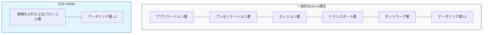
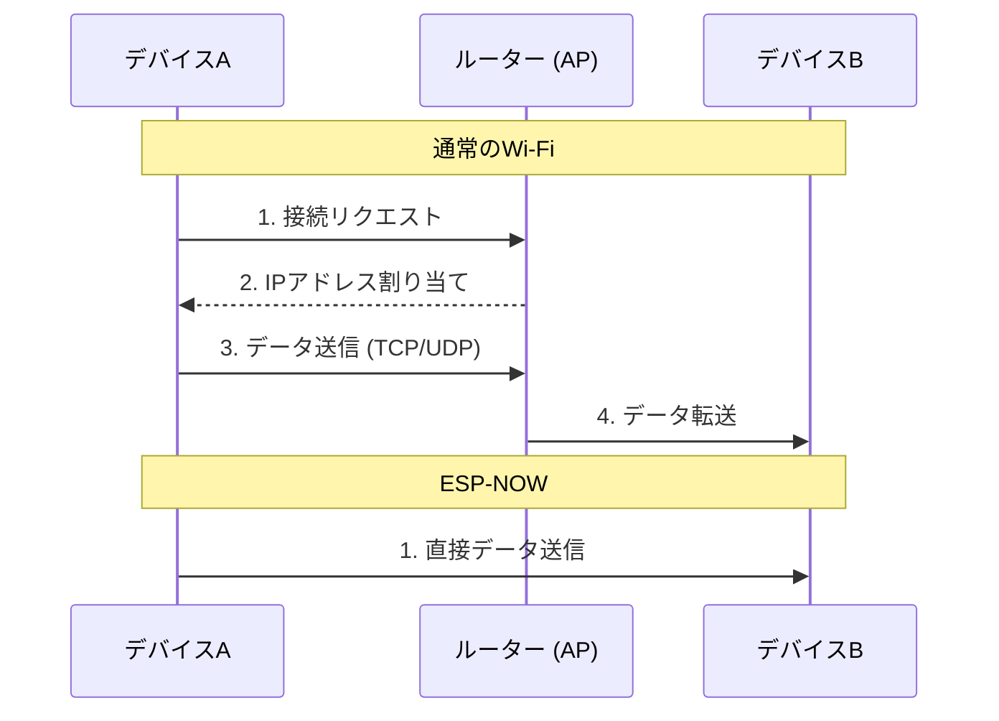

今回は、**手軽な通信を行える「ESP-NOW」について：公式の説明を少し見てみたり実装関連の情報を検索してメモしてみたり** という記事を読み、電子工作やIoTデバイス制作でよく耳にするこのプロトコルの正体が気になったので、自分なりに要点を整理してみました。

ちょっと興味があるので調べて始めています。参考まで。

---

## ESP-NOWってどんなもの？

「StackChan（スタックチャン）」などの自作ロボットや、デバイス同士を連携させるプロジェクトでよく使われているのが、この「ESP-NOW」です。一言でいうと、Espressif Systems社が開発した**「ルーターを介さずに、ESP32シリーズ同士で直接データをやり取りできる無線通信プロトコル」**のこと。

一般的なWi-Fiだと、まずアクセスポイントに接続して……という手順が必要になりますが、ESP-NOWならデバイスの電源を入れた瞬間に、相手を見つけてパケットを投げるといった使い方ができるんです。

主な特徴をリストアップしてみると、こんな感じです。

- **ルーター不要**: デバイス同士がペアリングなし（または簡素な登録）で通信できる。
- **低遅延・高速**: 接続までの待ち時間がほとんどない。
- **低消費電力**: 通信のオーバーヘッドが少ないため、バッテリー駆動に優しい。
- **共存可能**: Wi-FiやBluetooth LEと一緒に使うことができる。
- **対応機種が豊富**: ESP8266、ESP32、ESP32-S、ESP32-Cなどの各シリーズで利用可能。

## OSI参照モデルから見る「シンプルさ」の秘密

なぜESP-NOWはそんなに「手軽」で「速い」のでしょうか。その理由は、通信の構造を思い切ってシンプルにしているところにあります。

通常、私たちが使っているWi-Fi（TCP/IP）通信は、OSI参照モデルという階層構造に沿って動いています。一方、ESP-NOWはデータリンク層（レイヤー2）をベースにして、その上の複雑な階層をガバッと1つにまとめてしまっているんですね。

言葉だけだと少しイメージしにくいので、図にしてみましょう。

たとえば、荷物を送るときに「何重もの箱に入れて、それぞれに伝票を貼って……」とやるのが普通のWi-Fiだとすると、ESP-NOWは「中身を封筒に入れて、そのまま相手に手渡す」みたいなイメージです。

各層でパケットヘッダを追加したり外したりする処理がいらない分、CPUの負荷も減りますし、データが飛んでいくまでの時間も短縮されるというわけですね。

## 通常のWi-Fi接続との違い

ルーターを通す通信と、ESP-NOWによる直接通信の流れを比較してみると、その差は歴然です。

### 通信の流れの比較

このように、ESP-NOWは「相手を見つけてすぐ投げる」という挙動ができるので、レスポンスが重視されるラジコンのコントローラーや、センサーデータの瞬時な送信に向いています。

表にまとめると、以下のような違いがあります。

| 項目 | 一般的なWi-Fi | ESP-NOW |
| :--- | :--- | :--- |
| **接続先** | アクセスポイント（ルーター） | 相手のデバイス（直接） |
| **事前準備** | SSID/パスワード設定、IP取得 | 相手のMACアドレスの登録 |
| **通信距離** | ルーターの範囲内 | デバイス間の電波強度に依存 |
| **得意なこと** | インターネット接続、大容量通信 | 低遅延、省電力、ボタン操作の反映 |
| **ペアリング** | 必要（ハンドシェイクなど） | 不要、あるいは非常に高速 |

## 実装時に意識したいこと

ESP-NOWを使う場合、基本的には「相手のMACアドレス」を指定して送信します。ブロードキャスト（周囲の全員に送る）も可能ですが、特定の相手に送る場合は、あらかじめデバイスのMACアドレスを調べておく必要があります。

また、Wi-Fiのチャンネルが合っていないと通信できないといったハマりポイントもあるので、公式ドキュメントにある「Wi-Fiとの共存設定」あたりは、実装前にサッと目を通しておくと安心かもしれません。

## まとめ

ESP-NOWは、ネットワーク層などの「重たい処理」をバイパスして、データリンク層で直接やり取りすることで、あの手軽さを実現しているんですね。

「ボタンを押したらすぐにロボットを動かしたい」「数分に一回、センサーの値をパッと送ってすぐ眠らせたい」といった用途には、まさにうってつけの選択肢と言えそうです。ESP32を触っていて、「Wi-Fiの設定が面倒だな……」と感じたら、ぜひESP-NOWを試してみてください。

## 参照記事

- [手軽な通信を行える「ESP-NOW」について：公式の説明を少し見てみたり実装関連の情報を検索してメモしてみたり](https://qiita.com/youtoy/items/ac73bb29b3d9517a91ec)
- [I Turned Karpathy’s Autoresearch Into a Agent Skill For Claude Code That Optimizes Anything — Here Is the Architecture](https://medium.com/@alirezarezvani/i-turned-karpathys-autoresearch-into-a-agent-skill-for-claude-code-that-optimizes-anything-here-97de83f2b7f0)
- [The Postgres Query That Brought Down Black Friday (89K RPS Disaster)](https://medium.com/@guvencanguven965/the-postgres-query-that-brought-down-black-friday-89k-rps-disaster-2d6b191784e3)
- [Claude Code Insane Nerf. AMD Noticed (Here’s How You Fix It).](https://medium.com/@alexjamesdunlop/anthropics-hidden-claude-code-nerf-amd-noticed-here-s-how-you-fix-it-424e0d4a6a65)
- [Python Is 93× Slower?! The MCP Benchmark That Shocked Developers](https://medium.com/@kanishks772/python-is-93-slower-the-mcp-benchmark-that-shocked-developers-7e1c5be6604e)
- [DeepSeek V4 Runs Locally on Your GPU. That Changes Everything the Cloud AI Companies Didn’t Want Changed.](https://medium.com/@sohail_saifi/deepseek-v4-runs-locally-on-your-gpu-a738bf2acef6)

---

詳しくは[こちら](https://microarchitectures.jp/blog/esp-now-esp32-mechanism-features-official-guide/)をご覧ください。