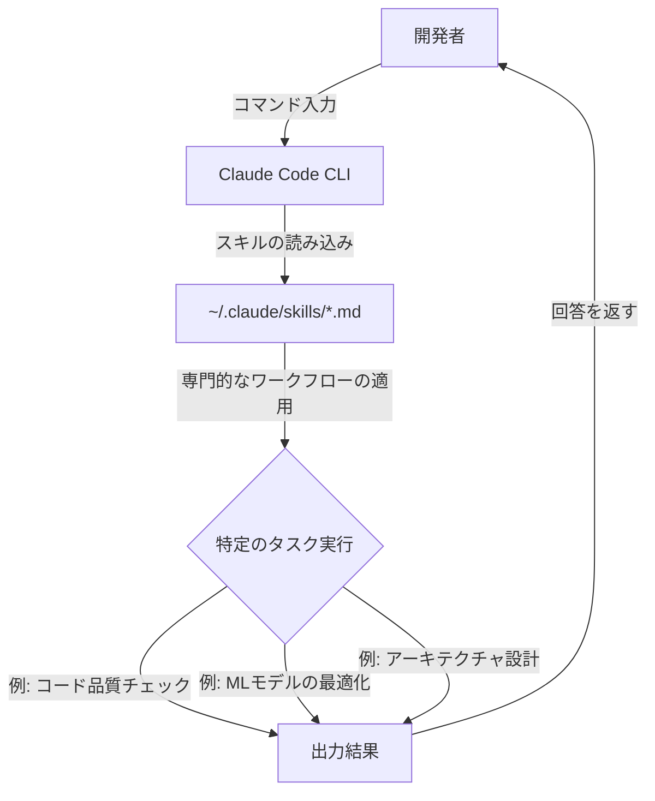

Joe Njenga氏による記事 **The 9 FREE Claude Code Skills Libraries That Pros Use (And Save Time)** を読み、Claude Codeの可能性を広げるヒントが詰まっていたので、実務で役立ちそうなポイントを整理して紹介します。

この記事のスキルを全部使ってみているわけじゃないですが、もとまっていて良い記事だったので共有です。

---

Claude Codeを使っていると、「毎回同じような指示を出しているな」と感じることはありませんか？ 実は、Claudeに特定の専門知識やワークフローを覚え込ませる「スキル」という仕組みがあり、これを活用することで作業時間を大幅に短縮できるんです。

## Claude Codeの「スキル」とは何か？

簡単に言うと、Claude Codeの「スキル」とは、特定のタスクを効率よくこなすための**手順書パッケージ**のようなものです。`SKILL.md` という1つのファイルに、Claudeがどのように考え、どのような手順で動くべきかがまとめられています。

これを特定のディレクトリ（通常は `~/.claude/skills/`）に入れておくだけで、Claudeがまるでその分野のスペシャリストであるかのように振る舞ってくれます。

仕組みを図解すると、以下のようなイメージになります。



## スキルを導入するメリット

標準の状態でも十分賢いClaudeですが、スキルを導入することで「やり方」を教える手間が省けます。

| 特徴 | 標準の Claude Code | スキル導入後の Claude Code |
| :--- | :--- | :--- |
| **指示の出し方** | 毎回プロンプトで細かく指定する | 1つのコマンドで複雑な手順が走る |
| **出力の安定性** | 回答にムラが出ることがある | 定義された手順（フレームワーク）に従う |
| **専門性** | 一般的な知識に基づく | 特定ドメイン（ML, ゲーム, 設計等）に特化 |
| **管理** | 再利用しにくい | モジュール化されているので他プロジェクトでも使える |

## プロが注目するライブラリ「Everything Claude Code」

元記事で特におすすめされていたのが、**Everything Claude Code** というリポジトリです。これはAnthropicのハッカソンで優勝したプロジェクトで、Claude Codeを使いこなすための設定が丸ごと詰まった「宝箱」のようなものです。

このリポジトリには、以下のようなものが含まれています。

*   **構築済みのエージェントスキル**: すぐに使える手順書
*   **プラグインディレクトリ**: 追加機能のセット
*   **他ツールとの互換性**: CursorやCodexといった他のAIエディタでも使える設定ファイル

一から自分でスキルを書くのもいいですが、まずはこうした実戦でテスト済みのライブラリを使ってみるのが効率的ですね。

## スキルのインストール方法

スキルの導入は意外と簡単です。GitHubからクローンして、特定のフォルダにコピーするだけで準備が整います。

```bash
# 1. スキルのリポジトリをクローンする
git clone https://github.com/repo/skill-name.git

# 2. スキルファイルをClaudeの設定ディレクトリにコピーする
cp -r skill-name/skills/* ~/.claude/skills/
```

また、プラグインマネージャーを使っている場合は、以下のようなスラッシュコマンドで追加することも可能です。

```bash
/plugin install skill-name
```

## まとめ：自分だけの「最強のClaude」を育てよう

Claude Codeは、そのまま使っても優秀なツールですが、スキルを追加していくことで「自分専用の有能なアシスタント」へと進化させることができます。

元記事では、コードの品質管理から、マーケティング、ゲーム開発、さらには自律的な機械学習（ML）の研究まで、さまざまな分野のスキルライブラリが紹介されています。自分がよく行う作業に合わせて、いくつかスキルを試してみると、驚くほどスムーズに作業が進むようになるかもしれません。

一からプロンプトを練る時間を、クリエイティブな実装の時間に回せるようになるといいですね。

## 参照記事

- [The 9 FREE Claude Code Skills Libraries That Pros Use (And Save Time)](https://medium.com/@joe.njenga/the-9-free-claude-code-skills-libraries-that-pros-use-and-save-time-6d43366545aa)
- [One Open-Source Repo Turned Claude Code Into an n8n Architect — And n8n Has Never Been More Useful](https://medium.com/@rentierdigital/one-open-source-repo-turned-claude-code-into-an-n8n-architect-and-n8n-has-never-been-more-useful-f68f4ec63d02)
- [I Turned Karpathy’s Autoresearch Into a Agent Skill For Claude Code That Optimizes Anything — Here Is the Architecture](https://medium.com/@alirezarezvani/i-turned-karpathys-autoresearch-into-a-agent-skill-for-claude-code-that-optimizes-anything-here-97de83f2b7f0)
- [Why Every Developer Needs Claude Code Sub Agents (And How I Build Them)](https://medium.com/@alexjamesdunlop/why-every-developer-needs-claude-code-sub-agents-and-how-i-build-them-551c2ae4aab0)
- [97% of Developers Kill Their Claude Code Agents in the First 10 Minutes (Here’s How The 3% Build Unstoppable Systems)](https://medium.com/@alirezarezvani/97-of-developers-kill-their-claude-code-agents-in-the-first-10-minutes-heres-how-the-3-build-d2b6913f4cb2)
- [How the Creator of Claude Code Actually Uses It: 13 Practical Moves](https://medium.com/@jpcaparas/how-the-creator-of-claude-code-actually-uses-it-13-practical-moves-2bf02eec032a)

---

詳しくは[こちら](https://microarchitectures.jp/blog/how-to-use-claude-code-free-skill-library-like-a-pro/)をご覧ください。