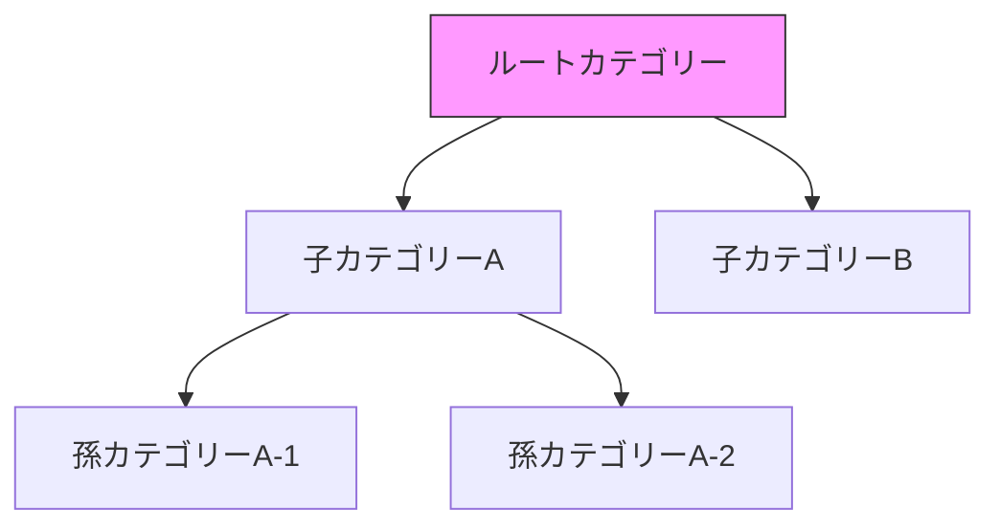
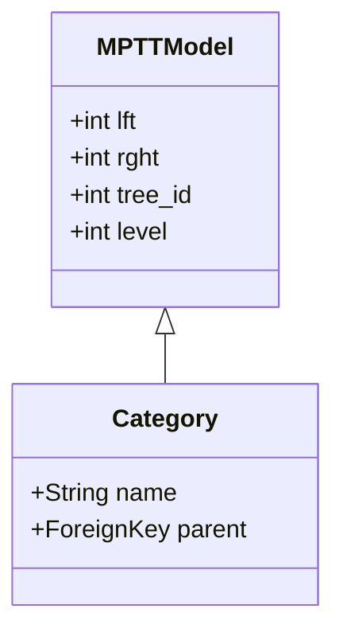

**Django Hierarchical models** という記事を読み、Djangoにおける「ツリー構造」や「階層データ」の持たせ方について、実務的な視点で整理してみたくなりました。

Webアプリケーションを作っていると、カテゴリーの親子関係や、フォルダ構成、コメントの返信スレッドなど、データに階層構造を持たせたい場面がよくあるかと思います。今回は、Djangoでこれらを実現するための代表的なアプローチと、それぞれの特性について考えてみます。

階層型のモデル組みたくなるときありますよね。Djangoでそう言ったモデルを作る時の参考記事です。

---

## 階層モデルの全体像

Djangoで階層構造を実装する場合、大きく分けて「標準の自己参照」を使う方法と、「外部ライブラリ（MPTTやTreebeard）」を活用する方法があります。

まずは、最もシンプルな自己参照のイメージを可視化してみます。



このように、自分自身のモデルを親として参照することで階層を作ります。

---

## 1. 最もシンプルな「自己参照」モデル

Djangoの標準機能だけで実装する場合、`ForeignKey` を自分自身に向ける「自己参照（Adjacency List）」という手法をとります。

### 実装例
```python
from django.db import models

class Category(models.Model):
    name = models.CharField(max_length=100)
    parent = models.ForeignKey(
        'self', 
        on_delete=models.CASCADE, 
        null=True, 
        blank=True, 
        related_name='children'
    )

    def __str__(self):
        return self.name
```

この方法は、直感的で分かりやすいのがメリットです。
しかし、例えば「あるカテゴリーに属するすべての孫要素まで一気に取得したい」という場合に、再帰的なクエリが発生してパフォーマンスが落ちてしまう懸念があります。数階層程度であれば問題ないかもしれませんが、深くなると少し厳しいかもしれません。

---

## 2. 効率を重視した設計パターン

データの取得（リード）が多いのか、更新（ライト）が多いのかによって、適した設計が変わります。よく比較される手法を一覧にしてみました。

| 手法 | 読み込み速度 | 書き込み速度 | 特徴 |
| :--- | :--- | :--- | :--- |
| **自己参照** (Adjacency List) | 遅め（再帰が必要） | 速い | シンプルだが、深い階層の取得に弱い |
| **MPTT** (Modified Preorder Tree Traversal) | 高速 | 遅め | 読み込みに特化。更新時にインデックス再計算が必要 |
| **Materialized Path** | 高速 | 普通 | パス（例: `/1/5/22/`）を文字列で保持する手法 |

### 各パターンの使い分けイメージ

- **自己参照**: 階層が浅い、または管理画面で少し編集する程度の場合。
- **MPTT**: 商品カテゴリーのように、頻繁に全階層を表示するが、カテゴリー構成自体はあまり変わらない場合。
- **Materialized Path**: 階層が深く、パスによる検索（前方一致など）を活用したい場合。

---

## 3. ライブラリを活用した実装

実務では、これらの複雑なロジックを自前で書くよりも、実績のあるライブラリを使うのが現実的かと思います。

### django-mptt
ツリー構造を扱うライブラリとして長く使われているのが `django-mptt` です。



MPTT（改良版先行順序ツリー走査）は、`lft`（左値）と `rght`（右値）という特殊なフィールドを持つことで、再帰を使わずにクエリ一発で子孫要素をすべて取得できる仕組みです。
ただし、新しい要素を追加するたびに他のレコードの値を書き換える必要があるため、書き込み頻度が高いシステムでは慎重に検討したほうがいいかもしれません。

### django-treebeard
もうひとつの選択肢が `django-treebeard` です。こちらは Materialized Path や Nested Sets など、複数のアルゴリズムを選択できるのが特徴です。
大規模なデータや、より柔軟な階層管理が必要な場合はこちらの方が向いていることもあるかと思います。

---

## どちらを選ぶべきか

結局のところ、どの手法がベストかはプロジェクトの要件次第になります。

1. **シンプルさを優先したい**: 
   まずは標準の `ForeignKey('self', ...)` で実装してみるのが良いと思います。
2. **表示パフォーマンスが課題になった**: 
   `django-mptt` などの導入を検討し、クエリ数を削減する方向にシフトするのがスムーズかもしれません。
3. **階層が非常に深く、頻繁に移動が発生する**: 
   Materialized Path（`django-treebeard` など）を検討してみると、バランスが取れるのではないでしょうか。

個人的には、管理画面で数レベルのカテゴリーを作る程度なら、無理に複雑な仕組みを入れずに標準機能で通すのが、メンテナンスもしやすくて良いかなと感じています。

こうしたモデル設計は、後からの変更が意外と大変な部分ですので、最初に「どの程度の深さになるか」「どのくらいの頻度で更新されるか」をイメージしておくと、後々の自分が楽になるかと思います。

## 参照記事

- [Django Hierarchical models](https://medium.com/@adrienvanthong/django-hierarchical-models-dc40351c9f82)
- [The Most Overlooked Feature in Python’s dataclasses](https://medium.com/@aashishkumar_77032/the-most-overlooked-feature-in-pythons-dataclasses-09bddd36e552)
- [I Changed One Line in postgresql.conf. Query Performance Jumped by 100×](https://medium.com/@premchandak_11/i-changed-one-line-in-postgresql-conf-query-performance-jumped-by-100-2ce046fb00e7)
- [How One Missing Word Can Destroy Your SQL Query’s Intent](https://medium.com/@nagarajvela/how-one-missing-word-can-destroy-your-sql-querys-intent-82c646ff766f)
- [How I Made Postgres Fly on 2 Cores and 4GB RAM — 1.2 Billion Rows in 0.7 Seconds](https://medium.com/@kakamber07/how-i-made-postgres-fly-on-2-cores-and-4gb-ram-1-2-billion-rows-in-0-7-seconds-1a0e01c49571)
- [従来のユーザーインターフェースが消えていく--「使い捨て」UIの到来](https://japan.zdnet.com/article/35247011/)

---

詳しくは[こちら](https://microarchitectures.jp/blog/efficient-hierarchical-structures-django-model-patterns/)をご覧ください。