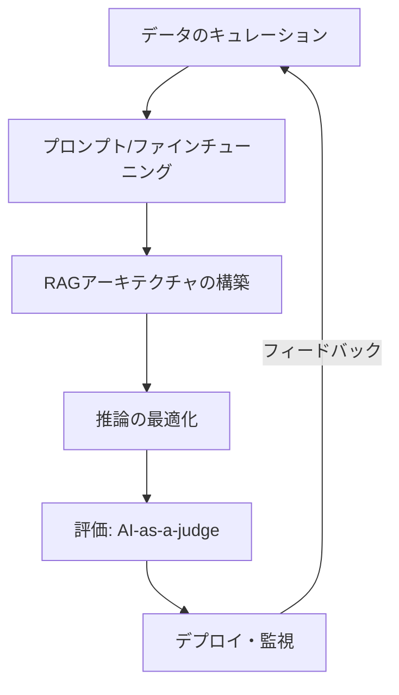

今回は、Joe Njenga氏による **7 Books That Will Make You a Better AI Engineer In 2026 (Beyond Coding)** という記事を参考に、AIエンジニアリングの急速な進化の中で、私たちがどのような知識を積み上げていくべきかについて整理してみます。

とても良くまとめられていて参考になりました。

---

ここ1、2年でAIを取り巻く環境は劇的に変わりました。かつてはLLMのAPIを叩いて、簡単なプロンプトを投げるだけで「AI開発」と呼ばれていましたが、2026年を見据えると、そうしたフェーズはすでに過去のものになりつつあります。

## 2026年のAIエンジニアに求められるシフト

現在、AIエンジニアリングの現場では、単なるライブラリの使い方よりも「システムとしての堅牢性」が問われるようになっています。具体的には、以下の3つの要素が重要度を増しています。

1.  **エージェンティックAI（Agentic AI）**: 単一のタスクをこなすのではなく、自律的に判断して行動するシステムの構築。
2.  **RAG（検索拡張生成）の高度化**: プロダクション環境で耐えうる、精度と信頼性の高い検索システムの設計。
3.  **内部構造の理解**: LLMがどのように推論し、どこに限界があるのかを理論的に把握すること。

APIを呼び出すだけのエンジニアと、システム全体の構造を理解しているエンジニアの差は、今後ますます広がっていくことが予想されます。

## AIエンジニアリングの全体像を捉える「地図」

こうした変化の中で、指針となる一冊として挙げられているのが、Chip Huyen氏の著書 **『AI Engineering』** です。

彼女はNVIDIAやNetflixでMLツールの構築に携わり、スタンフォード大学でも教鞭を執っていた人物です。この本は、単なるコードの書き方ではなく、AIアプリケーションを「プロダクト」として成立させるための全プロセスを網羅しています。

AIアプリケーションの開発フローを整理すると、以下のようなイメージになります。

### なぜ今、理論と設計が必要なのか

かつての開発では「とりあえず動くものを作る」ことが優先されましたが、2026年の水準では、以下のような意思決定フレームワークが求められます。

| 項目 | 従来のAI開発（API利用） | これからのAIエンジニアリング |
| :--- | :--- | :--- |
| **主な関心事** | プロンプトの調整 | エンドツーエンドの評価戦略 |
| **精度向上策** | 試行錯誤によるプロンプト変更 | データの品質管理とファインチューニングの併用 |
| **評価手法** | 人間による目視確認 | AI-as-a-judge（AIによる自動評価） |
| **最適化** | 特になし（API任せ） | 推論コストと速度の最適化・デプロイ戦略 |

この表からもわかるように、開発の比重が「実装」から「設計と評価」へ移っています。

## コーディングの先にある「思考の枠組み」

Chip Huyen氏の著書でも触れられていますが、エンジニアにとって重要なのは、特定のツールに依存しない「思考の枠組み」を持つことです。

たとえば、RAG（検索拡張生成）を構築する際、単にベクトルデータベースを使うだけでなく、「コンテキストとして何を注入するのが最適か」「そのデータの品質はどう担保するか」といった、上流のデータ設計から考える必要があります。

また、評価の自動化（AI-as-a-judge）についても、何をもって「正しい」とするかの基準を定義し、それをスケールさせる仕組みを作らなければなりません。これは、従来のソフトウェアテストとは異なる、AI特有の難しさがある部分です。

## まとめ

2026年に向けて、AIエンジニアは「コーディング」というスキルを土台にしつつ、その上に「システムデザイン」「データ品質管理」「評価戦略」といったレイヤーを積み上げていく必要があります。

流行のライブラリを追いかけることも大切ですが、まずはChip Huyen氏の著書のような、分野全体の地図を与えてくれるリソースに触れてみるのが良いかもしれません。技術の表面的な変化に惑わされず、本質的な「考え方」を養っておくことが、結果として長く活躍できるエンジニアへの近道になるのだと思います。

皆さんは、次のステップとしてどの領域を深掘りしてみたいでしょうか。こちらのリストが、これからの学習の参考になれば幸いです。

## 参照記事

- [7 Books That Will Make You a Better AI Engineer In 2026 (Beyond Coding)](https://medium.com/@joe.njenga/7-books-that-will-make-you-a-better-ai-engineer-in-2026-beyond-coding-0f79285325e0)
- [We Built the Same App Three Times. Here’s Why We Regret Two of Them.](https://medium.com/@mobileappdeveloper.koti/we-built-the-same-app-three-times-heres-why-we-regret-two-of-them-6975ac29115d)
- [If You Don’t Know These 12 System Design Basics, You’re Not a Real Software Engineer](https://medium.com/@kanishks772/if-you-dont-know-these-12-system-design-basics-you-re-not-a-real-software-engineer-28043fbb09bc)
- [Architecture Patterns That Actually Scale in 2025 (Most Teams Need Only These Three)](https://medium.com/@anurag.ydv36/architecture-patterns-that-actually-scale-in-2025-most-teams-need-only-these-three-02a1bd6084bf)
- [He Was a Lambda Fanboy… Until the Math Showed Cloudflare Workers Saved Us $1.1M a Year](https://medium.com/@cachecowboy/he-was-a-lambda-fanboy-until-the-math-showed-cloudflare-workers-saved-us-1-1m-a-year-3b5dac83235e)
- [Stop Copy-Pasting Claude Code Instructions: I Tried Generating Perfect CLAUDE.md Files Automatically](https://medium.com/@alirezarezvani/stop-copy-pasting-claude-code-instructions-i-tried-generating-perfect-claude-md-43b06e1f3fea)

---

詳しくは[こちら](https://microarchitectures.jp/blog/extending-ai-engineer-shelf-life-beyond-coding-2026/)をご覧ください。