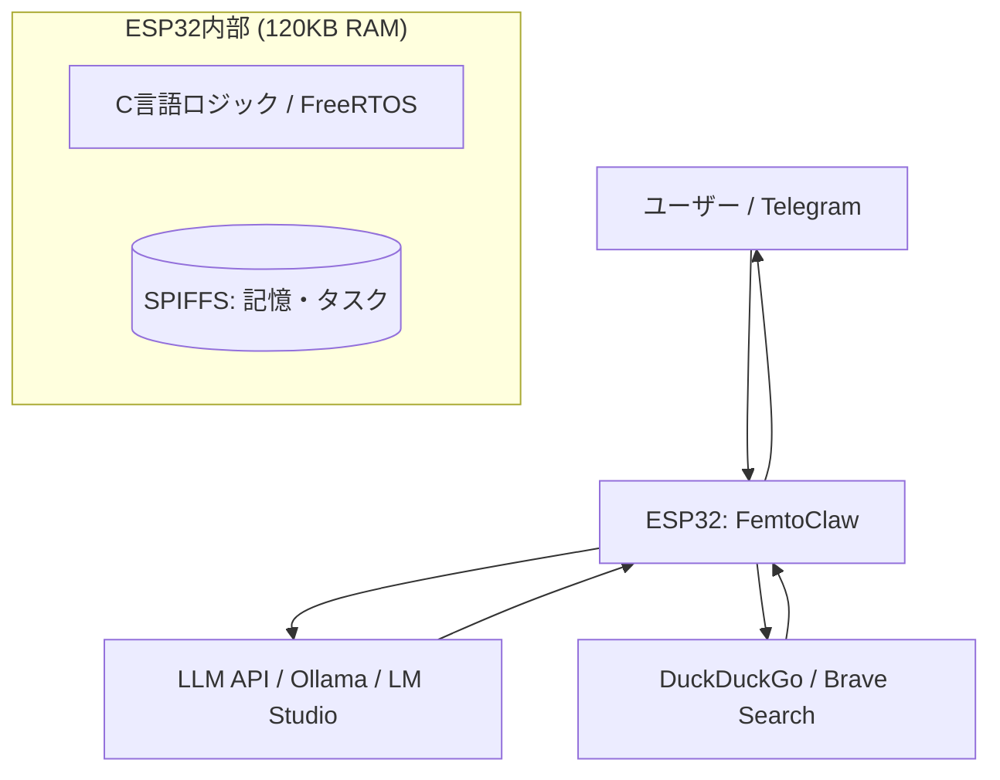

今回は、**FemtoClaw: I Built the World’s Smallest AI Assistant on a $4 Chip** という記事を読んで、リソースが極端に制限された環境でAIを動かすアプローチが非常に面白かったので、その内容を自分なりに整理して紹介します。

組込み技術者として興味深いので、一度作ってみようかなと思ってます。

「AIエージェントを動かすには、強力なGPUや数GBのメモリが必要」というイメージがあるかもしれません。しかし、今回紹介する「FemtoClaw」は、わずか4ドルのマイコン「ESP32」上で、メモリ120KBという過酷な条件下で動作するAIアシスタントです。LinuxもPythonも使わず、ピュアなC言語だけで実装されています。

## なぜESP32でAIエージェントなのか？

もともと、ESP32-S3（10ドル程度のボード）でAIエージェントを動かす「MimiClaw」というプロジェクトがありました。しかし、MimiClawは8MBのPSRAM（外付けメモリ）を搭載したモデルを前提としていました。

著者の手元にあったのは、2018年頃に広く普及した標準的な「ESP-WROOM-32」です。これにはPSRAMがありません。WiFiやOS（FreeRTOS）が起動した後に残るメモリは、わずか**120KB**程度。さらに、通信を暗号化するTLS接続を1つ張るだけで約120KBを消費してしまいます。

つまり、計算上は「何もできないはず」の状態から、いかにしてAIエージェントを動かすか、というパズルに挑んだのがこのプロジェクトなんですよ。

## FemtoClawが実現していること

これほど小さなデバイスでありながら、FemtoClawは単なるチャットボット以上の機能を持っています。

- **マルチモデル対応**: ClaudeやGPTだけでなく、ローカルのOllamaやLM Studioとも連携できます。
- **自律的な行動**: AI自身がcronジョブ（スケジュール）を作成し、定期的に「自分ですべきこと」を確認します。
- **長期記憶**: フラッシュメモリ上のSPIFFS領域にMarkdown形式で記憶を保存し、再起動しても内容を忘れません。
- **外部ツール利用**: 検索エンジン（DuckDuckGoやBrave Search）を使って最新情報を取得できます。

全体の処理の流れを図解すると、以下のようになります。



## 120KBの壁をどう乗り越えたか

もっとも困難だったのは、やはりメモリ管理です。以下の表を見ると、いかにリソースがタイトかがわかります。

| 項目 | 一般的なMimiClaw環境 | FemtoClaw (ESP32) |
| :--- | :--- | :--- |
| **ハードウェア** | ESP32-S3 | ESP-WROOM-32 |
| **外付けメモリ (PSRAM)** | 8MB | なし |
| **内部SRAM（空き）** | 約300KB〜 | **約120KB** |
| **主要な言語** | C言語 | C言語 |
| **通信プロトコル** | HTTPS (TLS) | HTTPS (TLS) |

ESP32でHTTPS通信を行うにはTLSスタックが必要ですが、これがメモリを大量に消費します。Telegramとの通信で1つ、LLM APIとの通信で1つ、合計2つの接続を維持しようとすると、それだけでメモリが底をついてしまいます。

これを解決するために、ベアメタルに近い環境で動作するC言語を使い、バッファ管理を徹底的に最適化したのがFemtoClawのポイントです。Pythonなどの高レイヤー言語では、ランタイムだけでメモリを使い果たしてしまいますが、C言語であれば「今どのバイトをどこに置くか」を精密にコントロールできるため、このサイズでもエージェントとして成立させられるわけですね。

## 実際の実装イメージ

コードの雰囲気としては、FreeRTOSのタスクとしてAIのループを回す形になります。たとえば、以下のようにSPIFFS（ファイルシステム）を使って「記憶」を読み書きする処理が含まれています。

```c
// 記憶をファイルに保存するイメージ
void save_memory(const char *content) {
    FILE* f = fopen("/spiffs/memory.md", "a");
    if (f == NULL) {
        // エラー処理
        return;
    }
    fprintf(f, "%s\n", content);
    fclose(f);
}
```

AIは何かを頼まれると、このファイルを確認し、必要であればDuckDuckGoを叩いて情報を補完し、回答を生成してTelegram経由でスマホに通知を送ります。

## まとめ：制約がエンジニアリングを面白くする

4ドルのチップでこれだけのことができるというのは、驚きというよりは「C言語による最適化の底力」を感じさせてくれます。最新のAIモデルを使いつつも、それを動かすのは枯れた技術であるC言語とマイコン、という組み合わせは、ハードウェアに近いエンジニアにとっては非常にワクワクする構成ではないでしょうか。

「メモリが足りないから動かない」と諦める前に、まだ削れるところはないか、管理の工夫で乗り切れないか。FemtoClawは、そんなエンジニアリングの原点を思い出させてくれるプロジェクトだと思います。

## 参照記事

- [FemtoClaw: I Built the World’s Smallest AI Assistant on a $4 Chip](https://medium.com/@manjunath.shiva/femtoclaw-i-built-the-worlds-smallest-ai-assistant-on-a-4-chip-0d537c90f230)
- [The 9 Hidden C Features Nobody Told You About (But Every Senior Dev Uses)](https://medium.com/@mahadrajpoot911/the-9-hidden-c-features-nobody-told-you-about-but-every-senior-dev-uses-e699a05e0d7e)
- [I Turned Karpathy’s Autoresearch Into a Agent Skill For Claude Code That Optimizes Anything — Here Is the Architecture](https://medium.com/@alirezarezvani/i-turned-karpathys-autoresearch-into-a-agent-skill-for-claude-code-that-optimizes-anything-here-97de83f2b7f0)
- [The Postgres Query That Brought Down Black Friday (89K RPS Disaster)](https://medium.com/@guvencanguven965/the-postgres-query-that-brought-down-black-friday-89k-rps-disaster-2d6b191784e3)
- [Claude Code Insane Nerf. AMD Noticed (Here’s How You Fix It).](https://medium.com/@alexjamesdunlop/anthropics-hidden-claude-code-nerf-amd-noticed-here-s-how-you-fix-it-424e0d4a6a65)
- [Python Is 93× Slower?! The MCP Benchmark That Shocked Developers](https://medium.com/@kanishks772/python-is-93-slower-the-mcp-benchmark-that-shocked-developers-7e1c5be6604e)

---

詳しくは[こちら](https://microarchitectures.jp/blog/femtoclaw-smallest-ai-agent-on-4-dollar-esp32-120kb/)をご覧ください。