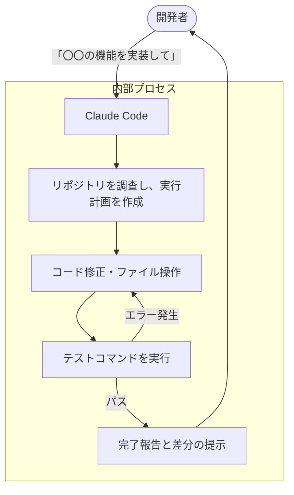

今回は、**Claude Code Is No Longer a Coding Assistant** という記事を参考にして、AIによるソフトウェア開発が「単なるお手伝い」から「自律的なワークフロー」へとどう変化しているのか、自分なりに整理してみました。

これまで多くのエンジニアが GitHub Copilot などのツールを使ってきましたが、Claude Code の登場によってその使い方が大きく変わろうとしています。単にコードを書いてもらうだけでなく、あたかも「AIの部下」に仕事を任せるような感覚に近づいているんです。

## コーディング・アシスタントから「AIワーカー」へ

これまで、AIは「コーディング・アシスタント」と呼ばれてきました。これは、「人間がハンドルを握り、AIがナビゲートや補助をする」というイメージですよね。

しかし、Claude Code が目指しているのは、もう少し踏み込んだ「AIワーカー」としての役割です。開発者が「このバグを直しておいて」「この機能を実装してテストまで通して」と大まかな指示を出すと、AIが自らファイルを探し、コードを読み、修正し、テストを実行して結果を確認する。そんな自律的な動きが特徴です。

従来のツールと、これからのAIワーカー的なツールの違いを表にまとめてみました。

| 特徴 | 従来のコーディング・アシスタント | Claude Code（AIワーカー） |
| :--- | :--- | :--- |
| **主な役割** | コードの補完・スニペットの提案 | 問題解決の自律的な遂行 |
| **操作の主体** | 人間がコードを書き、AIが部分的に手伝う | AIが計画を立て、人間がそれを承認する |
| **実行環境** | エディタ上でのテキスト生成 | ターミナル、ファイル操作、コマンド実行 |
| **守備範囲** | 関数やクラス単位の記述 | リポジトリ全体を俯瞰した変更・改善 |

## 自律的な開発フローの仕組み

Claude Code がどのように動くのか、そのプロセスを可視化してみましょう。

この流れの中で面白いのは、AIが「自分で自分にフィードバックをかける」という点です。テストが失敗したら、そのログを自分で読んで「ああ、ここが間違っていたのか」と修正案を出し直します。人間が逐一「ここが間違っているよ」と教える手間が省けるわけですね。

## 「サブ・エージェント」という考え方

さらに興味深いのが、Claude Code をひとつの司令塔として、特定のタスクに特化した「サブ・エージェント（スキル）」を使い分けるという手法です。

たとえば、以下のような役割分担が考えられます。

- **リサーチ担当**: 最新のライブラリ仕様やドキュメントを調べてくる。
- **リファクタリング担当**: コードの複雑度をチェックし、クリーンな設計に書き換える。
- **最適化担当**: パフォーマンスのボトルネックを見つけ、ハードウェアの特性に合わせた最適化を行う。

開発者は、これらのエージェントを束ねる「マネージャー」のような立場になります。自分で一つひとつのコードを書く時間は減り、代わりに「どの方向に進めるか」「最終的な成果物が要件を満たしているか」を判断する仕事がメインになっていくんですね。

## 開発者に求められるスキルの変化

ツールが「アシスタント」から「自律的なワーカー」に変わることで、私たち開発者に求められるスキルも少しずつ変化していきそうです。

1.  **問題定義の力**: AIに何をさせるべきか、具体的かつ適切なゴールを設定する能力。
2.  **レビュー能力**: AIが書いたコードや、実行したテストの結果が本当に正しいかを見抜く力。
3.  **アーキテクチャ設計**: 個別のコードはAIが書けても、システム全体の整合性や長期的な保守性を判断するのは、まだ人間の役割です。

たとえば、「このAPIのレスポンスを速くして」と頼むのは簡単ですが、そのためにデータベースの構成を変えるのか、キャッシュを入れるのか、あるいは通信プロトコルを見直すのか。そういった「戦略」の部分がより重要になってきます。

## まとめ

Claude Code のようなツールを使ってみると、もはや「コードの書き方を教わっている」のではなく、「開発プロセスそのものを外注している」ような感覚になります。これは、開発のスピードを上げるだけでなく、人間がより本質的な設計や価値創造に集中できる環境を作ってくれるものだと感じています。

もちろん、すべてをAI任せにするのはまだリスクがありますが、AIを「有能なチームメンバー」としてどう使いこなすか、そのマネジメントの視点を持つことが、これからの開発者にとって大切なポイントになりそうですね。

## 参照記事

- [Claude Code Is No Longer a Coding Assistant](https://medium.com/@alirezarezvani/claude-code-is-no-longer-a-coding-assistant-0966d2cb5fbb)
- [I Turned Karpathy’s Autoresearch Into a Agent Skill For Claude Code That Optimizes Anything — Here Is the Architecture](https://medium.com/@alirezarezvani/i-turned-karpathys-autoresearch-into-a-agent-skill-for-claude-code-that-optimizes-anything-here-97de83f2b7f0)
- [Why Every Developer Needs Claude Code Sub Agents (And How I Build Them)](https://medium.com/@alexjamesdunlop/why-every-developer-needs-claude-code-sub-agents-and-how-i-build-them-551c2ae4aab0)
- [97% of Developers Kill Their Claude Code Agents in the First 10 Minutes (Here’s How The 3% Build Unstoppable Systems)](https://medium.com/@alirezarezvani/97-of-developers-kill-their-claude-code-agents-in-the-first-10-minutes-heres-how-the-3-build-d2b6913f4cb2)
- [How the Creator of Claude Code Actually Uses It: 13 Practical Moves](https://medium.com/@jpcaparas/how-the-creator-of-claude-code-actually-uses-it-13-practical-moves-2bf02eec032a)
- [I Tested This Autonomous Framework That Turns Claude Code Into a Virtual Dev Team](https://medium.com/@joe.njenga/i-tested-this-autonomous-framework-that-turns-claude-code-into-a-virtual-dev-team-a030ab702630)

---

詳しくは[こちら](https://microarchitectures.jp/blog/from-coding-to-managing-ai-workers-claude-code-evolution/)をご覧ください。