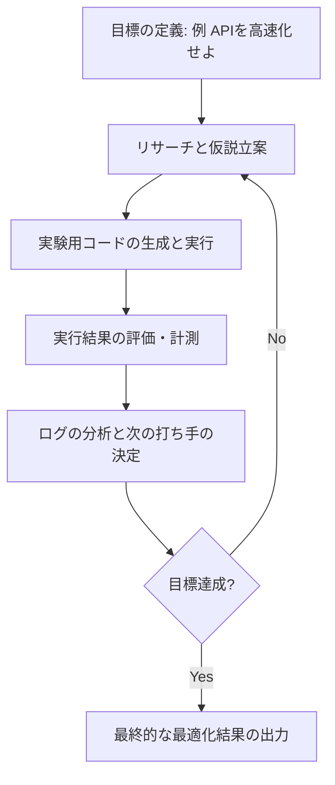

Andrej Karpathy氏が公開した「Autoresearch」というプロジェクトのコンセプトに触発され、それを実用的なエージェントスキルへ落とし込む試みが注目を集めています。今回は、**I Turned Karpathy’s Autoresearch Into a Agent Skill For Claude Code That Optimizes Anything — Here Is the Architecture** という記事を参考に、あらゆる課題を自動で最適化するエージェントの仕組みについて解説します。

ちょっと面白そうな内容だったので参考まで。　

---

## Karpathyの「Autoresearch」とは何か？

Andrej Karpathy氏が公開したAutoresearchは、非常にシンプルなコード（わずか630行ほど）で構成されています。このプロジェクトの本質は、高度なアルゴリズムそのものではなく、**「人間が寝ている間にエージェントが実験を繰り返し、損失曲線を下げ続ける」**というループの構造にあります。

この仕組みを、単なる「研究用」として終わらせるのではなく、日々の開発業務で発生する「APIのレスポンス改善」や「プロンプトの品質向上」といった具体的な課題に適用しようというのが、今回のエージェントスキルの狙いです。

## 自動最適化ループのアーキテクチャ

このエージェントスキルがどのように動くのか、そのプロセスを可視化してみましょう。基本的には、以下の図のようなサイクルを繰り返すことで、目標とする指標を改善していきます。



この流れは、私たちエンジニアが普段行っている「修正して、試して、ログを見て、また直す」という作業そのものですよね。これをClaude Codeのようなエージェントに「スキル」として持たせることで、文字通り「寝ている間に終わらせる」ことが可能になります。

## 3つのコア・コンポーネント

このアーキテクチャを支えるのは、大きく分けて3つの要素です。

### 1. 制約に基づいた「リサーチ」
エージェントに闇雲にコードを書かせるのではなく、「今のボトルネックは何か？」「過去の失敗から何を学べるか？」を考えさせます。Karpathy氏のコードが短かったように、複雑な指示よりも「シンプルなループを維持する」という制約が、逆にエージェントの動きを研ぎ澄ませる結果につながります。

### 2. 実行環境のサンドボックス化
エージェントが生成したコードを安全に実行し、そのパフォーマンス（実行時間やメモリ使用量、あるいは生成物の質）を客観的に測定する場所が必要です。Claude Codeはローカルファイルへのアクセスやコマンド実行ができるため、この「実験」のステップと相性がいいわけですね。

### 3. 分析ログの蓄積
「どの修正が効果的だったのか」を逐一記録します。たとえば、以下のような表形式で進捗を管理するイメージです。

| 試行回数 | 実施した施策 | 指標（例：レスポンス時間） | 結果 |
| :--- | :--- | :--- | :--- |
| 第1回 | キャッシュ処理の追加 | 500ms → 320ms | 改善（採用） |
| 第2回 | ライブラリの並列化 | 320ms → 310ms | 微増（不採用） |
| 第3回 | クエリの最適化 | 310ms → 120ms | 大幅改善（採用） |

## 具体的な活用シーン

この「最適化スキル」をClaude Codeに組み込むと、以下のような作業を自動化できるようになります。

- **APIのレイテンシ削減**: 複数の実装パターンを自動で試し、最も速いコードを選択させる。
- **プロンプトエンジニアリング**: LLMへの指示文を少しずつ変化させ、テストケースに対する正解率が最も高いプロンプトを見つけ出す。
- **フロントエンドのCTR改善**: 見出しのパターンを複数生成し、既存のデータに基づいてスコアリングを行う。

たとえば、プロンプトの最適化を依頼する場合、以下のような指示からスタートすることになります。

```bash
# Claude Codeへの指示イメージ
"autoresearchスキルを使って、このプロンプトの精度を80%以上に引き上げて。
実験のログは logs/prompt_optimization.md に残しておいてね。"
```

このように指示を投げれば、あとはエージェントが「仮説→実験→分析」を自動で回し、最終的に「最もパフォーマンスの良いプロンプト」を納品してくれる、というわけです。

## まとめ

Karpathy氏のAutoresearchから学べる最も重要なことは、**「優れたループは、優れたコードに勝る」**ということかもしれません。

あえて機能を絞り、改善のサイクルを高速に回すことに特化させる。この考え方をClaude Codeのエージェントスキルとして実装することで、これまで人間が時間を溶かしていた「微調整の繰り返し」という作業から解放される道筋が見えてきます。

「とりあえずこの部分を速くしておいて」とエージェントに伝えて、自分はコーヒーを飲みに行く。そんな開発スタイルが、すぐそこまで来ているように感じられますね。

## 参照記事

- [I Turned Karpathy’s Autoresearch Into a Agent Skill For Claude Code That Optimizes Anything — Here Is the Architecture](https://medium.com/@alirezarezvani/i-turned-karpathys-autoresearch-into-a-agent-skill-for-claude-code-that-optimizes-anything-here-97de83f2b7f0)
- [Why Every Developer Needs Claude Code Sub Agents (And How I Build Them)](https://medium.com/@alexjamesdunlop/why-every-developer-needs-claude-code-sub-agents-and-how-i-build-them-551c2ae4aab0)
- [97% of Developers Kill Their Claude Code Agents in the First 10 Minutes (Here’s How The 3% Build Unstoppable Systems)](https://medium.com/@alirezarezvani/97-of-developers-kill-their-claude-code-agents-in-the-first-10-minutes-heres-how-the-3-build-d2b6913f4cb2)
- [How the Creator of Claude Code Actually Uses It: 13 Practical Moves](https://medium.com/@jpcaparas/how-the-creator-of-claude-code-actually-uses-it-13-practical-moves-2bf02eec032a)
- [I Tested This Autonomous Framework That Turns Claude Code Into a Virtual Dev Team](https://medium.com/@joe.njenga/i-tested-this-autonomous-framework-that-turns-claude-code-into-a-virtual-dev-team-a030ab702630)
- [Claude Code is No Longer the King of Coding](https://medium.com/@dreamferus/claude-code-is-no-longer-the-king-of-coding-75a22f95ddd2)

---

詳しくは[こちら](https://microarchitectures.jp/blog/karpathy-autoresearch-claude-code-skill-auto-optimization/)をご覧ください。