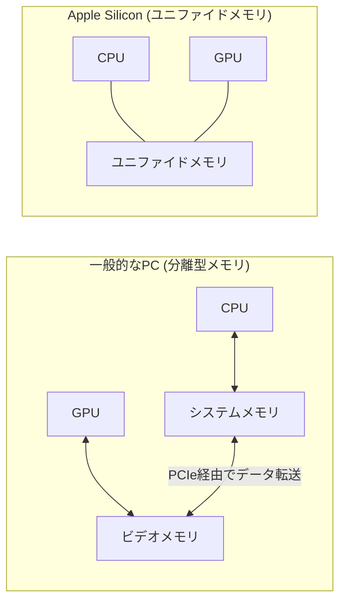

リチャード・クイン氏による **Hidden States on a Mac Mini: Using MLX for Real ML Research** という記事を読み、手元のコンパクトなマシンでここまで深い研究ができるのかと興味深く感じたので、その内容を自分なりに整理して紹介します。

MLX速いですよね。「mojo from scratch」でmicrogpt.pyをベースに色々いじってみて、MLX版も作ってみましたが、Mac環境では最速でした。もう少し詳しくなりたいなぁ。

---

これまで、大規模言語モデル（LLM）の研究といえば、高価なNVIDIAのGPUを積んだサーバーや、高額なクラウドサービスを利用するのが当たり前だと思われてきました。しかし、Apple Siliconと専用フレームワーク「MLX」の登場によって、その常識が少しずつ変わり始めています。

## なぜMac Miniが研究に向いているのか

「Mac MiniでAIなんて、趣味のレベルでしょ？」と思う方もいるかもしれません。でも、実はMac Mini（特にM2やM3チップ搭載モデル）は、特定の研究タスクにおいて非常に理にかなった選択肢なんです。

一番の理由は、Apple Silicon特有の「ユニファイドメモリ（Unified Memory）」構造にあります。

### ユニファイドメモリの仕組み

通常のPCやサーバーでは、CPU用のメモリ（RAM）とGPU用のメモリ（VRAM）が分かれています。データを処理するたびに、この間を行ったり来たりさせる必要があるのですが、これがボトルネックになります。

Apple Siliconでは、CPUとGPUが同じメモリプールを共有しています。



この「データの引っ越し」が不要になる仕組みのおかげで、メモリを大量に消費するLLMの内部状態の解析などが、驚くほどスムーズに行えるようになります。

## MLX：Apple Siliconのための新しい道具

このハードウェアの力を引き出すためにAppleが開発したのが「MLX」というフレームワークです。PyTorchを使っている人なら、違和感なく移行できるような設計になっています。

MLXが研究において優れている点を表にまとめてみました。

| 特徴 | PyTorch (Mac上) | MLX |
| :--- | :--- | :--- |
| **メモリ効率** | メタル（GPU）への転送が発生 | ゼロコピー（共有メモリを直接参照） |
| **APIの馴染みやすさ** | 標準的 | PyTorchに酷似しており学習コストが低い |
| **最適化** | 一般的 | Apple Siliconの各コアに最適化済み |
| **遅延評価** | 基本なし | 計算が必要になるまで実行を遅らせる効率的な仕組み |

## 「隠された状態（Hidden States）」を覗き見る

元記事で焦点が当てられているのは、LLMの「隠された状態（Hidden States）」の抽出です。

LLMは、入力されたテキストを処理する過程で、内部的にいくつもの層（レイヤー）を通ります。それぞれの層でデータがどう変換されているのか——つまりモデルが「何を考えているのか」を探るのが、インタープリタビリティ（解釈性）研究と呼ばれる分野です。

たとえば、次のようなコードで特定の層の出力を取り出すことができます（概念的なイメージです）。

```python
import mlx.core as mx
from mlx_lm import load, generate

# モデルの読み込み
model, tokenizer = load("mlx-community/Llama-3-8B-Instruct-4bit")

# 隠された状態を保存するためのリスト
hidden_states = []

# フック（処理の途中に割り込む仕組み）のような形で
# 各レイヤーの出力をキャプチャする
def capture_hidden_states(layer_output):
    hidden_states.append(layer_output)
    return layer_output

# MLXなら、これらをGPUメモリの制約をあまり気にせず、
# ローカルでじっくり解析できるのが強みです
```

この「隠された状態」は、モデルのバイアスを特定したり、特定の知識がどこに格納されているかを探ったりするのに使われます。クラウドだとデータの転送量や保存コストが気になりますが、手元のMac Miniなら、納得がいくまで何度でも実験を繰り返せます。

## まとめ：ローカル研究の新しい形

これまでは「研究＝巨大な計算リソース」というイメージでしたが、Mac MiniとMLXの組み合わせは、個人や小規模なチームに新しい可能性を提示しています。

もちろん、超大規模なモデルのトレーニングにはまだ力不足ですが、既存のモデルを動かし、その内部を詳しく調査するような研究であれば、Mac Miniは「静かで、熱を持たず、かつ経済的な」最高の研究室になってくれるはずです。

「高価なサブスクリプションやクラウド料金を気にせず、自分のマシンで24時間好きなだけコードを回す」。そんなスタイルに興味がある方は、ぜひMLXを触ってみてください。

## 参照記事

- [Hidden States on a Mac Mini: Using MLX for Real ML Research](https://medium.com/@quinn-richard/hidden-states-on-a-mac-mini-using-mlx-for-real-ml-research-9b2356309954)
- [Why Thousands Are Buying Mac Minis to Escape Big Tech AI Subscriptions Forever | Clawdbot](https://medium.com/@mayhemcode/why-thousands-are-buying-mac-minis-to-escape-big-tech-ai-subscriptions-forever-clawdbot-10c970c72404)
- [I Turned Karpathy’s Autoresearch Into a Agent Skill For Claude Code That Optimizes Anything — Here Is the Architecture](https://medium.com/@alirezarezvani/i-turned-karpathys-autoresearch-into-a-agent-skill-for-claude-code-that-optimizes-anything-here-97de83f2b7f0)
- [Claude Code Insane Nerf. AMD Noticed (Here’s How You Fix It).](https://medium.com/@alexjamesdunlop/anthropics-hidden-claude-code-nerf-amd-noticed-here-s-how-you-fix-it-424e0d4a6a65)
- [Python Is 93× Slower?! The MCP Benchmark That Shocked Developers](https://medium.com/@kanishks772/python-is-93-slower-the-mcp-benchmark-that-shocked-developers-7e1c5be6604e)
- [9K RPS Killed Our System in 4 Minutes — The $360K Black Friday Disaster](https://medium.com/@guvencanguven965/9k-rps-killed-our-system-in-4-minutes-the-360k-black-friday-disaster-8b700382a43a)

---

詳しくは[こちら](https://microarchitectures.jp/blog/mac-mini-serious-ml-research-mlx-hidden-states/)をご覧ください。