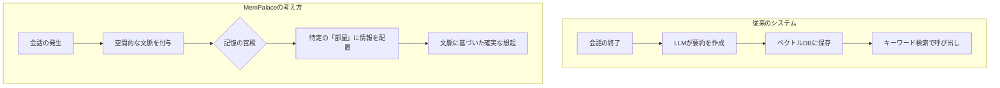

話題のAI記憶システムについて書かれた **MemPalace: The Viral AI Memory System That Got 22K Stars in 48 Hours (An Honest Look and Setup Guide)** を読み、AIのコンテキスト管理における課題と解決策について自分なりに整理してみました。

AIエージェントを使っていると、必ずと言っていいほど直面する問題があります。それは「昨日話したことを、今日のAIは覚えていない」ということです。

どれだけ丁寧にプロジェクトの背景やコードの好みを説明しても、チャットのセッションが切れれば、AIはまっさらな状態に戻ってしまいます。この「ステートレス（状態を持たない）」というLLMの性質は、長期的な開発パートナーとしてAIを活用する上での大きな壁になっています。

## なぜこれまでの「記憶」では不十分だったのか？

この問題に対して、これまで業界では主に2つの方法で対処してきました。しかし、どちらも完璧ではありません。

| 手法 | 仕組み | 課題 |
| :--- | :--- | :--- |
| **コンテキスト拡張** | 一度に読み込めるトークン量を増やす | コストが高く、情報の「中だるみ（Lost in the Middle）」が起きやすい。 |
| **ベクトル検索（RAG）** | 会話履歴を検索して、似た内容を呼び出す | 「いつ話したか」といった時間的な推論や、複雑なロジックの追跡が苦手。 |

特にベクトル検索（RAG）の場合、たとえば「1ヶ月前の認証仕様」と「昨日の修正案」を混同してしまうような、時間軸が重要な情報の扱いには限界がありました。

## 異色のプロジェクト「MemPalace」の登場

そんな中で登場したのが、**MemPalace** です。このプロジェクトは、GitHubに公開されてからわずか48時間で2.2万ものスターを獲得し、大きな注目を集めました。

興味深いのは、その開発背景です。発案者は、映画『フィフス・エレメント』や『バイオハザード』で知られる女優のミラ・ジョヴォヴィッチ氏。彼女が自身のゲームプロジェクトで「AIが世界観を覚えてくれない」という不満を抱いたことがきっかけだそうです。

彼女は、古代ギリシャの記憶術である「座所法（Method of Loci）」、いわゆる「記憶の宮殿」という技法に着目しました。これは、架空の空間（宮殿）をイメージし、その部屋や家具に覚えたい情報を関連付ける手法です。MemPalaceは、この空間的なメタファーをAIの記憶管理に応用しようとしています。

## MemPalaceが目指す仕組み

MemPalaceの特徴は、単に会話履歴を詰め込むのではなく、AIが情報を「どこに配置するか」を定義する点にあります。

一般的なメモリシステムとMemPalaceの流れを比較すると、以下のようなイメージになります。



### 「何を覚えるか」をAI任せにしない

Mem0やZepといった既存のシステムは、会話が終わった後にLLMに「重要な事実を要約して保存して」と頼むのが一般的です。しかし、これでは「何が重要か」の判断をAIに依存してしまい、開発者が本当に覚えておいてほしいニュアンスがこぼれ落ちることがあります。

MemPalaceは、情報の保存先を空間的に整理することで、この検索精度を上げようとしています。たとえば、「プロジェクトのルート構成に関する情報」は宮殿の「設計図の部屋」に、「昨日のバグ修正の経緯」は「作業ログの廊下」に置く、といった具合に、情報に構造的な住所を与えるイメージです。

## セットアップと実装のヒント

MemPalaceはPythonベースのリポジトリとして公開されています。MITライセンスなので、自分のプロジェクトに組み込むことも可能です。

基本的なセットアップの流れは以下の通りです。

インストール

記事ではpipでのインストールになっていましたが github を見ると変わっていたので、こちらが最新のインストール方法みたいですね。

```bash
uv tool install mempalace
mempalace init ~/projects/myapp
```

コードの中では、情報を単なるテキストの塊として扱うのではなく、属性（Attribute）や空間的なタグを持たせて管理するロジックが実装されています。これにより、数ヶ月前の会話であっても「あの特定の文脈」を引っ張り出しやすくなっています。

## まとめ：AIとの共同作業を「積み上げ」に変える

MemPalaceのようなシステムが実用的になれば、AIエージェントは「毎回初対面のエンジニア」から「自分の癖やプロジェクトの歴史を熟知した相棒」へと進化するかもしれません。

もちろん、まだ初期のプロジェクトであり、今後の改善が必要な部分もあるかなと思います。しかし、単に計算リソース（コンテキスト窓）を増やすのではなく、人間が古くから使ってきた「記憶術」という知恵をソフトウェアに応用するというアプローチは、非常に理にかなっているように感じます。

AIがあなたの「好み」や「過去の決定事項」を忘れなくなるだけで、日々の開発体験はぐっとスムーズになるはずです。興味のある方は、ぜひ自身のプロジェクトで試してみてください。

## 参照記事

- [MemPalace: The Viral AI Memory System That Got 22K Stars in 48 Hours (An Honest Look and Setup Guide)](https://medium.com/@creativeaininja/mempalace-the-viral-ai-memory-system-that-got-22k-stars-in-48-hours-an-honest-look-and-setup-26c234b0a27b)
- [The New Claude Code’s Auto-Memory Feature Just Changed How My Team Works — Here Is the Setup I Actually Build](https://medium.com/@alirezarezvani/the-new-claude-codes-auto-memory-feature-just-changed-how-my-team-works-here-is-the-setup-i-5126174b35dc)
- [Claude Code /btw: The Usefull Side Question That Changed How I Use Context](https://medium.com/@alirezarezvani/claude-code-btw-the-usefull-side-question-that-changed-how-i-use-context-d30ddea4aa2d)
- [I Turned Karpathy’s Autoresearch Into a Agent Skill For Claude Code That Optimizes Anything — Here Is the Architecture](https://medium.com/@alirezarezvani/i-turned-karpathys-autoresearch-into-a-agent-skill-for-claude-code-that-optimizes-anything-here-97de83f2b7f0)
- [The Postgres Query That Brought Down Black Friday (89K RPS Disaster)](https://medium.com/@guvencanguven965/the-postgres-query-that-brought-down-black-friday-89k-rps-disaster-2d6b191784e3)
- [Claude Code Insane Nerf. AMD Noticed (Here’s How You Fix It).](https://medium.com/@alexjamesdunlop/anthropics-hidden-claude-code-nerf-amd-noticed-here-s-how-you-fix-it-424e0d4a6a65)

---

詳しくは[こちら](https://microarchitectures.jp/blog/mempalace-new-approach-to-prevent-ai-forgetting-22k-stars/)をご覧ください。