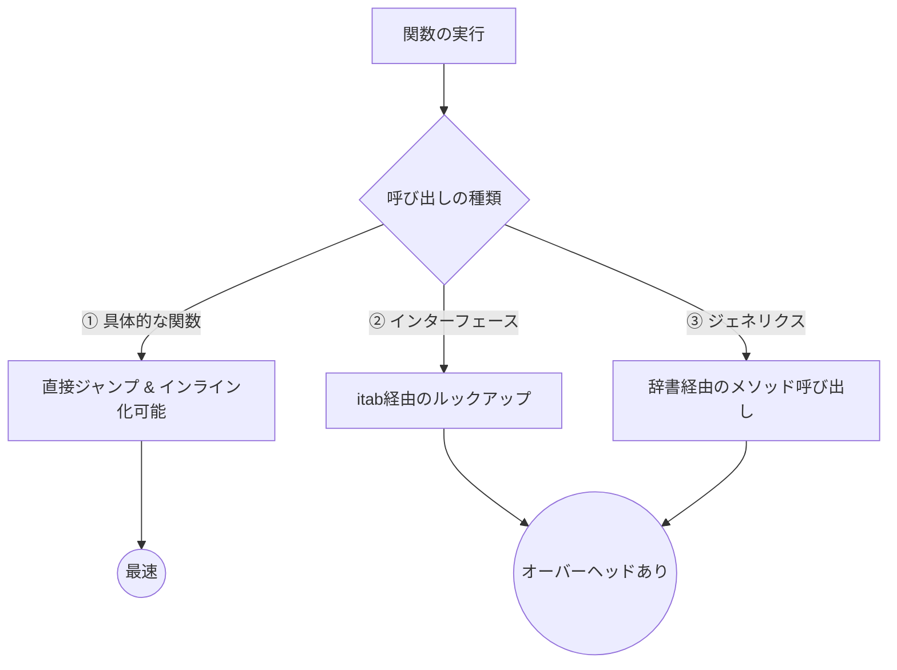

今回は、**Andrii's Blog** の記事を参考に、Go言語でパフォーマンスを極限まで追求する際に直面する「抽象化と速度のトレードオフ」について自分なりに整理してみました。

あまり見かけない go 言語で最適化すると言う話題(あれ、ぼくだけ😅)で、興味深かったです。参考まで。

---

Goは書きやすくて実行速度も速い、バランスの取れた良い言語ですよね。でも、画像処理や圧縮アルゴリズム（Brotliなど）のように、CPUの性能を限界まで引き出したい「ホットパス」を実装しようとすると、少し困った問題にぶつかることがあるんです。

それは、**「きれいな抽象化を使おうとすると、コードが遅くなる」**というジレンマです。

## なぜ抽象化が「コスト」になるのか？

C++やRustを使っている人なら、「ジェネリクスを使っても、コンパイル時に具体的なコードに展開されるから速度は落ちない（ゼロコスト抽象化）」というイメージを持っているかもしれません。

ところが、Goのジェネリクスは少し仕組みが違います。Goは「GC Shape Stenciling」という手法を使っていて、コンパイル時にある程度は共通化されるのですが、**型パラメータに対するメソッド呼び出し**が発生すると、結局はインターフェースのような動的なディスパッチに近い処理が行われてしまいます。

その結果、コンパイラにとって最も重要な最適化の一つである「インライン化」が妨げられてしまうんですね。

### 呼び出し方式による処理の違い

イメージとしては、以下のような違いがあります。



具体的にコードで見てみましょう。

## 3つの実装パターンの比較

たとえば、ハッシュテーブルに値を格納する処理を考えてみます。ハッシュ関数の計算方法だけを切り替えたい場合、以下の3つの書き方があります。

### 1. 具体的な関数（Concrete）
特定のハッシュ計算を直接書き込んだバージョンです。

```go
func StoreConcrete(t *Table, data []byte) {
    end := uint32(len(data))
    for i := uint32(0); i+4 <= end; i++ {
        v := binary.LittleEndian.Uint32(data[i:])
        // ここに直接ロジックを書く
        key := (v * HashMul32) >> (32 - BucketBits)
        // ... 格納処理
    }
}
```

### 2. ジェネリクス（Generic）
インターフェースを型制約として使い、型パラメータで切り替える方法です。

```go
type Hasher interface {
    Hash(v uint32) uint32
}

func StoreGeneric[H Hasher](t *Table, data []byte) {
    var h H
    // ...
    key := h.Hash(v) // ここがインライン化されにくい
    // ...
}
```

### 3. インターフェース（Interface）
実行時に引数として渡す、最も一般的なポリモーフィズムです。

```go
func StoreInterface(t *Table, data []byte, h Hasher) {
    // ...
    key := h.Hash(v) // 実行時にメソッドを探すので遅い
    // ...
}
```

## パフォーマンスとメンテナンス性のトレードオフ

これらを比較すると、以下のような特性になります。

| 実装方法 | インライン化 | 実行速度 | メンテナンス性 |
| :--- | :--- | :--- | :--- |
| **具体的な関数** | されやすい | **最高** | 低い（重複が増える） |
| **ジェネリクス** | されにくい | 中〜低 | 高い |
| **インターフェース** | されない | 低 | 高い |

元記事の筆者がBrotliの移植をしていた際には、なんと**16個ものほぼ同じ関数**を手動で複製して、それぞれに異なるハッシュ関数を直接書き込んだそうです。

「そんなのコードが汚くなるじゃないか！」と思うかもしれませんが、ホットパスにおいてはこの「手動コピー＆ペースト」が、コンパイラの最適化を引き出すためのもっとも確実な方法になってしまうわけですね。

## 結局、どうすべきか？

もちろん、すべてのコードでこんなことをする必要はありません。ほとんどのアプリケーションでは、ジェネリクスやインターフェースを使っても十分に高速です。

ただ、以下のようなケースでは「あえて抽象化を捨てる」勇気が必要かもしれません。

1.  **非常にタイトなループ（ホットパス）である。**
2.  **その中での数ナノ秒の遅延が、全体のパフォーマンスに直結する。**
3.  **ベンチマークを取ってみて、抽象化による劣化が明らかである。**

もし2〜3個のバリエーションなら手動でコピーし、それ以上増えるようなら「コード生成（go generate）」を使って、ソースコードを自動で複製する仕組みを作るのが、現実的な落とし所になりそうです。

Goのコンパイラも進化していますが、現時点では「一番速いのは、抽象化されていない剥き出しのコード」という事実は、頭の片隅に置いておくと良さそうですね。

## 参照記事

- [Andrii's Blog](https://blog.andr2i.com/posts/2026-05-03-notes-from-optimizing-cpu-bound-go-hot-paths)
- [Stop Writing Go Like It’s 2017: 15 Modern Patterns You Should Be Using](https://medium.com/@hxzhouh/stop-writing-go-like-its-2017-15-modern-patterns-you-should-be-using-0a2b6339549d)
- [Inside the Secret Tools Real Rust Teams Use (That Cargo Doesn’t Want You to Know About)](https://medium.com/@theopinionatedev/inside-the-secret-tools-real-rust-teams-use-that-cargo-doesnt-want-you-to-know-about-ee22b21be193)
- [Go Just Killed Rust’s Only Advantage (And Nobody’s Talking About It)](https://medium.com/@kanishks772/go-just-killed-rusts-only-advantage-and-nobody-s-talking-about-it-0d5fc550f355)
- [7 Underused Rust Features Every Senior Developer Knows](https://medium.com/@Krishnajlathi/7-underused-rust-features-every-senior-developer-knows-7b8bb8da684f)
- [The Hidden Power of Rust’s Hyper Library — Why It Beats Every Other HTTP Framework](https://medium.com/@syntaxSavage/the-hidden-power-of-rusts-hyper-library-why-it-beats-every-other-http-framework-19fc1858b39d)

---

詳しくは[こちら](https://microarchitectures.jp/blog/fastest-go-hot-paths-manual-copy-vs-abstraction/)をご覧ください。