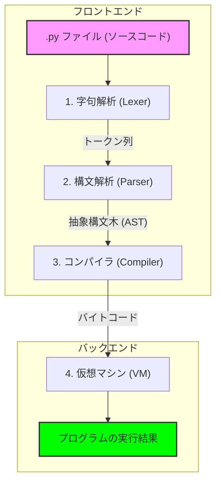

普段、何気なく `python script.py` と入力してプログラムを動かしていますが、その裏側で実際に何が起きているか、立ち止まって考えたことはあるでしょうか。今回は、**How Python Actually Executes Your Code: A Visual Walk Through the Interpreter That Most Developers Never See** という記事を参考に、Pythonインタープリタの内部でソースコードがどのように処理されていくのかを整理してみました。

こういう話、ある程度のプログラマなら分かっていると思ってるんだけど、解説とかすると喜ばれる物なのかな？

---

「Pythonはインタープリタ言語だから、一行ずつ実行されるんだよね」という理解は、実は半分正解で半分は言葉足らずだったりします。その「魔法」の正体を解き明かしていきましょう。

## 5秒でわかる！Python実行の全体像

Pythonがあなたの書いた `.py` ファイルを読み込んでから結果を出力するまでには、大きく分けて4つのステージがあります。



多くの人が「Pythonはコンパイルされない」と思いがちですが、実際には実行のたびに「バイトコード」へと高速でコンパイルされ、それを仮想マシンが解釈して動かしているんです。この仕組みがわかると、なぜ2回目以降のインポートが速いのか、なぜ `.pyc` ファイルが生成されるのかといった謎が解けてきます。

---

## ステップ 1：トークン化（字句解析）

まず、Pythonはソースコードを「テキスト」としてではなく、「意味のある最小単位（トークン）」の集まりとして分解します。これを字句解析（Lexing）と呼びます。

たとえば、次のような単純な関数を考えてみましょう。

```python
def add(a, b):
    return a + b
```

レクサー（字句解析器）は、これをバラバラにして以下のようなトークンのリストに変換します。

| 元のコード | トークンの種類 | 説明 |
| :--- | :--- | :--- |
| `def` | NAME | この段階ではまだ「予約語」ではなく単なる名前 |
| `add` | NAME | 関数の名前 |
| `(` | OP | 演算子・記号 |
| `a` | NAME | 引数名 |
| `:` | OP | 区切り記号 |
| (改行) | NEWLINE | 文の終わり |
| (空白4つ) | INDENT | Python特有のインデント構造 |

面白いのは、**インデントも一つのトークンとして扱われる**という点です。Pythonにとって、スペースは単なる余白ではなく、コードの構造を決める重要な部品なんですね。

---

## ステップ 2：構文解析（ASTの構築）

トークンの羅列ができただけでは、まだPythonは「何をすべきか」を理解していません。次に、これらのトークンをルールに基づいて並べ替え、「家系図」のようなツリー構造を作ります。これが **抽象構文木（AST: Abstract Syntax Tree）** です。

ここで初めて、`def` という名前が「関数の定義」を意味し、`return` が「値を返す操作」であることが認識されます。もし括弧を閉じ忘れていたり、インデントがめちゃくちゃだったりすると、この段階で `SyntaxError` が発生して止まります。

---

## ステップ 3：コンパイル（バイトコードへの変換）

ASTができあがると、Pythonはそれを **バイトコード** と呼ばれる中間形式に変換します。これは人間には読めませんが、コンピュータ（仮想マシン）にとっては非常に効率よく読み取れる命令セットです。

Pythonがコンパイル言語（C++など）と違うのは、このコンパイルがメモリ上で行われ、実行のたびに（あるいは必要に応じて `.pyc` ファイルとして）生成される点です。

実際に `dis` モジュールを使うと、自分のコードがどんなバイトコードになっているか覗き見ることができます。

```python
import dis

def add(a, b):
    return a + b

dis.dis(add)
```

実行すると、以下のような「スタックマシン」向けの命令が表示されます。

1. `LOAD_FAST 0 (a)` : 変数 a を読み込む
2. `LOAD_FAST 1 (b)` : 変数 b を読み込む
3. `BINARY_ADD`       : 2つの値を足す
4. `RETURN_VALUE`     : 結果を返す

---

## ステップ 4：仮想マシン（実行）

最後の手順が、**Python仮想マシン（PVM）** による実行です。

PVMは先ほどのバイトコードを上から順番に読み込み、CPUに伝わる機械語の命令へと変換して実行していきます。ここがまさに「インタープリタ（解釈実行）」と呼ばれる部分です。

PythonがC言語などに比べて遅いと言われる理由は、この「バイトコードを一個ずつ読み取って、適切な処理を呼び出す」というループ処理が、純粋な機械語の実行に比べてオーバーヘッドが大きいからなんですね。

---

## まとめ：仕組みを知ると「なぜ」が見えてくる

「Pythonの実行プロセス」を紐解いてみると、単純なスクリプトの裏側でかなりシステマチックな変換が行われていることがわかります。

- **なぜ初回実行より2回目の方が速いのか？** → すでにコンパイル済みのバイトコード（`.pyc`）があるからです。
- **なぜ動的型付けなのか？** → 仮想マシンが実行時に（`BINARY_ADD` を行うその瞬間に）データの型を見て、適切な計算方法を選んでいるからです。

こうした内部構造を知ることは、単に知識を増やすだけでなく、パフォーマンスの最適化やデバッグの際にも「マシンの気持ち」を理解する助けになります。普段書いているコードが、実は精巧なパイプラインを通って動いていると想像してみると、いつもの開発が少し違って見えてくるかもしれません。

## 参照記事

- [How Python Actually Executes Your Code: A Visual Walk Through the Interpreter That Most Developers Never See](https://medium.com/@sohail_saifi/how-python-actually-executes-your-code-a-visual-walk-through-the-interpreter-that-most-developers-13623bb75db7)
- [I Turned Karpathy’s Autoresearch Into a Agent Skill For Claude Code That Optimizes Anything — Here Is the Architecture](https://medium.com/@alirezarezvani/i-turned-karpathys-autoresearch-into-a-agent-skill-for-claude-code-that-optimizes-anything-here-97de83f2b7f0)
- [The Postgres Query That Brought Down Black Friday (89K RPS Disaster)](https://medium.com/@guvencanguven965/the-postgres-query-that-brought-down-black-friday-89k-rps-disaster-2d6b191784e3)
- [Claude Code Insane Nerf. AMD Noticed (Here’s How You Fix It).](https://medium.com/@alexjamesdunlop/anthropics-hidden-claude-code-nerf-amd-noticed-here-s-how-you-fix-it-424e0d4a6a65)
- [Python Is 93× Slower?! The MCP Benchmark That Shocked Developers](https://medium.com/@kanishks772/python-is-93-slower-the-mcp-benchmark-that-shocked-developers-7e1c5be6604e)
- [DeepSeek V4 Runs Locally on Your GPU. That Changes Everything the Cloud AI Companies Didn’t Want Changed.](https://medium.com/@sohail_saifi/deepseek-v4-runs-locally-on-your-gpu-a738bf2acef6)

---

詳しくは[こちら](https://microarchitectures.jp/blog/peeking-inside-python-4-steps-to-code-execution/)をご覧ください。