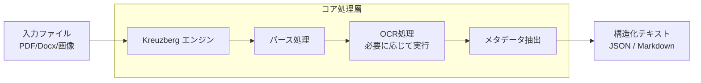

**Kreuzberg v4.0: Rust_Powered Document Intelligence for Every Stack** という記事を読み、Rustで構築されたドキュメント解析エンジンの実用性が非常に興味深かったので、その内容を自分なりに整理して紹介します。

Rust で書かれた汎用のドキュメントからテキストを抽出するエンジンの紹介です。参考まで。

---

昨今のLLM（大規模言語モデル）の普及に伴い、PDFや画像、各種オフィスツールなどの「非構造化データ」をいかに精度よく、かつ高速にテキスト化するかが重要になっています。こうした背景の中、Rustのパフォーマンスを活かしたドキュメントインテリジェンス・ライブラリ「Kreuzberg」の最新バージョンが登場しました。

## Kreuzberg v4.0 とは

Kreuzberg（クロイツベルク）は、多様なファイル形式からテキストやメタデータを抽出するためのエンジンです。もともとはPythonのエコシステムを中心に語られることが多かった分野ですが、v4.0ではコア部分にRustを採用することで、リソース効率と安全性を高めているのが大きな特徴かと思います。

従来のツールでは、PDFからのテキスト抽出やOCR（光学文字認識）を行う際、依存関係が複雑になったり、メモリ消費量が膨大になったりすることが課題でした。Kreuzbergはこれらを整理し、単一のインターフェースで扱えるように設計されています。

### 処理の全体イメージ

Kreuzbergがどのように文書を処理し、構造化されたデータを出力するかを、簡単なフローで見てみます。



このように、入力されたファイルの種類を自動で判別し、適切な処理フローへ流してくれるようなイメージです。

## なぜ Rust なのか

ドキュメント解析にRustを採用する理由は、単なる流行ではなく、実務上のメリットがいくつかあるからだと考えられます。

| 比較項目 | 従来のライブラリ（主にPython） | Kreuzberg v4.0 (Rustベース) |
| :--- | :--- | :--- |
| **実行速度** | インタープリタによるオーバーヘッド | ネイティブコードによる高速な実行 |
| **メモリ管理** | ガベージコレクションによるスパイク | 所有権モデルによる予測可能なメモリ消費 |
| **並列処理** | GIL（グローバルインタプリタロック）の制限 | スレッドセーフな設計による高い並列性 |
| **デプロイ** | 多くのランタイム依存が必要 | バイナリが軽量で配布しやすい |

実際に大量のドキュメントをRAG（検索拡張生成）などのパイプラインに投入する場合、この「並列処理」と「メモリ効率」の差が、インフラコストの差として現れてくるかもしれません。

## 主な機能と特徴

Kreuzberg v4.0 で提供されている機能は、現代的な開発スタックに適合するように考えられています。

1.  **マルチフォーマット対応**
    PDFだけでなく、Word（.docx）、Excel（.xlsx）、PowerPoint（.pptx）から、各種画像ファイル（JPEG, PNG, TIFF）まで幅広く対応しています。
2.  **インテリジェントOCR**
    テキストレイヤーを持たないスキャン済みPDFなどの場合、自動的にOCRエンジン（Tesseractなど）を呼び出して文字を読み取ってくれます。
3.  **ストリーミング処理**
    メモリに乗り切らないような巨大なファイルを扱う際も、少しずつ読み込んで処理を進めるストリーミング的なアプローチが取られています。
4.  **他言語バインディング**
    コアはRustですが、PythonやNode.jsから簡単に呼び出せるような仕組みが提供されており、既存のプロジェクトにも導入しやすいかと思います。

### Rustでの利用例

Rustから利用する場合、以下のようなイメージでコードを書くことになります。こちらを見ると、非同期処理（async）との親和性の高さも伺えます。

```rust
use kreuzberg::extract;

#[tokio::main]
async fn main() -> Result<(), Box<dyn std::error::Error>> {
    // ドキュメントからテキストを抽出
    let result = extract("path/to/document.pdf").await?;
    
    println!("抽出テキスト: {}", result.content);
    println!("作成者: {:?}", result.metadata.author);
    
    Ok(())
}
```

難しい設定を抜きにして、関数一つでパースが完了する辺り、使い勝手の良さを重視している印象を受けます。

## まとめ：あらゆるスタックでの活用

Kreuzberg v4.0 は、Rustという堅牢な基盤を採用したことで、従来のドキュメント解析ツールにありがちだった「不安定さ」や「リソース消費の多さ」を解消しようとしています。

たとえば、クラウドネイティブな環境でサーバーレス関数（AWS Lambdaなど）を使って文書解析を行う場合、起動の速さとメモリ使用量の少なさは大きな利点になります。また、ローカル環境で機密性の高い文書を大量に処理する際も、外部APIに依存せずネイティブスピードで処理できる安心感があるのではないでしょうか。

ドキュメントインテリジェンスは、今後さらにLLMの実用化において重要な役割を果たす分野ですので、こうしたRust製のツールをスタックの一部に組み込んでみるのも、良い選択肢の一つになるかもしれません。

## 参照記事

- [Kreuzberg v4.0: Rust_Powered Document Intelligence for Every Stack](https://medium.com/@trivajay259/kreuzberg-v4-0-rust-powered-document-intelligence-for-every-stack-ea783fe95c48)
- [Training LLM, from Scratch, in Rust](https://medium.com/@stefanobosisio1/training-llm-from-scratch-in-rust-03381bbd7204)
- [Cloudflare Proved That Rust Can Replace Entire Infrastructure Layers](https://medium.com/@yashbatra11111/cloudflare-proved-that-rust-can-replace-entire-infrastructure-layers-76479acba290)
- [Rust vs. C++ in 2026: We Rewrote Our Core Engine And Killed The Safety Tax Myth](https://medium.com/@ArkProtocol1/rust-vs-c-in-2026-we-rewrote-our-core-engine-and-killed-the-safety-tax-myth-190015fe97a1)
- [I Built a Tiny Observability Agent in Rust — This Is What I Found](https://medium.com/@cachecowboy/i-built-a-tiny-observability-agent-in-rust-this-is-what-i-found-35df4701f5b7)
- [Go vs Rust Showdown 2026: Performance, Safety, and Why Developers Are Questioning Their Choices](https://medium.com/@codingplainenglish/go-vs-rust-showdown-2026-performance-safety-and-why-developers-are-questioning-their-choices-c3807c908926)

---

詳しくは[こちら](https://microarchitectures.jp/blog/rust-document-analysis-kreuzberg-v4-new-options/)をご覧ください。