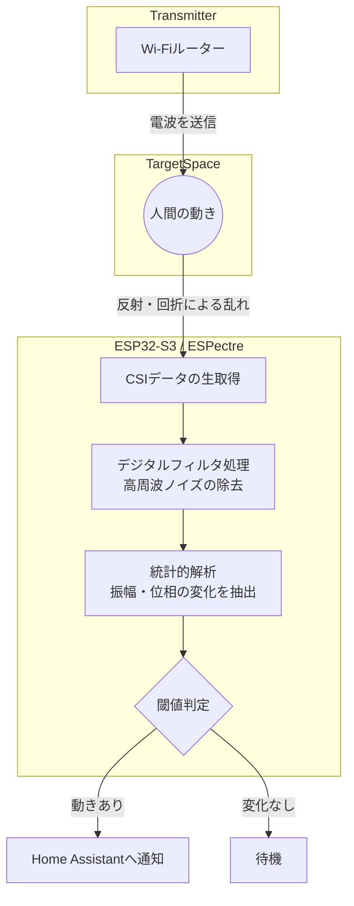

Francesco Pace 氏による記事 **How I Turned My Wi-Fi Into a Motion Sensor…** を読み、専用のセンサーを使わずにWi-Fiの電波だけで動きを検知するというアプローチが非常に興味深かったので、その仕組みを整理して紹介します。

これって面白いですよね。以前も聞いた事はあるんですが、実装までの紹介じゃなかったように思います。参考まで。

　　*

## センサーがなくても「波の乱れ」で動きはわかる

2025年9月、Wi-Fiで動きを検知するための新しい規格「IEEE 802.11bf」が公開されました。これにより、将来のWi-Fiデバイスは標準機能として人感センサーのような役割を持てるようになります。

とはいえ、対応デバイスが普及するのを待つのはもどかしいですよね。そこで、市販の安価なマイコン（ESP32-S3など）を使い、既存のWi-Fiルーターから出ている電波を解析することで、今すぐ「Wi-Fi人感センサー」を実現してしまったのが今回のプロジェクトです。

この手法の面白いところは、AIや機械学習を一切使わず、古典的な数学と信号処理だけでノイズを削ぎ落とし、精度の高い検知を行っている点にあります。

## 仕組みを「懐中電灯」で例えてみる

Wi-Fiによる検知と言われてもピンとこないかもしれません。そんな時は、暗い部屋で懐中電灯を照らしている場面を想像してみてください。

光の前に手をかざすと、壁に映る影が動きますよね。もし誰かが部屋を横切れば、光が遮られたり反射したりして、部屋全体の明るさや影の形が刻一刻と変化します。

Wi-Fiもこれと同じなんです。目に見えない電磁波が部屋中に充満していて、人間が動くとその波が反射したり、遮られたりして「乱れ」が生じます。この乱れをキャッチして解析すれば、カメラや赤外線センサーがなくても「あ、今誰か動いたな」とわかるわけです。

### CSI（チャネル状態情報）の活用

技術的には、**CSI（Channel State Information）** という情報を利用しています。
現代のWi-Fi（OFDM方式）では、一つの信号をたくさんの細かな周波数（サブキャリア）に分けて送信しています。受信機側では、それぞれのサブキャリアがどのような影響を受けたかを、以下の2つの数値で把握しています。

1.  **振幅（Amplitude）**：信号がどれくらい弱まったか
2.  **位相（Phase）**：信号の波がどれくらいズレたか

部屋に誰もいなければ、これらの数値は安定しています。しかし、人間が動くとこれらの数値が複雑に変動します。この微細な変化を数学的に取り出すのが、このシステムの肝になります。

## 処理の流れを可視化する

実際にESP32などのデバイスの中で行われている処理の流れを整理してみましょう。

## なぜAIではなく「数学」なのか

最近のWi-Fiセンシングの研究では、ディープラーニングを使って複雑なパターンを学習させることが一般的です。しかし、今回のプロジェクト「ESPectre」では、あえてAIを使わない道を選んでいます。

その理由は、**リソースの節約とシンプルさ**です。10ドル程度のマイコンでAIモデルを動かすのは負荷が高いですが、デジタルフィルタや統計処理といった数学的アルゴリズムなら、非常に軽量に動作します。

従来の赤外線（PIR）センサーと比較すると、Wi-Fiセンシングには以下のようなメリットがあります。

| 比較項目 | PIRセンサー（赤外線） | Wi-Fiセンシング (CSI) |
| :--- | :--- | :--- |
| **死角の影響** | 壁や障害物があると検知不可 | 壁越しでも検知可能 |
| **検知範囲** | センサーの正面（扇状） | 部屋全体をカバー |
| **プライバシー** | 高い | 高い（画像は撮らない） |
| **見た目** | センサーを露出させる必要がある | 既存のデバイス内に隠せる |
| **実装の難易度** | 非常に簡単（ON/OFFのみ） | やや高い（信号処理が必要） |

## まとめ：身近な電波に新しい役割を

これまで、Wi-Fiは「データを飛ばすための道具」でしかありませんでした。しかし、CSIという物理レイヤーの情報に目を向ければ、それは「部屋の状態を映し出すセンサー」としても機能します。

高価な機材を買い揃えなくても、手元のマイコンと少しの数学の知識があれば、見えない電波を可視化できるというのは、エンジニアとして非常にワクワクする話ですよね。

「壁の向こう側の動きがわかる」という利点を活かせば、照明の自動化だけでなく、高齢者の見守りやセキュリティなど、活用の幅はさらに広がりそうです。

## 参照記事

- [How I Turned My Wi-Fi Into a Motion Sensor…](https://medium.com/@francesco.pace/how-i-turned-my-wi-fi-into-a-motion-sensor-61a631a9b4ec)
- [I Was Ready to Return My DGX Spark. Then NVIDIA’s January Update Changed Everything.](https://medium.com/@paoloperrone/i-was-ready-to-return-my-dgx-spark-then-nvidias-january-update-changed-everything-e67699155a45)
- [Building a Drone Flight Controller from Scratch: A Software Engineer’s Guide to Clean C++](https://medium.com/@svirahonda/building-a-drone-flight-controller-from-scratch-a-software-engineers-guide-to-clean-c-644a2bd392c4)
- [The Cost of Everything: Mindful Telemetry in iOS](https://medium.com/@careful_celadon_goldfish_904/the-cost-of-everything-mindful-telemetry-in-ios-0c862281fc73)

---

詳しくは[こちら](https://microarchitectures.jp/blog/wifi-math-10-dollar-mcu-high-performance-motion-sensor/)をご覧ください。