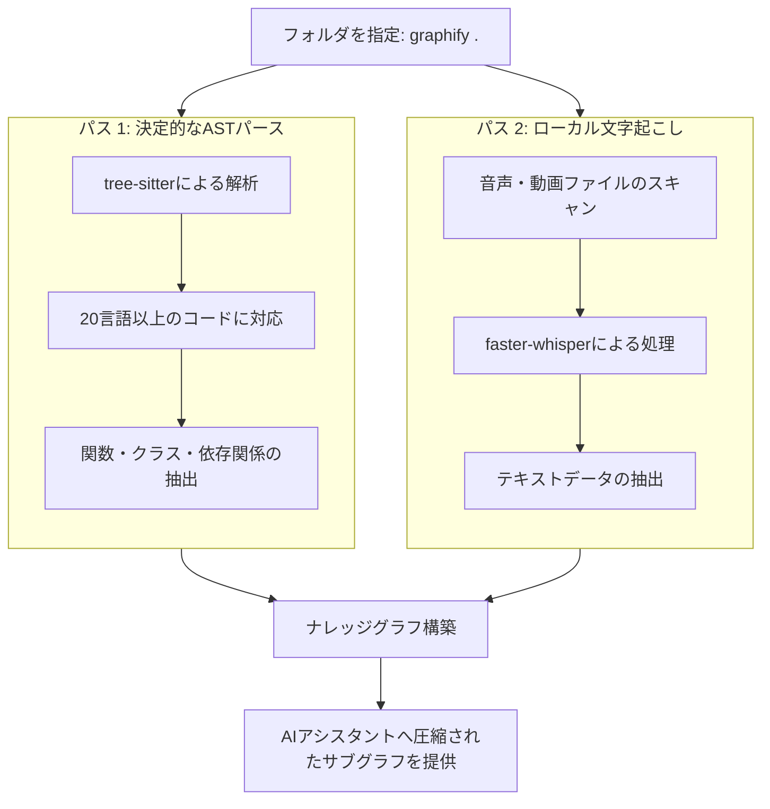

**How to Use Graphify: Turn Any Folder Into a Knowledge Graph** という記事を読み、LLMのコンテキストウィンドウの限界を賢く回避するアプローチが興味深かったので、こちらで内容を整理して紹介します。

開発者が大規模なコードベースをLLMで扱う際、避けて通れないのが「コンテキストウィンドウの制限」です。ファイルの中身をそのままプロンプトに流し込む従来の手法では、コードの量が増えるにつれてトークン消費量が膨れ上がり、AIの理解度も追いつかなくなってしまいます。

Andrej Karpathy氏は以前、論文やスクリーンショット、ツイートなどの断片的な情報をフォルダに保存し、それをLLMを使ってWikiのようにまとめ、Obsidianで管理するワークフローを提唱していました。今回紹介する「Graphify」は、まさにそのプロセスを自動化し、あらゆるファイルをクエリ可能な「ナレッジグラフ」に変換してくれるオープンソースツールです。

使い始めてみましたので、参考まで。

---

## Graphifyの全体像

Graphifyは、単なるベクトルデータベースのラッパーではありません。フォルダ内のファイルをスキャンし、コード、ドキュメント、画像、動画から永続的な知識のつながりを作成します。

処理の全体像は以下のようなイメージです。



このように、情報を構造化してからAIに渡すことで、トークン消費量を大幅に（最大で71.5倍程度）削減できる可能性があるようです。

---

## ステップ1：インストールと初期実行

Graphifyの利用には、複雑なエンベディングパイプラインの構築などは不要です。一応、以下の手順だけで使い始めることができます。

```bash
# パッケージのインストール
pip install graphifyy

# プロジェクトディレクトリ内で実行
graphify .
```

これを実行すると、Graphifyは即座にフォルダ内のスキャンを開始し、グラフの構築を始めます。設定の手間がほとんどかからない点は、実務でも使いやすそうだと感じます。

---

## ステップ2：パス1 ― コードの決定的な解析

最初のフェーズでは、ローカル環境でコードの解析が行われます。この段階でLLMのAPIにコードが送信されることはありません。

Graphifyは `tree-sitter` を使用して、PythonやJavaScript、Rustなど20種類以上の言語をパースします。ここで抽出されるのは以下のような情報です。

- クラスや関数の定義
- インポート関係
- コールグラフ（呼び出し関係）
- docstringやコメント

この解析は「確定的」なアルゴリズムで行われるため、抽出された関係性には「1.0」という高い信頼度スコアが付与されます。コードベースの構造を事実に基づいて正確に把握できるのが、このツールの強みと言えるかもしれません。

---

## ステップ3：パス2 ― メディアファイルのローカル処理

もしフォルダ内に会議の録音（MP4）や講義の音声ファイルが含まれている場合、Graphifyはそれらも処理対象に含めます。

デバイス上で `faster-whisper` を動かし、音声データをテキストに変換します。これもローカルで実行されるため、プライバシー面でも安心感がありますね。こうして得られた文字起こしデータも、先ほどのコード解析結果と統合され、一つの大きなナレッジグラフの一部となります。

---

## 従来手法との比較

生のファイルをそのままLLMに渡す場合と、Graphifyでグラフ化してから渡す場合の違いを簡単に表にまとめてみました。

| 比較項目 | 従来のプロンプト（生ファイル） | Graphifyによるアプローチ |
| :--- | :--- | :--- |
| **スケーラビリティ** | トークン量に対して線形に悪化 | 関係性を抽出するため効率的にスケール |
| **トークン消費** | 非常に多い | 大幅に削減（最大 71.5分の1） |
| **情報の正確性** | 文脈が途切れる可能性がある | 構造化された関係性に基づく |
| **対応ファイル** | 主にテキストのみ | コード、PDF、画像、音声、動画 |

たとえば、「この関数がどこで使われているか、関連する仕様書はあるか」といった質問に対して、生ファイルを全部読み込ませるよりも、グラフから関連する部分だけを抜き出して渡すほうが、AIも正確に答えやすくなるかと思います。

---

## まとめ

Graphifyは、膨大なデータをそのままAIに投げ込むのではなく、一度「知識の地図（グラフ）」として整理してから活用するという、非常に理にかなったアプローチをとっています。

コンテキストウィンドウの拡大も進んでいますが、コストや精度の面を考えると、このように「情報を圧縮して構造化する」技術は今後さらに重要になってくるのではないでしょうか。手元にある大量の資料やコードベースを持て余している方は、一度試してみると面白いかもしれません。

## 参照記事

- [How to Use Graphify: Turn Any Folder Into a Knowledge Graph](https://medium.com/@anna.bildea/how-to-use-graphify-turn-any-folder-into-a-knowledge-graph-d51b38eb60b6)
- [Training LLM, from Scratch, in Rust](https://medium.com/@stefanobosisio1/training-llm-from-scratch-in-rust-03381bbd7204)
- [5 Free Open-Source Tools I Actually Use (And You Should Bookmark Today)](https://medium.com/@sovannaro/5-free-open-source-tools-i-actually-use-and-you-should-bookmark-today-70bd78ecc9e2)
- [One Open-Source Repo Turned Claude Code Into an n8n Architect — And n8n Has Never Been More Useful](https://medium.com/@rentierdigital/one-open-source-repo-turned-claude-code-into-an-n8n-architect-and-n8n-has-never-been-more-useful-f68f4ec63d02)
- [The New Claude Code’s Auto-Memory Feature Just Changed How My Team Works — Here Is the Setup I Actually Build](https://medium.com/@alirezarezvani/the-new-claude-codes-auto-memory-feature-just-changed-how-my-team-works-here-is-the-setup-i-5126174b35dc)
- [Sonnet 5 Leaked: The “Visual” Agent That Just Killed The Context Limit](https://medium.com/@dinmaybrahma/sonnet-5-leaked-the-visual-agent-that-just-killed-the-context-limit-c72c2a2ccc51)

---

詳しくは[こちら](https://microarchitectures.jp/blog/structuring-large-folders-knowledge-graphs-with-graphify/)をご覧ください。