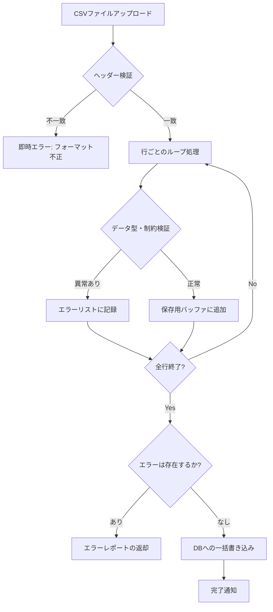

実務でデータ連携機能を開発していると、避けては通れないのがCSVインポートです。今回は **CSV Import with Validation and Error Handling: When Users Upload the Messiest Data** という記事を読み、ユーザーが送ってくる「想定外のデータ」をいかにスマートに捌くか、という点について改めて整理してみたいと思います。

CSVのインポート機能ってクライアントさんから簡単に提案されるんですが、実装すると色々はまるんですよね。😅

---

CSVインポート機能は、一見すると「ファイルを受け取って、中身をループで回してDBに入れるだけ」のように思えるかもしれません。しかし、実際に運用を始めてみると、ユーザーは私たちの想像をはるかに超える「乱雑なデータ」をアップロードしてくるものです。

たとえば、ヘッダーの名前が微妙に違っていたり、日付の形式がバラバラだったり、数値が入るべき場所に全角文字が混じっていたり……。こうした事態に備えた設計を怠ると、システムがクラッシュしたり、汚れたデータがDBに入り込んでしまったりすることになります。

こちらの記事では、そうした混乱を防ぐための「堅牢なCSVインポート」の設計指針を考えてみます。

## インポート処理の全体像

CSVインポートを安全に行うには、単一の処理として考えるのではなく、いくつかのフェーズに分けた「パイプライン」として設計するのが良いかと思います。



このように、まずは構造（ヘッダー）をチェックし、その後に中身（データ）を細かく見ていくという二段構えのフローが一般的です。

## 1. ヘッダー検証（構造のチェック）

まず最初に行うべきは、CSVの「形」が正しいかどうかの確認です。
ユーザーが古いテンプレートを使っていたり、列を削除してしまっていたりする場合、行データの検証に進む前にエラーを出すべきです。

*   **必須カラムの有無**: 必要な列がすべて揃っているか。
*   **カラムの順序**: 順序に依存する実装は避けるべきですが、固定されている場合はチェックが必要です。
*   **エンコーディング**: UTF-8かShift-JISか。ここがずれると後の検証がすべて失敗します。

## 2. 行レベルの検証（データのチェック）

ヘッダーが正しければ、次は1行ずつ中身を精査します。ここで大切なのは、**「1つのエラーで見捨てない」**ことだと思います。

たとえば1,000行のCSVをアップロードしたとき、最初の1行目でエラーが出て処理が止まってしまうと、ユーザーは何度も修正とアップロードを繰り返す羽目になります。これでは利便性が低いため、エラーをすべて収集して最後にまとめて報告するのが親切な設計と言えるでしょう。

### 検証の観点

| 検証項目 | 内容の例 |
| :--- | :--- |
| **データ型** | 数値フィールドに文字列が入っていないか、日付形式が正しいか |
| **必須チェック** | 必須項目が空（null）になっていないか |
| **ビジネスルール** | 在庫数がマイナスになっていないか、開始日が終了日より前か |
| **マスタ参照** | 指定されたカテゴリIDや商品コードがDBに実在するか |

## 3. エラーハンドリングの戦略

エラーが発生した際、システムとしてどう振る舞うべきでしょうか。これには大きく分けて2つのアプローチがあるかと思います。

### 全か無か（アトミックな処理）
1箇所でもエラーがあれば、すべてのインポートをキャンセルする方法です。データの整合性を保ちやすいですが、ユーザーの修正コストは高くなるかもしれません。トランザクション管理が重要になります。

### 部分成功の許容
「正しい行だけインポートし、エラーの行だけスキップする」方法です。一見便利ですが、ユーザーが「どの行が入って、どの行が入っていないのか」を正確に把握できる仕組み（エラーレポート）が必要です。

たとえば、以下のようなエラーレスポンスを返せると、ユーザーも修正がしやすいはずです。

```json
{
  "status": "error",
  "total_rows": 100,
  "success_count": 98,
  "errors": [
    { "row": 15, "column": "email", "message": "メールアドレスの形式が正しくありません" },
    { "row": 42, "column": "price", "message": "数値で入力してください" }
  ]
}
```

## 4. 実装のイメージ（Python / Pandasの例）

実際にデータを扱う際、ライブラリを活用すると検証処理をシンプルに記述できます。たとえばPythonのPandasを使うと、こんな感じで「まずは一括で読み込み、後から検証する」といった流れが作りやすいです。

```python
import pandas as pd

def import_csv(file_path):
    # 1. 読み込み
    df = pd.read_csv(file_path)
    errors = []

    # 2. ヘッダー検証
    required_columns = {'product_name', 'price', 'stock'}
    if not required_columns.issubset(df.columns):
        return "エラー: 必要なカラムが足りません"

    # 3. 行ごとの検証（ベクトル演算で高速化も可能）
    for index, row in df.iterrows():
        line_no = index + 2  # ヘッダー分を考慮
        
        # 数値チェック
        if not isinstance(row['price'], (int, float)) or row['price'] < 0:
            errors.append(f"{line_no}行目: 価格が不正です")
            
        # 必須チェック
        if pd.isna(row['product_name']):
            errors.append(f"{line_no}行目: 商品名が空です")

    # 4. 結果の判定
    if errors:
        return errors  # エラーをまとめて返す
    else:
        save_to_db(df)  # DB保存処理へ
        return "成功"
```

## まとめ

CSVインポートは、一見単純な「ファイルアップロード」に見えて、その実態は**「外部からの不確実なデータに対するバリデーションパイプライン」**と言えるかもしれません。

「ユーザーは必ず間違ったデータを送ってくる」という前提に立ち、
1.  **構造を先にチェックする**
2.  **エラーはまとめて報告する**
3.  **どの行がなぜダメなのかを具体的に伝える**

といった点を意識するだけで、システム全体の堅牢性とユーザー体験は大きく向上するかと思います。皆さんのプロジェクトでも、インポート処理を見直す際の参考にしてみてください。

## 参照記事

- [CSV Import with Validation and Error Handling: When Users Upload the Messiest Data](https://medium.com/@sohail_saifi/csv-import-with-validation-and-error-handling-when-users-upload-the-messiest-data-610329dc4d48)
- [I Turned Karpathy’s Autoresearch Into a Agent Skill For Claude Code That Optimizes Anything — Here Is the Architecture](https://medium.com/@alirezarezvani/i-turned-karpathys-autoresearch-into-a-agent-skill-for-claude-code-that-optimizes-anything-here-97de83f2b7f0)
- [The Postgres Query That Brought Down Black Friday (89K RPS Disaster)](https://medium.com/@guvencanguven965/the-postgres-query-that-brought-down-black-friday-89k-rps-disaster-2d6b191784e3)
- [Claude Code Insane Nerf. AMD Noticed (Here’s How You Fix It).](https://medium.com/@alexjamesdunlop/anthropics-hidden-claude-code-nerf-amd-noticed-here-s-how-you-fix-it-424e0d4a6a65)
- [Python Is 93× Slower?! The MCP Benchmark That Shocked Developers](https://medium.com/@kanishks772/python-is-93-slower-the-mcp-benchmark-that-shocked-developers-7e1c5be6604e)
- [DeepSeek V4 Runs Locally on Your GPU. That Changes Everything the Cloud AI Companies Didn’t Want Changed.](https://medium.com/@sohail_saifi/deepseek-v4-runs-locally-on-your-gpu-a738bf2acef6)

---

詳しくは[こちら](https://microarchitectures.jp/blog/handling-messy-user-csvs-validation-and-error-handling/)をご覧ください。