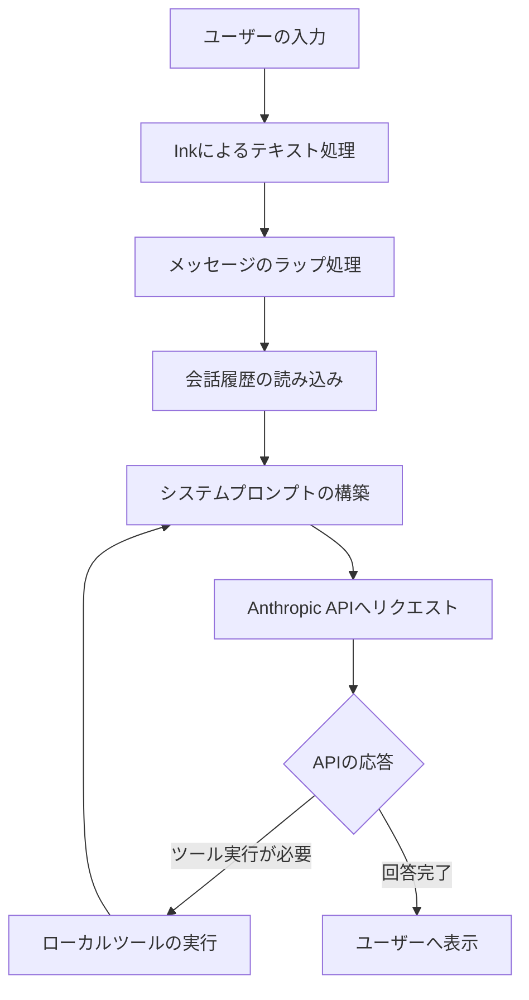

今回は、**I Found Claude Code Unpacked The Best Visual Walkthrough (We’ve Been Missing)** という記事を参考に、最近話題のClaude Codeが具体的にどのような仕組みで動いているのかを整理してみました。このサイト結構いいのでお勧めです。

話題のツールではありますが、その中身がどうなっているのかを把握するのはなかなか大変ですよね。この記事では、複雑なコードベースを視覚化した「Claude Code Unpacked」というプロジェクトを元に、その設計思想を紐解いていきます。

---

## 巨大なコードベースを紐解く「地図」

Claude Codeは、Anthropicが開発したターミナル上で動くAIエージェントです。実はそのソースコードは非常に大規模で、以下のような構成になっています。

| 項目 | 規模・数 |
| :--- | :--- |
| ファイル数 | 1,900ファイル以上 |
| コード行数 | 約51万9,000行（TypeScript） |
| 実装されているツール | 53種類以上 |
| スラッシュコマンド | 95種類以上 |

これだけの規模になると、ただコードを眺めるだけでは全体像を掴むのは困難です。そこで役立つのが、ソースコードの依存関係や処理の流れを視覚化した「ビジュアル・ウォークスルー」です。

このマップを辿っていくと、Claude Codeが単に「プロンプトを投げて結果を受け取る」だけのツールではなく、非常に緻密な「エージェント・ループ」によって制御されていることがわかります。

## 11のステップで動く「エージェント・ループ」

私たちがターミナルで文字を入力してから、AIが実際にファイルを操作したり回答を返したりするまでには、大きく分けて11のステップが存在します。

イメージとしては、「受付（入力）→ 整理（コンテキスト構築）→ 相談（API呼び出し）→ 実行（ツール使用）」というサイクルが高速で回っているような感じです。

主な流れをMermaidの図で整理してみましょう。

### 1. 入力とメッセージの変換
まず、`Ink`というReactベースのCLIライブラリを使って、私たちのキーボード入力を受け取ります。入力されたテキストは、そのまま送信されるわけではなく、`createUserMessage()` という関数によって、AnthropicのAPIが理解できるメッセージ形式に丁寧にパッケージングされます。

### 2. 「記憶」と「状況」の統合
ここが面白いところで、Claude Codeは送信前に「今の状況」をかき集めます。
- **履歴:** 以前のやり取りの内容。
- **CLAUDE.md:** プロジェクト固有の指示書。
- **メモリ:** エージェントが保持している一時的な記憶。
- **コンテキスト:** 現在開いているファイルやディレクトリの情報。

これらを組み合わせて、その瞬間に最適な「システムプロンプト」を動的に作り上げているんです。

### 3. ツールの実行サイクル
APIから「このファイルを読んでください」とか「テストを実行してください」といった指示（ツール・コール）が返ってくると、Claude Codeは手元のマシンでそのコマンドを実行します。その実行結果をまたプロンプトに含めてAPIに送る……というループを繰り返すことで、複雑なタスクを完遂させています。

## 整理された53以上のツール群

Claude Codeがこれほど多機能なのは、役割ごとに整理された「ツール」が大量に用意されているからです。これらは機能別に分類されており、必要に応じてエージェントが使い分けています。

| カテゴリ | 役割の例 |
| :--- | :--- |
| **ファイル操作** | ファイルの読み書き、検索、ディレクトリ構造の把握 |
| **開発支援** | テストの実行、型チェックの確認、ビルドコマンドの実行 |
| **情報収集** | `grep`によるコード検索、ブラウザ（特定環境）での調査 |
| **実験的機能** | フィーチャーフラグで管理された開発中の新機能 |

面白いのは、すべてのツールが常に有効なわけではないという点です。「フィーチャーフラグ」によって、特定の条件下や実験モードでのみ有効になるツールやコマンドも存在します。ソースコードを視覚化することで、こうした「隠れた機能」の存在も一目でわかるようになっています。

## なぜ「視覚化」が重要なのか

50万行を超えるコードをすべて読み解くのは、専門のエンジニアでも骨が折れる作業です。しかし、ツリーマップのようにアーキテクチャを俯瞰し、エージェントの思考プロセスをアニメーションで追うことで、以下のような「設計の本質」が見えてきます。

- **モジュール化の徹底:** 1,900ものファイルが、役割ごとにきれいに分かれている。
- **エラーへの耐性:** ツール実行に失敗した際、どうやってループを立て直すかが定義されている。
- **拡張性:** 新しいスラッシュコマンドやツールを追加しやすい構造になっている。

「AIエージェントがどうやって動いているのか、いまいちイメージが湧かない」という方も、こうしたビジュアルベースの解説を見てみると、「なるほど、中でこういう順番で考えているのか」と腑に落ちる部分が多いはずです。

## まとめ

Claude Codeの裏側には、膨大なコードと緻密なループ処理が隠されていました。単に賢いモデルを使っているだけでなく、ローカル環境の情報をいかに整理し、AIに「文脈」として伝えるかという部分に、開発の工夫が詰まっていると感じます。

こうしたアーキテクチャを理解しておくと、自分でAIエージェントを構築したり、既存のツールをより深く使いこなしたりする際のヒントになりそうですね。

---

## 参照記事

- [I Found Claude Code Unpacked The Best Visual Walkthrough (We’ve Been Missing)](https://medium.com/@joe.njenga/i-found-claude-code-unpacked-the-best-visual-walkthrough-weve-been-missing-9dac5ed0a3f9)
- [If You Don’t Know These 12 System Design Basics, You’re Not a Real Software Engineer](https://medium.com/@kanishks772/if-you-dont-know-these-12-system-design-basics-you-re-not-a-real-software-engineer-28043fbb09bc)
- [Why 80% of Developers Will Quit Their Job Because of This Trend](https://medium.com/@kakamber07/why-80-of-developers-will-quit-their-job-because-of-this-trend-a48193589c3e)
- [I Turned Karpathy’s Autoresearch Into a Agent Skill For Claude Code That Optimizes Anything — Here Is the Architecture](https://medium.com/@alirezarezvani/i-turned-karpathys-autoresearch-into-a-agent-skill-for-claude-code-that-optimizes-anything-here-97de83f2b7f0)
- [Why Every Developer Needs Claude Code Sub Agents (And How I Build Them)](https://medium.com/@alexjamesdunlop/why-every-developer-needs-claude-code-sub-agents-and-how-i-build-them-551c2ae4aab0)
- [97% of Developers Kill Their Claude Code Agents in the First 10 Minutes (Here’s How The 3% Build Unstoppable Systems)](https://medium.com/@alirezarezvani/97-of-developers-kill-their-claude-code-agents-in-the-first-10-minutes-heres-how-the-3-build-d2b6913f4cb2)

---

詳しくは[こちら](https://microarchitectures.jp/blog/visualizing-claude-code-internal-structure-autonomous-agents/)をご覧ください。