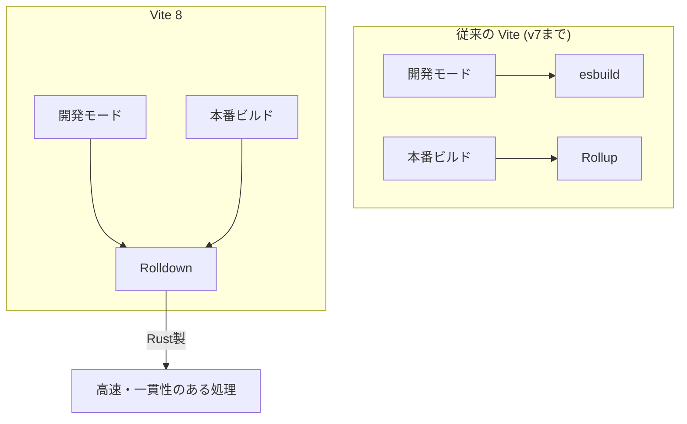

InfoQに掲載された **Vite Version 8: Unified Rust-Based Bundler and Up to 30x Faster Builds** という記事を読んで、ViteがついにRustベースの統合バンドラへと舵を切ったというニュースが非常に興味深かったので、その内容を自分なりに整理して紹介します。かなり速くなったみたいですね。

　　*

フロントエンド開発の現場で欠かせないツールとなったViteですが、今回のバージョン8はこれまでのアップデートの中でも特に大きな転換点になりそうです。

## 二重構造からの脱却：なぜRust製の統合バンドラが必要だったのか

これまでのViteは、実は2つの異なるバンドラを使い分ける「二重構造」になっていました。開発時には爆速な **esbuild** を使い、本番ビルドには最適化に優れた **Rollup** を使うという構成です。

この仕組みは、それぞれのツールのいいとこ取りをできる一方で、いくつかの課題も抱えていました。たとえば、開発時と本番時でモジュールの処理結果が微妙に異なってしまう「エッジケース」の発生や、2つのプラグインシステムを維持するための複雑なコード（いわゆる接着剤のようなコード）の肥大化です。

Vite 8では、この2つをRustで書かれた新しい統合バンドラ **Rolldown** に置き換えることで、仕組みをシンプルに一本化しました。



このように、処理の入り口が一つになることで、開発時と本番時の挙動の不一致がなくなり、メンテナンス性も向上するというわけです。

## 実測値で見るパフォーマンスの向上

「Rust製になったから速い」と言われても、実際どれくらい違うのか気になりますよね。ベータ版の時点ですでに、いくつかのプロジェクトから具体的な数字が報告されています。

| プロジェクト | 以前のビルド時間 | Vite 8 でのビルド時間 | 短縮率 |
| :--- | :--- | :--- | :--- |
| **Linear** | 46秒 | 6秒 | 約87%削減 |
| **Hacker News 報告例** | 4分 (240秒) | 30秒 | 約8倍高速 |
| **Beehiiv** | - | - | 64% 改善 |
| **大規模プロジェクト** | 12分 | 2分 | 約83%削減 |

最大で30倍という数字も出ているようですが、多くの場合で数倍から10倍近い高速化が期待できそうです。ビルドを待つ時間が減るというのは、開発者にとってシンプルに嬉しいニュースですね。

## プラグインの互換性と開発者体験（DX）の向上

「バンドラがまるごと変わるなら、既存のプラグインが使えなくなるのでは？」と心配になりますが、その点も考慮されています。Rolldownは既存のViteプラグインエコシステムと完全な互換性を維持するように設計されているため、ほとんどのプロジェクトでは大きな修正なしに移行できるはずです。

また、ビルド速度以外にも細かな使い勝手が向上しています。

### tsconfig パスの標準サポート
これまでエイリアスの設定などでプラグインが必要だった機能が、標準でサポートされました。
```json
// vite.config.ts
export default {
  resolve: {
    tsconfigPaths: true // これだけでパスの解決が有効に
  }
}
```

### ブラウザコンソールの転送機能
`server.forwardConsole: true` を設定すると、ブラウザ側に出力されたログをターミナル側にも流せるようになります。
「ブラウザのデベロッパーツールを開き忘れてエラーに気づかなかった」というミスを防げますし、AIコーディングアシスタントにログを読み取らせる際にも便利そうですね。

## 注意点：Yarn PnPとの互換性問題

いいことばかりに見えるVite 8ですが、一つ注意が必要なのが **Yarn Plug'n'Play (PnP)** を使っているプロジェクトです。

現在、特にWindows環境において、Vite 8とYarn PnPの間で互換性の問題が報告されています。Viteチームとしては、今後Yarn PnPを積極的にサポートしない可能性も示唆しており、影響を受ける場合はYarnの `nodeLinker` を標準的な `node-modules` に戻すといった対応が必要になるかもしれません。ここは自分のプロジェクトの構成と照らし合わせて検討したいポイントです。

## まとめ

Vite 8は、単なる「速くなったマイナーアップデート」ではなく、Rustによるツールの再構築という大きなステップを踏み出しました。
Next.jsなどの特定のフレームワークに紐付いたTurbopackとは異なり、Viteは広範なエコシステムを支える汎用的なツールとしての立ち位置を強めています。

Reactプラグイン（@vitejs/plugin-react v6）でも内部的に **Oxc** が使われるようになるなど、JavaScriptのツールチェーンがどんどんRustに書き換わっていく流れを象徴するようなリリースだと感じました。

---

## 参照記事

- [Vite Version 8: Unified Rust-Based Bundler and Up to 30x Faster Builds](https://www.infoq.com/news/2026/05/vite-v8-rust/?utm_campaign=infoq_content&utm_source=infoq&utm_medium=feed&utm_term=global)
- [7 Underused Rust Features Every Senior Developer Knows](https://medium.com/@Krishnajlathi/7-underused-rust-features-every-senior-developer-knows-7b8bb8da684f)
- [Training LLM, from Scratch, in Rust](https://medium.com/@stefanobosisio1/training-llm-from-scratch-in-rust-03381bbd7204)
- [We Built a Kernel Module in Rust — And It Actually Worked](https://medium.com/@theopinionatedev/we-built-a-kernel-module-in-rust-and-it-actually-worked-eeec597b29cf)
- [Inside the Secret Tools Real Rust Teams Use (That Cargo Doesn’t Want You to Know About)](https://medium.com/@theopinionatedev/inside-the-secret-tools-real-rust-teams-use-that-cargo-doesnt-want-you-to-know-about-ee22b21be193)
- [Go Just Killed Rust’s Only Advantage (And Nobody’s Talking About It)](https://medium.com/@kanishks772/go-just-killed-rusts-only-advantage-and-nobody-s-talking-about-it-0d5fc550f355)

---

詳しくは[こちら](https://microarchitectures.jp/blog/vite-8-released-rust-rolldown-migration-build-changes/)をご覧ください。