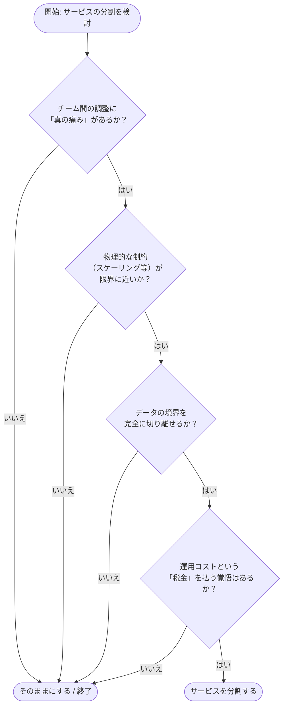

**Your Microservices Architecture Is Probably Wrong. Here’s the Framework I Use to Decide When to Break a Service Apart and When Not To.** という記事を読み、サービスの分割基準という「基本だけど一番難しい問題」について、現場目線で非常に納得感のある内容だったので自分なりに整理して紹介します。

「マイクロサービスはもう古い」とか「これからはモノリスだ」といった極端な話ではなく、もっと実務的で、「いつ分けるべきで、いつ分けるべきでないか」を冷静に判断するための知恵が詰まっていました。

昨今、マイクロサービスでの実装をよく見かけるのですが、ちょっとオーバーエンジニアリングじゃないかと思う事も多々あります。みんなが google や facebook みたいな物を作っている訳じゃないのだから、まずはモノリスで作って、ユーザーが増えてきたら順に切り替えるのが良いんじゃないかなぁと思ってます。参考まで。

---

## そもそも、その分割理由は「本物」ですか？

マイクロサービス化を検討するとき、私たちはついつい「もっともらしい理由」を探してしまいがちです。でも、著者の Sohail 氏によれば、世の中のマイクロサービスの多くは「そもそも分割すべきではなかった」といいます。

まずは、よくある「実は間違っている分割理由」を整理してみましょう。心当たりがあるものはありませんか？

### よくある「間違った」正当化のリスト

| よくある理由 | 実態はどうなっているか |
| :--- | :--- |
| **「スケーリングが容易になる」** | ほとんどのシステムで、ボトルネックはアプリではなくデータベースです。DBが同じなら、アプリだけ分けても複雑さが増すだけなんですよ。 |
| **「チームが独立して動ける」** | 変更のたびに結局他チームとの調整が必要なら、単に「ネットワーク越しの調整」という面倒な仕事が増えただけです。 |
| **「コードが綺麗になる」** | ホワイトボード上の図が綺麗なのを見て安心していませんか？ 実際には、APIのバージョン管理などのオーバーヘッドで、開発体験は悪化することが多いです。 |
| **「大企業がやっているから」** | Netflixは数千人のエンジニアがいるからあの構成なんです。少人数のチームで真似するのは、近所のプールを渡るために豪華客船を買うようなものです。 |

技術的に「できる」ことと、アーキテクチャとして「すべき」ことは全く別物なんですね。

---

## 迷った時に使う「正直な」意思決定フレームワーク

では、どうすれば正しい判断ができるのでしょうか。ここで紹介されているフレームワークは、とてもシンプルです。「できるから分ける」のではなく、「分けなければならない理由があるか」を自分たちに問いかける形になっています。

以下のフローチャートに沿って、自分たちの状況をチェックしてみましょう。

### ステップ1：真の「調整の苦痛」はあるか？

まずはここからです。「コードベースが大きくなってきたから」という漠然とした理由ではなく、**「今の構成のせいで、チーム同士が物理的にぶつかって開発が止まっているか？」**を考えます。

もし、1つの機能をリリースするために5つのチームと会議を重ねなければならないなら、それは構成に問題があるかもしれません。でも、単に「なんとなく見通しが悪い」くらいなら、コード内のモジュール化（ディレクトリ分けなど）で解決できるはずです。

### ステップ2：スケーリングの問題は「アプリ」にあるか？

「特定の機能だけアクセスが多いから分けたい」というのもよく聞きます。でも、ちょっと待ってください。その負荷で悲鳴を上げているのは、本当にアプリケーションサーバーのCPUやメモリですか？

多くの場合、負荷の正体はデータベースのロックやクエリの遅延だったりします。もしサービスを分けても、裏側で同じデータベースを叩いているなら、問題は何も解決しません。むしろ、分散トランザクションのような新しい悩みが増えるだけなんですよね。

### ステップ3：データの境界を引き直せるか？

これが一番の難関かもしれません。サービスを分けるということは、データベースも分けるということです。

「注文サービス」と「在庫サービス」に分けたとき、それらのデータは本当に独立して管理できますか？ もし、頻繁にJOINが必要だったり、強い整合性（ACID）が求められたりするなら、無理に分けるべきではありません。**「データベースが共有されたマイクロサービス」は、マイクロサービスの良いところを消して、悪いところだけを残したような状態**になってしまいます。

---

## 最後に：退屈な結論こそが「正解」

このフレームワークを順番に辿っていくと、ほとんどの場合、答えは「今は分割しなくていい」になるはずです。

でも、それでいいんです。著者は「このフレームワークは少し退屈だ」と言っていますが、それは正しいことです。優れたアーキテクチャというのは、派手な最新技術を駆使することではなく、**「不必要な複雑さを持ち込まないこと」**だからです。

もし、どうしても分割が必要になったとき、それは「やりたいから」ではなく「そうしないとビジネスが回らないから」という明確な理由に基づいているはずです。その時こそ、自信を持ってサービスを切り出しましょう。

それまでは、今あるコードベースを大切に育てて、モジュール境界をしっかり意識しながら開発を進めるのが、実は一番の近道だったりしますよ。

---

## 参照記事

- [Your Microservices Architecture Is Probably Wrong. Here’s the Framework I Use to Decide When to Break a Service Apart and When Not To.](https://medium.com/@sohail_saifi/your-microservices-architecture-is-probably-wrong-670800d77e74)
- [Project Loom Killed Half Our Microservices: What Java Architects Need to Unlearn](https://medium.com/@yashbatra11111/project-loom-killed-half-our-microservices-what-java-architects-need-to-unlearn-3d6bf01814bf)
- [The Hardware Security Module Integration That Every Database Needs](https://medium.com/@sohail_saifi/the-hardware-security-module-integration-that-every-database-needs-66ff86b5074b)
- [410 Deleted by author — Medium](https://medium.com/@Ed-Ward/denmark-just-brought-putins-nightmare-to-life-a3ee8493c8ca)
- [How WhatsApp Handles 100 Billion Messages Daily on Erlang](https://medium.com/@sohail_saifi/how-whatsapp-handles-100-billion-messages-daily-on-erlang-cd06ba5abb52)
- [Programming Is Dead: A Letter to Junior and Mid‑Level Engineers](https://medium.com/@dbounds/programming-is-dead-a-letter-to-junior-and-mid-level-engineers-5b630f0e9645)

---

詳しくは[こちら](https://microarchitectures.jp/blog/wait-before-microservices-honest-splitting-framework/)をご覧ください。