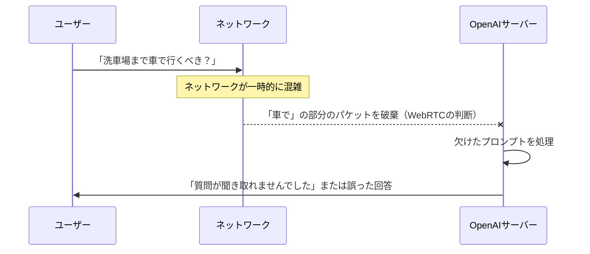
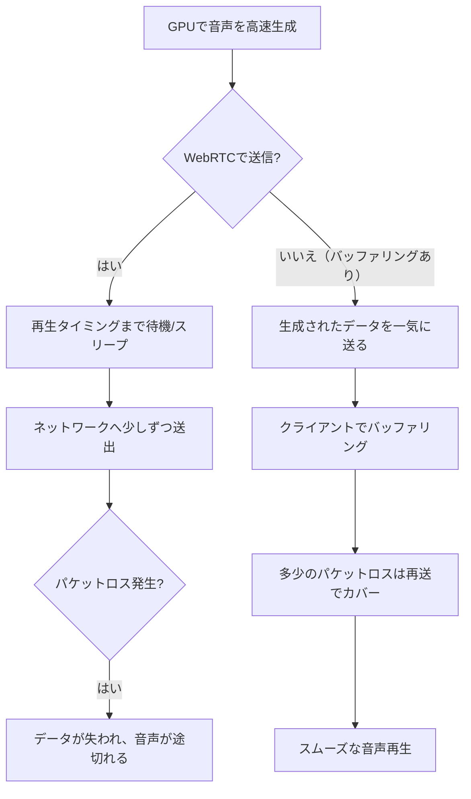

今回は、OpenAIが公開した技術ブログに関連して投稿された **OpenAI’s WebRTC Problem** という記事を読み、音声AIにおける通信プロトコルの選択について自分なりに整理してみました。

元記事の筆者の方は WebRTC に詳しい方のようで、OpenAI の音声周りに関して厳しい感じでした。興味深い内容だったので共有します。

---

OpenAIが音声AIのスケールと低遅延化に関する技術スタックを公開しましたが、これに対して「WebRTCを選択すべきではない」と警鐘を鳴らす専門家がいます。TwitchやDiscordでWebRTCの基盤（SFU）を構築してきた開発者の視点から、なぜWebRTCが音声AIにとって「アグレッシブすぎる」のか、その技術的な課題を見ていきましょう。

## WebRTCの「良さ」が音声AIでは「仇」になる

WebRTCは、もともとビデオ会議や電話のように「人間同士のリアルタイムな会話」を想定して設計された技術です。そのため、ネットワークが不安定になったとき、WebRTCは非常にストイックな挙動を見せます。

それは**「遅れるくらいなら、パケットを捨てる」**という方針です。

### リアルタイム性と正確性のトレードオフ

私たちがWeb会議をしているとき、相手の声が少し途切れても「あ、今ちょっと電波悪かったかな」と脳内で補完して会話を続けられますよね。しかし、相手がAI（LLM）の場合は話が変わります。

以下の図は、WebRTCがネットワークの遅延にどう対処するかを示したイメージです。

WebRTCは低遅延を維持するために、ジッターバッファ（揺れを吸収する一時蓄積場所）を最小限にし、間に合わなかったパケットを積極的にドロップします。

しかし、ユーザーからすれば、数百ミリ秒（ms）待たされてもいいから、プロンプトの内容が正確に届くことの方が重要です。高価なLLMのリソースを使って、不完全な音声データからゴミのような回答が返ってくるのは避けたいところですよね。

## WebRTCと音声AIのミスマッチ

WebRTCの設計思想と、音声AIが求める要件を比較してみると、いくつかの決定的な違いが見えてきます。

| 特徴 | WebRTC（ビデオ会議向け） | 音声AIが求めるもの |
| :--- | :--- | :--- |
| **優先順位** | リアルタイム性 ＞ 品質 | 正確性 ＞ リアルタイム性 |
| **パケットロス時** | データを捨てる（ドロップ） | 再送してでも全データを届ける |
| **バッファリング** | 最小限（20ms〜200ms程度） | ネットワークの揺れを吸収できる程度 |
| **再生タイミング** | 到着した瞬間に再生 | 生成された順序を守って再生 |

### TTS（音声合成）はリアルタイムより速いという事実

現在の技術では、GPUを使った音声合成（TTS）は、実際に再生される時間よりもずっと速く音声を生成できます。たとえば、8秒間の音声を生成するのにかかる時間はわずか2秒程度です。

理想的なシナリオでは、この「先読みして生成されたデータ」をクライアント側にバッファリングしておくことで、ネットワークが多少不安定になっても音声が途切れないようにできるはずです。

しかし、WebRTCにはこの「バッファリング」という概念がほとんどありません。WebRTCで音声を送る場合、サーバー側はパケットを送信する前にわざわざ「スリープ」を入れて、再生タイミングに合わせて少しずつ送る必要があります。

このように、WebRTCを使うと、わざわざ人工的な遅延を入れた上で、パケットロスのリスクを冒していることになります。これは、せっかくの「高速な生成能力」を台無しにしているとも言えるわけです。

## 「さもなければ死」というハードコードされた設計

WebRTCのブラウザ実装は、低遅延を実現するためにかなりハードに最適化されています。たとえば、音声パケットの再送（NACK）を有効にしようとしても、設定が難しかったり、ジッターバッファが小さすぎて結局間に合わなかったりすることが多いんです。

かつてDiscordなどの大規模プラットフォームでWebRTCのカスタマイズに挑んだエンジニアたちも、結局はプロトコルを独自に書き直すという結論に至っています。

OpenAIのような世界最高峰のチームがなぜWebRTCを選んだのか。それはおそらく、ブラウザとの親和性や、すでに普及している標準技術であるという「便利さ」を優先したからかもしれません。しかし、真の「会話レベルの低遅延」と「高い品質」を両立させるには、WebRTCという既存の枠組みが足かせになる可能性があります。

## まとめ

WebRTCは素晴らしい技術ですが、すべての「リアルタイム」に適しているわけではありません。特に、一文字一文字が重要な意味を持つAIへのプロンプト送信や、高速な生成能力を活かしたいTTSの配信においては、もっと柔軟なプロトコル（たとえば、再送制御が可能なものや、より大きなバッファを許容するもの）が求められています。

「OpenAIが使っているから」という理由だけでWebRTCを選択する前に、自分たちが作ろうとしているプロダクトにとって、本当に「ドロップしてもいいパケット」なんて存在するのか、一度考えてみる価値はありそうです。

## 参照記事

- [OpenAI’s WebRTC Problem](https://moq.dev/blog/webrtc-is-the-problem/)
- [Training LLM, from Scratch, in Rust](https://medium.com/@stefanobosisio1/training-llm-from-scratch-in-rust-03381bbd7204)
- [We Built a Kernel Module in Rust — And It Actually Worked](https://medium.com/@theopinionatedev/we-built-a-kernel-module-in-rust-and-it-actually-worked-eeec597b29cf)
- [Inside the Secret Tools Real Rust Teams Use (That Cargo Doesn’t Want You to Know About)](https://medium.com/@theopinionatedev/inside-the-secret-tools-real-rust-teams-use-that-cargo-doesnt-want-you-to-know-about-ee22b21be193)
- [Go Just Killed Rust’s Only Advantage (And Nobody’s Talking About It)](https://medium.com/@kanishks772/go-just-killed-rusts-only-advantage-and-nobody-s-talking-about-it-0d5fc550f355)
- [How Const Generics Changed Rust Forever — Why You Should Use Them Now](https://medium.com/@syntaxSavage/how-const-generics-changed-rust-forever-why-you-should-use-them-now-f2910bfa5385)

---

詳しくは[こちら](https://microarchitectures.jp/blog/voice-ai-webrtc-openai-low-latency-pitfalls/)をご覧ください。