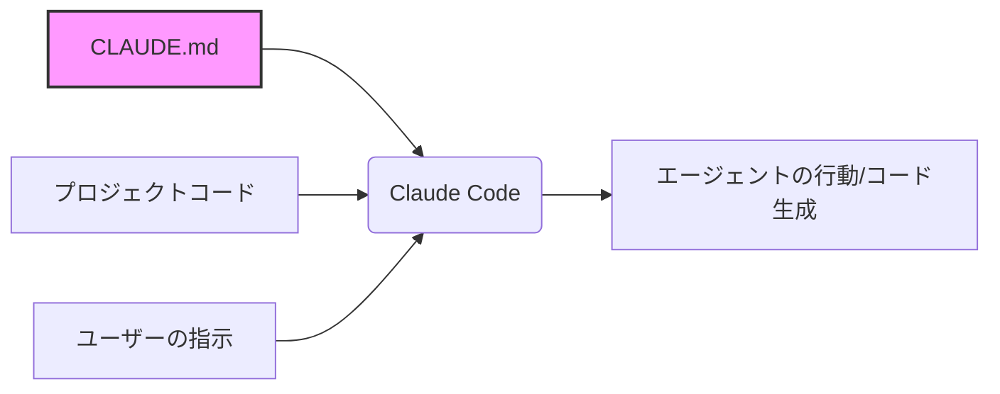

今回は、**A 70 Line Markdown File Hit 110,000 GitHub Stars in 3 Months and Topped Trending for 28 Consecutive Days. Here’s What Karpathy’s CLAUDE.md Actually Contains.** という記事を参考に、最近GitHubで異例の注目を集めている「CLAUDE.md」という設定ファイルの正体について整理してみました。

中々興味深い物だったので、共有です。

---

プログラミングの世界では、数万行のコードを持つフレームワークやライブラリがスターを集めるのが一般的ですよね。ところが今、たった70行ほどのテキストファイルが、28日間も連続でGitHubのトレンド1位を独占するという珍しい現象が起きています。

## CLAUDE.mdとは何か？

まず、このファイルの技術的な背景をさらっておきましょう。CLAUDE.mdは、Anthropic社が提供するエージェント型コーディングツール「Claude Code」で使われる設定ファイルです。

プロジェクトのルートディレクトリにこのファイルを置いておくと、Claude Codeを起動したときに自動で中身が読み込まれます。AIエージェントに対して「このプロジェクトではこう振る舞ってほしい」という独自の指示（コンテキスト）を与えるための、いわば「プロジェクト専用の取り扱い説明書」のような役割を果たします。

イメージとしては、新しくチームに入った優秀なエンジニアに、「うちのチームではTypeScriptの型定義を厳格にするよ」とか「エラーハンドリングはこの共通関数を使ってね」といったローカルルールをあらかじめ伝えておくメモ、と考えると分かりやすいかもしれません。

## なぜこのファイルが爆発的に広まったのか

きっかけは、元TeslaのAI責任者であり、現在は教育者としても著名なAndrej Karpathy氏の投稿でした。彼はClaude Codeを使ってみた感想として、LLM（大規模言語モデル）がコードを書く際によく陥る「失敗パターン」をいくつか指摘したんです。

その指摘をベースに、開発者のForrest Chang氏が「AIに失敗させないための指示書」として構造化したのが、今回話題になったCLAUDE.mdのテンプレート（forrestchang/andrej-karpathy-skills）です。

AIがやりがちな失敗と、それに対してCLAUDE.mdでどのような対策を講じているのかを整理してみましょう。

| AIが陥りやすい失敗パターン | CLAUDE.mdでの対策（指示） |
| :--- | :--- |
| **勝手な推測（暗黙の仮定）** | 不明点がある場合は、推測で進めずに必ずユーザーに質問する。 |
| **オーバーエンジニアリング** | 10行で済む処理に巨大なフレームワークを使わない。シンプルさを維持する。 |
| **余計な修正（副作用）** | 頼んでいない箇所のコード整形や、コメントの削除を勝手に行わない。 |

特に「勝手な推測」については、ある研究データによるとLLMのコンパイルエラーの9割以上が、型を明確にせず推測で書いたことが原因だといいます。Karpathy氏の指摘は、まさに現場のエンジニアが日々感じているストレスを言語化したものだったわけですね。

## CLAUDE.mdに記されている具体的な中身

この70行のファイルには、具体的にどのようなことが書かれているのでしょうか。主なポイントは以下の3つに集約されます。

### 1. 思考プロセスの制御
AIに対して「すぐにコードを書き始めるな」と命じています。まず現在の状況を分析し、不明な点があればユーザーに聞き、プランを立ててから実行に移る、というステップを徹底させる指示です。

### 2. コードの「シンプルさ」の徹底
AIは放っておくと、将来使うかもしれない拡張性などを考慮して、コードを複雑にしすぎる傾向があります。CLAUDE.mdでは「最小限の修正で目的を達成すること」「既存のパターンを尊重すること」を強調しています。

### 3. デバッグとテストの習慣化
「コードを書いて終わり」ではなく、変更後にどのように動作確認をすべきか、どのテストコマンドを叩くべきかといった、ワークフローのルールを明文化しています。

## 結局、何が重要なのか

この現象が面白いのは、GitHubで評価されたのが「複雑なアルゴリズム」ではなく、「AIとのコミュニケーションの質」だったという点です。

プロンプトエンジニアリングというと、チャット欄に長い文章を打ち込むイメージがあるかもしれません。しかし、CLAUDE.mdのように「ファイルとしてプロジェクトに固定しておく」手法は、AIを単なるチャット相手ではなく、開発環境の一部として組み込むための現実的な解といえます。

もちろん、Anthropicのドキュメントによれば、AIがこのファイルに従う確率は80%程度とのことです。完全に制御できるわけではありませんが、プロジェクトの「空気感」をAIに伝える手段としては、今のところ最も手軽で効果的な方法なのかもしれません。

皆さんのプロジェクトでも、自分たちなりの「CLAUDE.md」を作ってみると、AIエージェントがより「気の利く相棒」に近づくかもしれませんよ。

## 参照記事

- [A 70 Line Markdown File Hit 110,000 GitHub Stars in 3 Months and Topped Trending for 28 Consecutive Days. Here’s What Karpathy’s CLAUDE.md Actually Contains.](https://medium.com/@sohail_saifi/a-70-line-markdown-file-hit-110-000-github-stars-in-3-months-and-topped-trending-for-28-consecutive-c232a346bf5d)
- [Stop Copy-Pasting Claude Code Instructions: I Tried Generating Perfect CLAUDE.md Files Automatically](https://medium.com/@alirezarezvani/stop-copy-pasting-claude-code-instructions-i-tried-generating-perfect-claude-md-43b06e1f3fea)
- [Claude Code /btw: The Usefull Side Question That Changed How I Use Context](https://medium.com/@alirezarezvani/claude-code-btw-the-usefull-side-question-that-changed-how-i-use-context-d30ddea4aa2d)
- [How I Turn Claude Into a Systems Engineering Genius With One Prompt](https://medium.com/@alexjamesdunlop/how-i-turn-claude-into-a-systems-engineering-genius-with-one-prompt-d342af0f517c)
- [5% of Users in Claude Code Were Getting Errors. One Agent Failed. Five Agents Solved It in 90 Minutes.](https://medium.com/@alirezarezvani/5-of-users-were-getting-errors-one-agent-failed-five-agents-solved-it-in-90-minutes-5dafc5b8c1e1)
- [I Tried (New) Claude Code Git Worktree (I Now Run Smooth Parallel Agents)](https://medium.com/@joe.njenga/i-tried-new-claude-code-git-worktree-i-now-run-smooth-parallel-agents-8e21627167b7)

---

詳しくは[こちら](https://microarchitectures.jp/blog/github-over-110k-stars-karpathy-claude-md-explained/)をご覧ください。