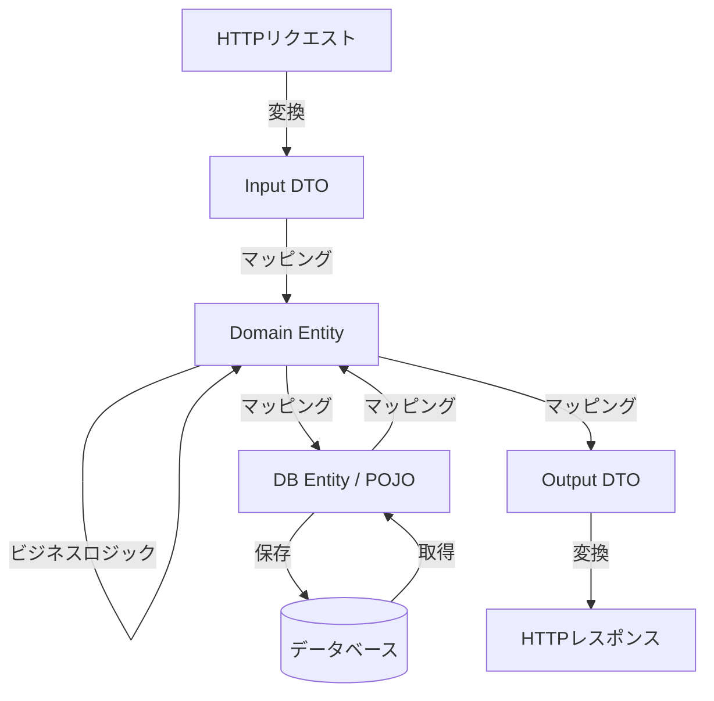

Bhavyansh氏による **Why “Clean Architecture” Often Makes Code Harder to Change** という記事を読み、設計の美しさと開発効率のバランスについて実務的な観点から非常に共感する部分があったので、こちらで内容を整理してみたいと思います。

ソフトウェア開発において「クリーン・アーキテクチャ」は一種の理想郷のように語られることがありますが、実際に運用してみると、思わぬメンテナンスコストに直面することがあります。今回は、なぜ良かれと思って導入したアーキテクチャがコードの変更を難しくしてしまうのか、その背景を探ります。

この記事を読みましたが、全く同意です。「クリーン・アーキテクチャ」は綺麗で、大規模開発なら当然使われるべきと思いますが、小規模の開発では逆に利用すべきではないのでは？と最近、考えています。ちょっとオーバーエンジニアリング過ぎに思っているのです。同意できない方も沢山いると思いますが...😅

---

## わずか「1項目の追加」に数時間を費やす現実

たとえば、ユーザープロフィールに「電話番号」というフィールドを一つ追加するだけの修正を想像してみてください。

本来であれば、データベースのテーブルにカラムを追加し、UIの入力項目を増やすだけの単純な作業のはずです。しかし、厳格にクリーン・アーキテクチャを適用しているプロジェクトでは、以下のような事態に陥ることがあります。

- 修正が必要なファイルが **11箇所** に及ぶ
- データの詰め替え（マッピング）だけで数時間を消費する
- 似たような構造のクラス（DTOやEntity）を何度も行き来する

このような状況は、設計の「純粋さ」を追い求めるあまり、開発の機動力（アジリティ）が犠牲になっているサインかもしれません。

### データが各層を通過する際のオーバーヘッド

クリーン・アーキテクチャでは層を分離するために、それぞれの層で専用のデータモデル（DTOやEntity）を持つことが推奨されます。その結果、一つのデータを保存するだけでも、以下のような複雑な変換プロセスが発生します。

このように、データの通り道が増えるほど、一つの変更が全ての層に波及することになります。

---

## なぜコードが「変更しにくく」なるのか

アーキテクチャの目的は「変更を容易にすること」のはずですが、なぜ逆の効果が生まれてしまうのでしょうか。主な原因を整理してみます。

### 1. 似て非なるモデルの重複
「データベースのモデル」と「ドメインモデル」、そして「APIのレスポンスモデル」が、現状では全く同じフィールドを持っていることはよくあります。これらを厳格に分けると、フィールドを一つ増やすたびに、3つのクラスを修正し、それぞれの変換ロジック（マッパー）を更新しなければなりません。

### 2. 間接参照による認知負荷の増大
インターフェースと実装を分離しすぎると、IDEで「定義へジャンプ」をした際にインターフェースにしか辿り着けず、実際の実装を探すためにプロジェクト内を検索し直す手間が発生します。コードの追いやすさが低下し、全体像を把握するのに時間がかかるようになります。

### 3. 「将来の変更」への過剰な備え
「将来データベースを差し替えるかもしれない」「外部APIが変わるかもしれない」という懸念から抽象化レイヤーを重ねますが、実際にはその変更が一度も起こらないまま、システムの寿命を終えるケースも少なくありません。

---

## 理想と現実の比較

クリーン・アーキテクチャの理想と、小〜中規模の開発で直面する現実を比較すると以下のようになります。

| 項目 | クリーン・アーキテクチャの理想 | 実務で発生しがちな現実 |
| :--- | :--- | :--- |
| **依存性** | ビジネスロジックが細部に依存しない | 変更時に修正すべきファイルが多すぎて漏れが出る |
| **テスト** | DBなしでビジネスロジックをテストできる | モックの作成自体が大きな負担になる |
| **柔軟性** | フレームワークの交換が容易 | フレームワークを交換する前に、要件が変わってコードが捨てられる |
| **開発速度** | 長期的にメンテナンス性が向上する | 単純な機能追加のたびに「お作法」に時間を取られる |

---

## 私たちはどう向き合うべきか

アーキテクチャはあくまで手段であり、目的ではありません。設計の「正解」に固執するのではなく、プロジェクトのフェーズや規模に合わせて、以下のような現実的な選択肢を検討してみてもいいかもしれません。

- **最初はシンプルに（KISS原則）**: 最初から多層構造にするのではなく、まずは少ない層で構築し、複雑さが増してきたタイミングでリファクタリングを検討する。
- **「同じもの」は共有する**: ドメインモデルとDBモデルが完全に一致している初期段階であれば、あえて分離せずに共通化し、将来的に乖離が生じた時点で分ける。
- **実利を取る**: テストが書きやすくなる、あるいはチーム開発で責任範囲が明確になるなど、具体的なメリットが感じられる範囲で抽象化を取り入れる。

## まとめ

クリーン・アーキテクチャが提示する「関心の分離」という考え方自体は、非常に価値のあるものです。しかし、それを銀の弾丸としてどんなプロジェクトにも無批判に適用してしまうと、かえって身動きが取れなくなる恐れがあります。

「この層は本当に必要か？」「この抽象化で得られる恩恵は、修正コストに見合っているか？」と、時折立ち止まって自問してみることが、健全なコードベースを維持する秘訣ではないかと思います。

実務においては、教科書通りの美しさよりも、変更に対して「ちょうどいい」軽やかさを保つことの方が、結果として長く愛されるシステムに繋がるのかもしれません。

## 参照記事

- [Why “Clean Architecture” Often Makes Code Harder to Change](https://medium.com/@bhavyansh001/why-clean-architecture-often-makes-code-harder-to-change-2e2654e44680)
- [OpenClaw Multi-Agent System: The Blueprint I Built in 12 Hours](https://medium.com/@alirezarezvani/openclaw-multi-agent-system-the-blueprint-i-built-in-12-hours-509498d02908)
- [7 Skills That Were Junior Dev Work 2 Years Ago That AI Now Does Instantly, And What You Should Learn Instead](https://medium.com/@sohail_saifi/7-skills-that-were-junior-dev-work-2-years-ago-that-ai-now-does-instantly-and-what-you-should-d110c44ab825)
- [5 TypeScript Tips Every Developer Should Know](https://medium.com/@Deep-concept/5-typescript-tips-every-developer-should-know-4cf4b0852994)
- [The Hardware Security Module Integration That Every Database Needs](https://medium.com/@sohail_saifi/the-hardware-security-module-integration-that-every-database-needs-66ff86b5074b)
- [410 Deleted by author — Medium](https://medium.com/@Ed-Ward/denmark-just-brought-putins-nightmare-to-life-a3ee8493c8ca)

---

詳しくは[こちら](https://microarchitectures.jp/blog/why-clean-architecture-backfires-in-practice/)をご覧ください。