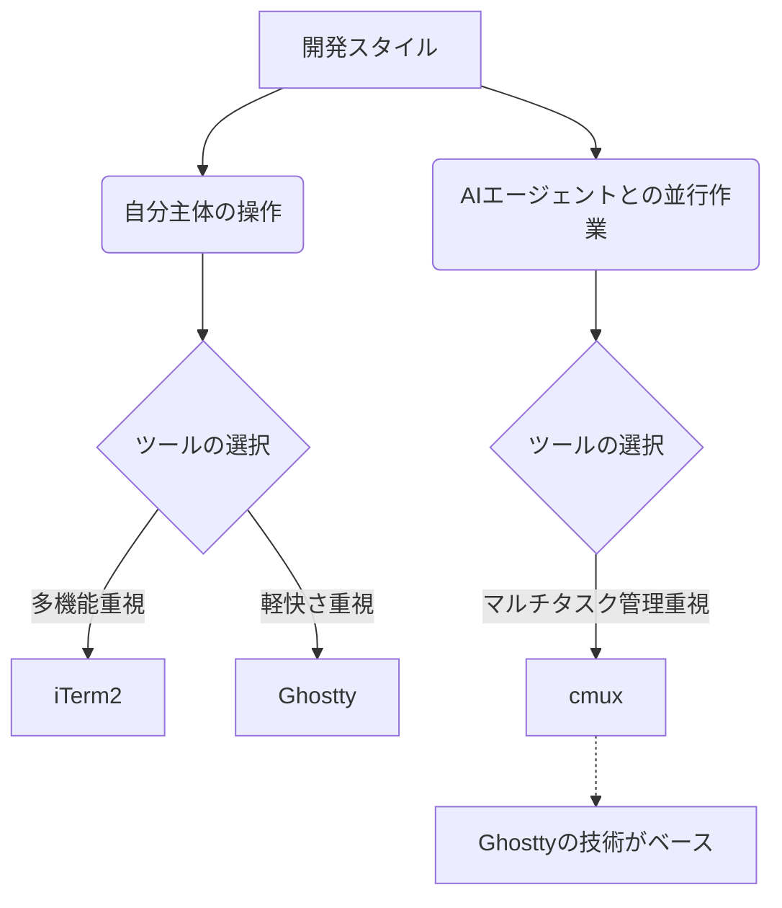

開発環境の核となるターミナル選びについて、**Why I’m Using cmux Now Instead of iTerm2 and Ghostty** という記事を読み、今の自分の開発スタイルにも通じる部分があったので、その内容を整理して紹介します。

皆さんは、ターミナルに何を求めていますか？ 以前は「多機能であること」や「カスタマイズ性」が重視されていましたが、最近ではその基準が少しずつ変化しているようです。

## 「全部入り」のiTerm2から、引き算のGhosttyへ

長年、macOSでのターミナルといえば **iTerm2** が定番でした。画面分割、ホットキー、トリガー、検索機能など、およそ考えつく機能はすべて揃っています。自分の使いやすいように、少しずつ道具箱に新しい引き出しを増やしていくような感覚は、確かに楽しいものでした。

しかし、ふと立ち止まってみると、そのたくさんの引き出しを自分ですべて使いこなせているわけではないことに気づきます。日々の作業は、エディタとターミナルを行き来し、ログを確認し、いくつかのサービスを立ち上げる……といったシンプルなことの繰り返しだからです。

そこで注目されたのが **Ghostty** です。Ghosttyは「道具としての存在感のなさ」が魅力です。

- 設定に時間をかけさせない
- フォントのレンダリングが非常に綺麗
- 動作が軽快で、作業を邪魔しない

ツールそのものに気を取られず、目の前のコードに集中したいというニーズに、Ghosttyは完璧に応えてくれました。

## 変化した背景：AIエージェントの台頭

ところが、最近になってターミナルの使い方がまた一つ変化してきました。それは、**「自分一人がコマンドを打つ場所」から「複数のAIエージェントを管理する場所」**へと役割が変わってきたことです。

たとえば、次のような状況を想像してみてください。

- ターミナルA：Codexでバックエンドの修正を走らせる
- ターミナルB：Claude Codeでフロントエンドのテストを書かせる
- ターミナルC：デバッグ用のログを監視する
- ターミナルD：別のマイクロサービスの動作確認をする

このように、複数のプロジェクトやエージェントを同時に動かすようになると、単一のウィンドウがいかに速くて綺麗か（Ghosttyの強み）という点よりも、**「今どこで何が起きているか」をどう管理するか**という点が重要になってきます。

## AI時代のワークベンチ「cmux」

そこで登場するのが **cmux** です。これは単なる「速いターミナル」を目指したものではなく、現在の「マルチタスクな開発」という現実を受け入れたツールと言えます。

cmuxは、内部的にGhosttyのコンポーネントを使用しているため、macOSネイティブで動作し、使用感も非常にスムーズです。最大の特徴は、その管理画面にあります。

### cmuxが解決してくれること

1.  **プロジェクトの可視化**: 画面の左側にプロジェクトのリストが表示され、どれが実行中でどれが止まっているかが一目でわかります。
2.  **通知機能**: AIエージェントがユーザーの入力を待っているとき、スマートに通知してくれます。わざわざウィンドウを切り替えて「終わったかな？」と確認しに行く必要がありません。
3.  **関連リソースの集約**: ターミナルだけでなく、関連するブラウザ画面などを一つのワークスペースにまとめられるため、ウィンドウをあちこち探す手間が省けます。

これまで紹介した3つのツールの特徴をまとめると、以下のようになります。

| 特徴 | iTerm2 | Ghostty | cmux |
| :--- | :--- | :--- | :--- |
| **主なスタンス** | 全機能が揃った万能ツール | 極限までシンプルで高速 | マルチタスクの司令塔 |
| **カスタマイズ性** | 非常に高い | 必要最小限 | ワークスペース単位で管理 |
| **適したスタイル** | ターミナルを自分色に染めたい | ツールに邪魔されたくない | 複数のエージェントを並行運用したい |
| **ベース技術** | 独自（macOSネイティブ） | Zig（高速レンダリング） | Ghosttyベース |

## まとめ：道具は作業に合わせて選ぶもの

iTerm2が「何でも入る大きな道具箱」で、Ghosttyが「究極に研ぎ澄まされた一本のナイフ」だとしたら、cmuxは「複数のドローンを同時に操るための管制塔」のようなイメージかもしれません。

「最近、AIエージェントを使い始めてからターミナルのタブ管理が追いつかなくなってきたな」と感じている方は、一度 cmux を試してみると、そのマルチタスクのしやすさにしっくりくるはずです。

今の自分の開発スタイルが、AIの導入によってどう変わってきたか。それに合わせて、毎日使う道具も見直してみる時期に来ているのかもしれませんね。

## 参照記事

- [Why I’m Using cmux Now Instead of iTerm2 and Ghostty](https://medium.com/@piedpay/why-im-using-cmux-now-instead-of-iterm2-and-ghostty-f5363c3eb5d6)
- [CLI Tools You Need to Know to Level Up Your Coding Game.](https://medium.com/@the_infinity/cli-tools-you-need-to-know-to-level-up-your-coding-game-f6c9cf1a82c7)
- [The Dev Tools Everyone Loves — But I Stopped Using (And What I Use Instead)](https://medium.com/@aashishkumar_77032/the-dev-tools-everyone-loves-but-i-stopped-using-and-what-i-use-instead-e4828cd75bc9)
- [VS Code’s New Terminal Upgrade Is a Bigger Deal Than It Sounds](https://medium.com/@bhavyansh001/vs-codes-new-terminal-upgrade-is-a-bigger-deal-than-it-sounds-45d6760c83e3)
- [My Team Banned AI Tools. Productivity Went UP 40%.](https://medium.com/@coding_with_tech/my-team-banned-ai-tools-productivity-went-up-40-47b961885c1c)
- [6 macOS Apps You Will ACTUALLY Use Every Single Day](https://medium.com/@theusefultech/6-macos-apps-you-will-actually-use-every-single-day-9a0a2ac55bc5)

---

詳しくは[こちら](https://microarchitectures.jp/blog/post-1779175602/)をご覧ください。